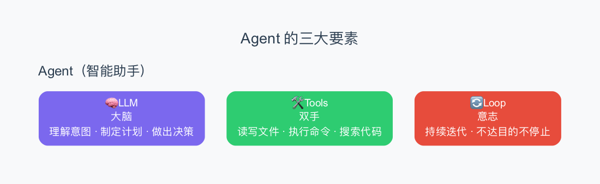
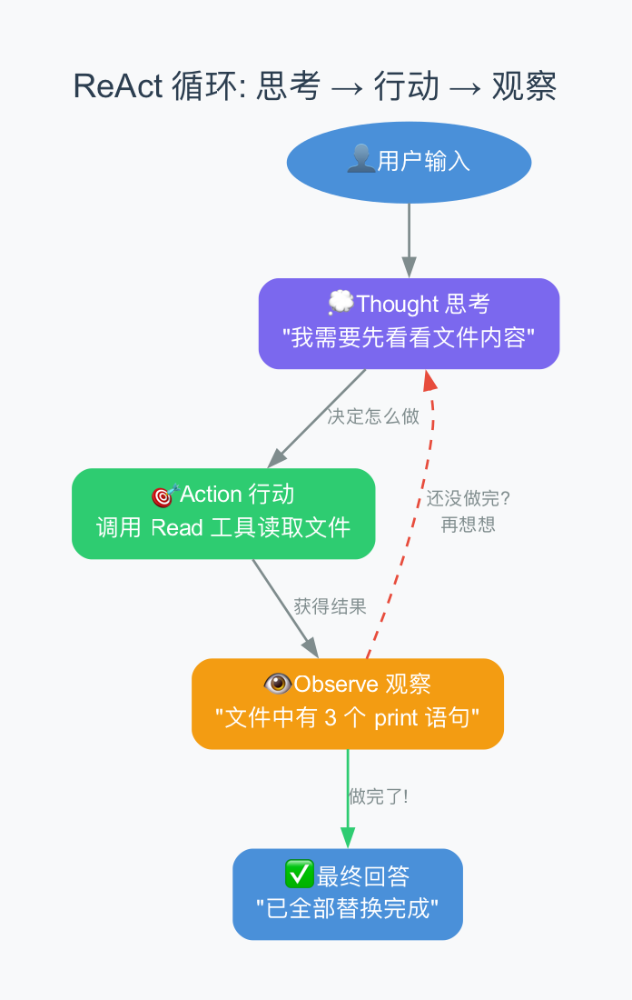
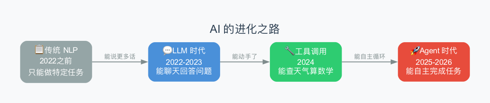

# 第1章：Agent 是什么？——从"只会说"到"会动手"

> **本章目标**：读完这章，你将明白 Agent（智能助手）和普通聊天机器人有什么本质区别，以及它是靠什么"动手"的。
>
> **难度**：⭐ 入门级，不需要编程基础

---

## 1.1 从一个例子开始

假设你做了一个 Python 项目，运行时报错了。你分别去问两个 AI：

### 1.1.1 问普通聊天机器人

> **你**：我项目里的 `main.py` 报了一个错，说找不到模块，怎么修？
>
> **聊天机器人**：这种错误通常是因为……（1）你没安装这个包，试试 `pip install xxx`；（2）你的 import 路径写错了；（3）你的虚拟环境没激活。建议你先检查一下……

它就像一个**电话客服**——告诉你怎么做，但不会帮你做。你得自己去敲命令、改代码。

### 1.1.2 问 Agent（比如 Claude Code）

> **你**：我项目里的 `main.py` 报了一个错，帮我修一下。
>
> **Agent**：好的，让我先看看文件。
>
> （它自己去读了 `main.py` 的内容）
>
> **Agent**：找到了，你引用了 `requests` 库但没安装。我帮你装一下。
>
> （它自己去执行了 `pip install requests`）
>
> **Agent**：装好了，我再跑一次验证一下。
>
> （它自己又执行了一次运行命令）
>
> **Agent**：搞定了！问题就是缺了 `requests` 库，已经帮你装好了，现在能正常运行了。

它就像一个**上门维修师傅**——你不用指导他，他自己检查、自己动手、自己验证。

> **一句话总结**：聊天机器人是"顾问"（只会说），Agent 是"助理"（会动手）。

---

## 1.2 用一个餐厅比喻来理解

### 普通聊天机器人 = 菜谱朗读员

```
你：    "糖醋排骨怎么做？"
朗读员： "先把排骨焯水，然后调糖醋汁，大火收汁……"
你：    "火候呢？"
朗读员： "大火烧开，小火慢炖 20 分钟……"
```

**你能学到做法，但他不会走进厨房帮你做。**每次你问一句，他答一句，仅此而已。

### Agent = 私人厨师

```
你：    "我想吃糖醋排骨。"
厨师：  "好，让我先看看冰箱里有什么。"
       👉 自己打开冰箱检查食材
厨师：  "排骨有，但缺香醋。我去买。"
       👉 自己出门买醋
厨师：  "回来了。先焯水……再调汁……"
       👉 自己执行一整套操作
厨师：  "做好了，尝尝。"
       👉 端上菜
```

**厨师全程不需要你指导。他自己检查环境、发现缺什么就去补、一步步做完、最后还帮你验证。**

这就是 Agent 的核心——**自主完成任务**。

---

## 1.3 Agent 靠什么"动手"？三大要素

一个 Agent 要从"只会说"变成"会动手"，需要三样东西：



### 要素一：🧠 大脑（LLM，大语言模型）

这是 Agent 的"思考能力"。它负责：

| 大脑做什么 | 通俗理解 |
|-----------|---------|
| 理解你的话 | "用户想让我修代码" |
| 想想该怎么做 | "我得先读文件，找到问题，再改" |
| 决定用什么工具 | "这次应该用'读文件'工具" |
| 看懂工具返回的结果 | "原来少了这个库" |

> **LLM** 就是 ChatGPT、Claude 这类大模型。你可以理解为"一个能理解和生成文字的程序"。

### 要素二：🛠️ 工具（Tools）

这是 Agent 的"手脚"。没有工具，它就只能说不能做。

| 工具 | 能做什么 | 比喻 |
|------|---------|------|
| Read | 读取文件内容 | 翻开一页纸 |
| Write | 写新文件 | 拿笔写字 |
| Edit | 修改已有文件 | 用涂改液改错字 |
| Bash | 执行命令行命令 | 在终端里打字 |
| Grep | 搜索文件内容 | 在书里找关键词 |

> **关键理解**：工具是人提前准备好的。AI 只能用你给它的工具，不能凭空变出新能力。就像厨师只能用厨房里已有的锅碗瓢盆。

### 要素三：🔄 循环（Loop）

这是 Agent 和聊天机器人**最本质的区别**。

聊天机器人：**一问一答，结束。**

Agent：**一问 → 自己想 → 自己做 → 看结果 → 再想 → 再做 → ……→ 完成。**

这个"想-做-看-再想"的循环，就叫 **Agent Loop**（代理循环）。

---

## 1.4 这个"循环"到底长什么样？

下面这张图展示了 Agent 的"思考-行动"循环：



让我们用之前的"修代码"例子走一遍这个循环：

```
第1轮：
  💭 思考：用户要修 main.py，我得先看看文件里写了什么
  🎯 行动：调用 Read 工具，读取 main.py
  👁️ 观察：文件第 3 行写了 import requests

第2轮：
  💭 思考：第 3 行引用了 requests 库，可能没装
  🎯 行动：调用 Bash 工具，执行 pip list 看看装了没有
  👁️ 观察：列表里没有 requests

第3轮：
  💭 思考：确认了，就是缺这个库，我来安装
  🎯 行动：调用 Bash 工具，执行 pip install requests
  👁️ 观察：安装成功了

第4轮：
  💭 思考：装好了，我再跑一次验证
  🎯 行动：调用 Bash 工具，运行 python main.py
  👁️ 观察：运行成功，没有报错

第5轮：
  💭 思考：问题解决了，告诉用户
  ✅ 最终回答："搞定了，问题是缺了 requests 库，已经帮你装好了"
```

> **"想-做-看-再想"** 这个模式，在学术界有个名字叫 **ReAct**（Reasoning + Acting，推理+行动）。你不需要记住这个名字，只要理解这个循环就行。

---

## 1.5 AI 是怎么一步步变"聪明"的？

Agent 不是一夜之间出现的。它经过了几个阶段的进化：



| 阶段 | 时间 | AI 能做什么 | 比喻 |
|------|------|-----------|------|
| 传统 NLP | 2022之前 | 只能做一个特定任务（翻译、分类） | 计算器 |
| LLM 时代 | 2022-2023 | 能回答各种问题，但只能说不能做 | 百科全书 |
| 工具调用 | 2024 | 能查天气、算数学，但每次只能做一步 | 电话客服 |
| Agent 时代 | 2025-2026 | 能自主规划、多步执行、验证结果 | 私人助理 |

你正在学的 claw-code，就是 Agent 时代的一个代表作品。

---

## 1.6 claw-code 是什么？为什么要学它？

### claw-code 和 Claude Code 的关系

**Claude Code** 是 Anthropic 公司出品的终端编程助手。但它是闭源的——你看不到它内部是怎么实现的。

2026 年 3 月 31 日，有人发现 Claude Code 的 npm 安装包里不小心包含了一份源码映射文件（.map 文件），通过这个文件可以还原出它的全部源代码。

一个叫 **Sigrid Jin** 的韩国开发者看到后，没有直接复制泄露的代码（那样有法律问题），而是用 Python 从零重新写了一遍——只模仿架构设计，不复制代码。这就是 **claw-code**。

> **净室重写（clean-room rewrite）**：意思是开发者只看了原始系统的行为和结构，然后用完全自己写的代码重新实现。就像你吃过一道菜之后，自己回家凭记忆做了一遍——菜的味道可能相似，但做法完全是你自己的。

### claw-code 里有什么值得学的？

claw-code 虽然不是官方产品，但它的架构设计**忠实地反映了 Claude Code 的内部结构**。通过学习它，你可以理解：

- Claude Code 是怎么组装"指令"发给 AI 的
- 它是怎么让 AI "动手"的（工具系统）
- 它是怎么确保 AI 不会乱来的（权限系统）
- 它是怎么"记住"之前说过的话的（会话管理）
- 它是怎么在对话太长时"压缩记忆"的（对话压缩）

---

## 1.7 本教程的学习路线

我们将**跟着一次完整的用户请求**，从头到尾走一遍 Agent 的内部流程：

```
第 1 章 ← 你在这里：理解 Agent 是什么

第 2 章：看一眼完整的流程全貌（全景地图）

  然后逐个模块深入 ↓

  第 3 章：System Prompt（给 AI 的"员工手册"）
  第 4 章：Agent Loop（"思考-行动"循环）
  第 5 章：工具系统（AI 的"双手"）
  第 6 章：消息模型（AI 的"语言"）
  第 7 章：权限系统（AI 的"安全门"）
  第 8 章：启动流程（AI 的"开机过程"）

  进入高级主题 ↓

  第 9 章：会话持久化（怎么保存对话）
  第10章：对话压缩（记忆太长了怎么办）
  第11章：费用追踪（每次花多少钱）
  第12章：MCP 协议（怎么连接外部工具）

  最后动手 ↓

  第13章：用 Python 写一个最小的 Agent
  第14章：怎么给它加新功能
```

每章都从通俗比喻开始，再逐步深入到源码细节。

---

## 1.8 本章小结

| 你学到了什么 | 一句话记忆 |
|-------------|-----------|
| Agent 是什么 | 不只会"说"，还会"做"的 AI |
| 和聊天机器人的区别 | 聊天机器人是一问一答；Agent 是自主循环直到完成 |
| Agent 靠什么动手 | 三要素：大脑（LLM）+ 工具（Tools）+ 循环（Loop） |
| ReAct 是什么 | "想-做-看-再想"的循环模式 |
| claw-code 是什么 | Claude Code 架构的开源重写，用来学习内部设计 |

---

> **下一章**：[第2章：一次请求的完整旅程](02-request-journey.md) —— 我们会像慢动作回放一样，看看你按回车之后，Agent 内部发生了什么。
