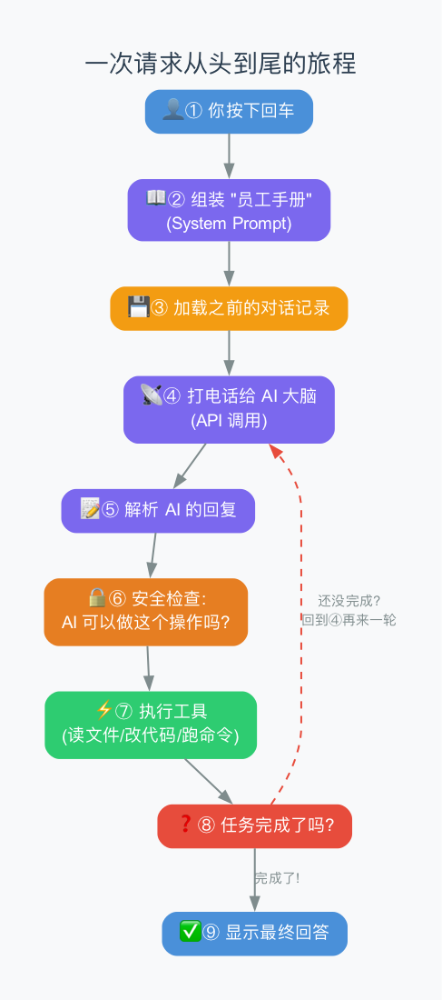
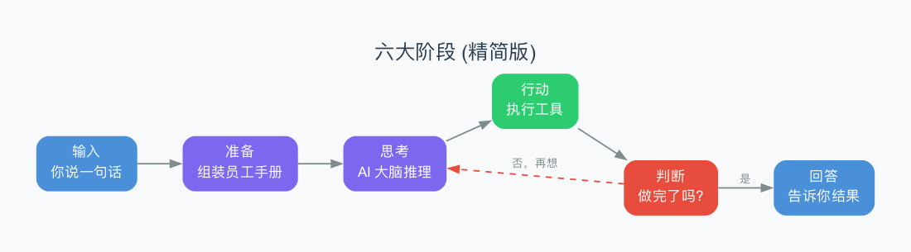
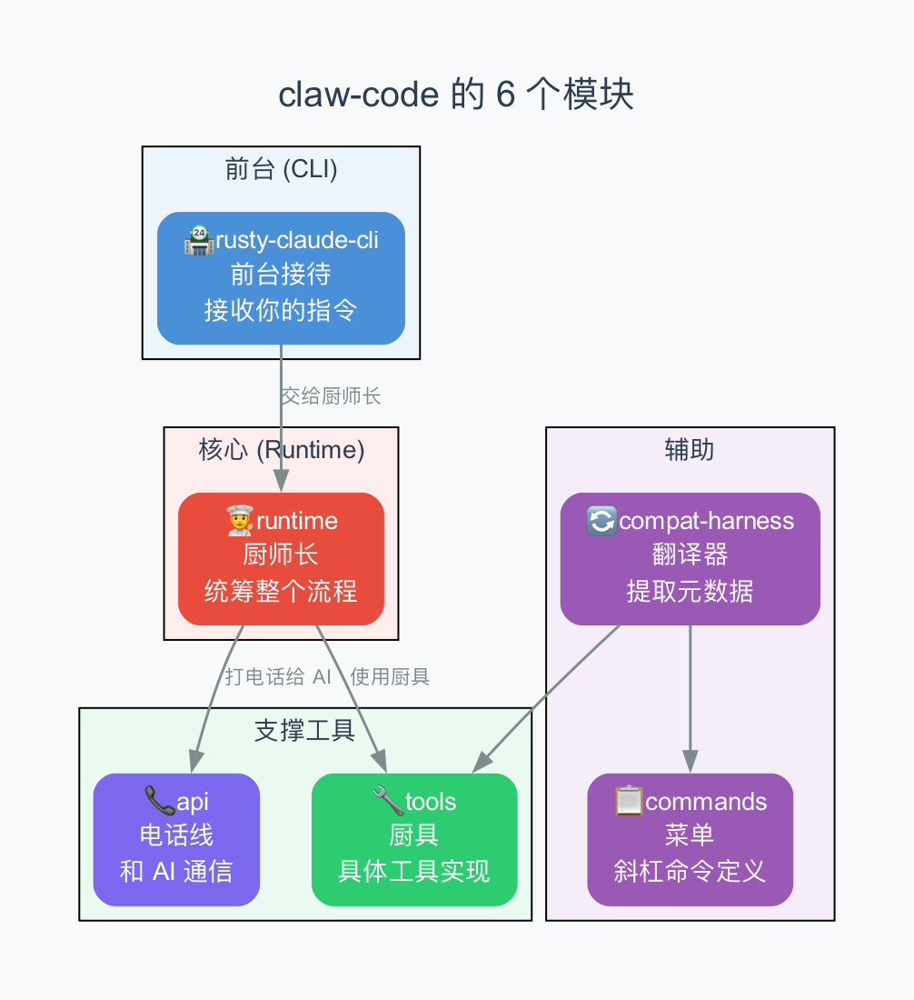

# 第2章：一次请求的完整旅程——从回车键到最终回答

> **本章目标**：像慢动作回放一样，看清你按下回车之后、看到回答之前，Agent 内部到底发生了什么。这一章是整本教程的"地图"——先看全貌，后面每章再回到具体模块深入。
>
> **难度**：⭐ 入门级

---

## 2.1 故事从一个回车键开始

你在终端里打了一句话：

```
> 帮我把 main.py 里的 print 都换成 logging
```

按下回车。接下来大约 **1 秒钟** 内，Agent 内部发生了非常多的事情。让我们像慢镜头一样，一步一步看清楚。

---

## 2.2 全景流程图

先看一张"地图"。不用记住每个细节，有个整体印象就行：



用文字简化一下，其实就是 **9 个步骤**：

```
你按下回车
   │
   ① 组装"员工手册"（System Prompt）
   │
   ② 加载之前的聊天记录（Session）
   │
   ③ 把你的话追加到聊天记录里
   │
   ④ 打电话给 AI 大脑（调 API）
   │
   ⑤ 收到 AI 的回复，检查它想不想"动手"
   │
   ⑥ 想动手？→ 安全检查：它被允许这样做吗？
   │
   ⑦ 允许了？→ 执行工具，拿到结果
   │
   ⑧ 把结果追加到聊天记录里
   │
   ⑨ AI 觉得任务完成了？→ 把回答显示给你
   │  AI 觉得还没完成？→ 回到④，再来一轮
```

---

## 2.3 精简成六大阶段

上面 9 步可以归纳为 **6 个阶段**。后面整本教程就是按这 6 个阶段展开的：



| 阶段 | 做什么 | 通俗理解 |
|------|--------|---------|
| **输入** | 接收你打的那句话 | 客人点菜 |
| **准备** | 组装"员工手册" + 加载聊天记录 | 厨师看 SOP + 翻备忘录 |
| **思考** | 把准备好的东西发给 AI，让它推理 | 厨师想想要怎么做这道菜 |
| **行动** | AI 决定要调工具 → 检查权限 → 执行 | 厨师拿起刀切菜 |
| **判断** | AI 看结果，决定是继续还是结束 | 厨师尝一口，看熟没熟 |
| **回答** | 把最终结果告诉你 | 端菜上桌 |

> **注意"判断"那一步**：如果 AI 觉得还没做完，它会回到"思考"阶段，再来一轮。这个"思考→行动→判断→再思考"的循环，就是上一章说的 Agent Loop。

---

## 2.4 慢动作：跟着"帮我把 print 换成 logging"走一遍

让我们用时间线的方式，看一次真实的 3 轮循环：

### T+0ms：你按下回车

你的这句话变成了一条"用户消息"：

```
角色: 用户
内容: "帮我把 main.py 里的 print 都换成 logging"
```

### T+1ms：准备阶段——组装"员工手册"

Agent 需要告诉 AI "你是谁、应该怎么做"。这就是 **System Prompt**（系统提示词），相当于一份"员工手册"。

它由几个部分拼起来：

```
"员工手册"的组成：

┌─────────────────────────────┐
│ 📋 静态规则（永远不变的部分）  │
│ "你是一个编程助手"            │
│ "先看代码再改"               │
│ "不要引入安全问题"            │
├─────────────────────────────┤
│ 🌍 环境信息（每次启动时更新）  │
│ "你在 macOS 系统上"          │
│ "工作目录是 /Users/me/project"│
│ "今天是 2026-04-02"          │
├─────────────────────────────┤
│ 📄 项目指令（从 CLAUDE.md 读）│
│ "这个项目用 Python 3.12"     │
│ "代码风格遵循 PEP 8"         │
└─────────────────────────────┘
```

> **CLAUDE.md** 是项目根目录下的一个特殊文件。你可以在里面写项目规则，Agent 每次启动时都会自动读取。就像厨房墙上贴的"今日菜单"。

### T+5ms：准备阶段——加载聊天记录

如果你之前和 Agent 聊过，它会加载之前的对话：

```
之前的聊天记录：
  用户: "帮我创建一个 Python 项目"
  AI:   "好的，已经创建了……"
  AI:   (调用了 Write 工具创建了 main.py)
  工具: "写入成功"
  ...

现在你的新消息追加上去：
  用户: "帮我把 main.py 里的 print 都换成 logging"
```

这些对话记录存在一个叫 **Session**（会话）的数据结构里，保存在你电脑的磁盘上。

### T+50ms：第一轮——打电话给 AI 大脑

Agent 把"员工手册" + "聊天记录" + "你的新消息"一起发给远端的 AI：

```
发送给 AI 的内容：
  员工手册: [系统提示词...]
  聊天记录: [之前的多轮对话...]
  你的话: "帮我把 main.py 里的 print 都换成 logging"
  可用工具: [Read, Write, Edit, Bash, Glob, Grep ...]
```

> 这一步是**网络请求**——Agent 通过互联网把数据发给 Anthropic 的服务器，服务器上的大模型进行推理，然后流式返回结果。这就是为什么你需要联网才能用 Claude Code。

### T+200ms：第一轮——收到 AI 的回复

AI 的回复是流式（streaming，一点一点地）返回的：

```
AI 说的话：
  "让我先看看文件内容"           ← 这是文字
  [调用 Read 工具，读取 main.py]  ← 这是"动手"
```

AI 返回的每条消息里可能包含两种东西：
- **文字**：AI 想对你说的
- **工具调用**：AI 想要"动手"做的事情

### T+210ms：第一轮——安全检查

AI 说要读文件，但 Agent 不会盲目执行。它先检查：

```
安全检查：
  工具名: Read
  操作: 读取 main.py
  权限: ✅ 允许（读文件一般是安全的）
```

不同的工具有不同的权限级别：

| 工具 | 默认权限 | 原因 |
|------|---------|------|
| Read（读文件） | ✅ 自动允许 | 只是看，不会改任何东西 |
| Glob（搜索文件名） | ✅ 自动允许 | 只是查找，安全 |
| Grep（搜索内容） | ✅ 自动允许 | 只是搜索，安全 |
| Edit（编辑文件） | ⚠️ 需要确认 | 会修改你的代码 |
| Bash（执行命令） | ⚠️ 需要确认 | 可能执行危险操作 |

> 这个"安全检查"机制就是**权限系统**。它确保 AI 不会在你不知道的情况下删除文件或执行危险命令。

### T+211ms：第一轮——执行工具

权限通过了，Agent 真的去读取文件：

```
读取 src/main.py 的结果：

import os
print('hello')
print('world')
name = input('你的名字：')
print(f'你好，{name}')
```

### T+215ms：判断——还没做完，继续循环

工具结果追加到聊天记录里。AI 看到了文件内容，但它还没开始改代码。所以 Agent Loop 继续转——再打一次电话给 AI。

### T+220ms：第二轮——AI 再想

这次 AI 已经看到了文件内容，它说：

```
AI 说：
  "文件中有 3 个 print 语句，我来逐一替换。"
  [调用 Edit 工具，把 print('hello') 改成 logging.info('hello')]
```

Agent 又做了一轮"安全检查 → 执行 → 追加结果"。

### T+600ms：第三轮——AI 还在继续

```
AI 说：
  [调用 Edit 工具，把 print('world') 改成 logging.info('world')]
```

### T+800ms：第四轮——AI 觉得做完了

```
AI 说：
  "3 个 print 都已替换为 logging.info。你还需要在文件顶部添加 import logging。"
  [调用 Edit 工具，在文件顶部添加 import logging]
```

### T+950ms：最后一轮——AI 确认完成

```
AI 说：
  "完成！所有 print 语句已替换，import 也加好了。"

  （这次没有工具调用——AI 认为任务完成了）
```

**Agent Loop 结束！** 因为 AI 这次没有要调用任何工具，它觉得已经做完了。

### T+960ms：收尾

```
→ 把 AI 的回答显示在你的终端上
→ 把这次完整的对话记录保存到磁盘
→ 记录一下用了多少 token（AI 的"计费单位"），花了多少钱
```

---

## 2.5 回顾：这次请求花了多少资源？

| 指标 | 数值 | 说明 |
|------|------|------|
| API 调用次数 | 5 次 | 循环了 5 轮 |
| 工具执行次数 | 4 次 | 1次Read + 3次Edit |
| 总时间 | 约 1 秒 | |
| Token 消耗 | ~6000 input + ~1000 output | token 是 AI 计算文字的基本单位 |
| 费用 | 约 $0.12 | 按 Claude 的定价 |

> **Token**（词元）是 AI 处理文字的基本单位。一个英文单词大约 1-2 个 token，一个中文字大约 2-3 个 token。每调用一次 API 都会消耗 token，按量计费。

---

## 2.6 claw-code 的模块是怎么分工的？

上面的所有工作，在 claw-code 里是由 6 个**模块**（crate）协作完成的：



| 模块 | 比喻 | 职责 |
|------|------|------|
| **rusty-claude-cli** | 前台接待 | 你在终端打字，它负责接收 |
| **runtime** | 厨师长 | 统筹整个流程：准备材料、调度循环、管理记录 |
| **api** | 电话线 | 和远端的 AI 服务器通信 |
| **tools** | 厨具 | 具体的工具实现：读文件、写文件、执行命令 |
| **commands** | 菜单 | 斜杠命令（如 `/help`、`/compact`）的定义 |
| **compat-harness** | 翻译器 | 从原始代码提取元数据 |

### 它们之间的关系

```
前台接待接收你的指令
       ↓
交给厨师长处理
       ↓
厨师长需要和 AI 通话 → 用电话线
厨师长需要执行工具 → 用厨具
       ↑
    翻译器提供工具和命令的清单
```

> 你会发现，**厨师长（runtime）是真正的核心**。其他所有模块都是给它打配合的。这也是为什么我们在教程中会花最多时间在 runtime 上。

---

## 2.7 源码中的真实路径

如果你想直接看 claw-code 的源码，一次请求走过的文件路径是：

```
① rusty-claude-cli/src/main.rs
   → 程序入口，解析命令行参数

② rusty-claude-cli/src/app.rs
   → 创建运行时，开始处理

③ runtime/src/prompt.rs
   → 组装"员工手册"（System Prompt）
   → 发现和加载 CLAUDE.md

④ runtime/src/conversation.rs     ← 核心中的核心！
   → ConversationRuntime::run_turn()
   → 这里就是 Agent Loop 的所在

⑤ api/src/client.rs
   → 和 AI 服务器通信（SSE 流式传输）

⑥ runtime/src/permissions.rs
   → 安全检查：允许还是拒绝？

⑦ runtime/src/file_ops.rs
   → 具体的工具操作：读文件、写文件、编辑

⑧ runtime/src/session.rs
   → 保存/加载对话记录

⑨ runtime/src/usage.rs
   → 记录 token 消耗和费用
```

> 不用现在就去读这些文件。后续每一章都会带你深入一个文件，逐行讲解。

---

## 2.8 和其他 Agent 框架的简单对比

市面上还有其他类似的 Agent 工具。了解它们有助于你建立全局视野：

| 工具 | 类型 | 特点 |
|------|------|------|
| **Claude Code** | 商业闭源 | Anthropic 官方出品，最成熟 |
| **claw-code** | 开源重写 | 学习用，模仿 Claude Code 的架构 |
| **Cursor** | IDE 插件 | 嵌在编辑器里，鼠标操作为主 |
| **Aider** | 开源终端 | 重视 Git 集成 |
| **OpenCode** | 开源终端 | Go 语言写的，支持多种 AI 模型 |
| **LangChain** | 开发框架 | Python 库，需要自己组装 |

> **claw-code 的独特价值**：它是唯一一个公开了"类 Claude Code 架构"的开源项目。如果你想理解 Claude Code 的内部设计，学 claw-code 是最直接的路。

---

## 2.9 本章小结

### 一次请求走了哪 6 步？

| 步骤 | 比喻 | 做了什么 |
|------|------|---------|
| ① 准备 | 看员工手册 | 组装 System Prompt |
| ② 加载 | 翻备忘录 | 读取之前的聊天记录 |
| ③ 思考 | 想想怎么做 | 把所有信息发给 AI |
| ④ 行动 | 动手做 | 执行工具（读写文件、运行命令） |
| ⑤ 判断 | 检查做完了没 | AI 决定继续还是结束 |
| ⑥ 保存 | 记到本子上 | 更新聊天记录，记录费用 |

### 几个关键术语速查

| 术语 | 简单理解 | 首次出现 |
|------|---------|---------|
| **System Prompt** | 给 AI 的"员工手册" | 2.4节 |
| **Session** | 聊天记录的存档 | 2.4节 |
| **Agent Loop** | "思考→行动→判断"的循环 | 2.4节 |
| **Token** | AI 计费的最小单位 | 2.5节 |
| **Crate** | Rust 的代码模块（类似 Python 的包） | 2.6节 |
| **SSE** | 流式传输（一点一点返回结果） | 2.7节 |

### 你现在应该能回答的问题

- 用户按下回车后，数据经过了哪些步骤？
- Agent 为什么要"循环"？什么时候会停下来？
- claw-code 的 6 个模块分别负责什么？
- 为什么说 runtime 是核心？

---

> **下一章**：[第3章：System Prompt](03-system-prompt.md) —— 深入第一个模块：Agent 是怎么给 AI 写"员工手册"的？CLAUDE.md 文件是怎么被发现的？
