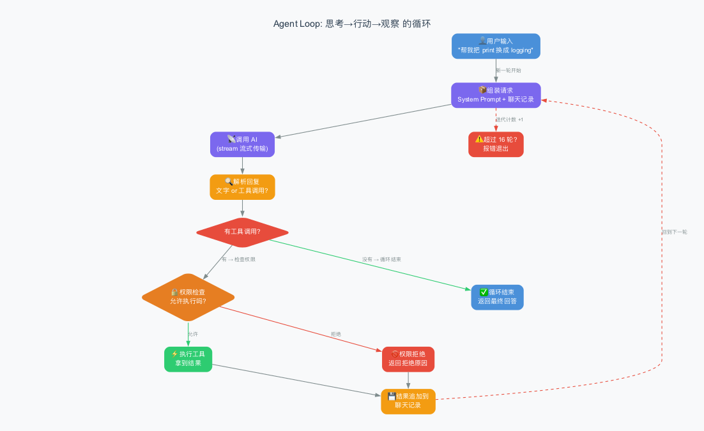
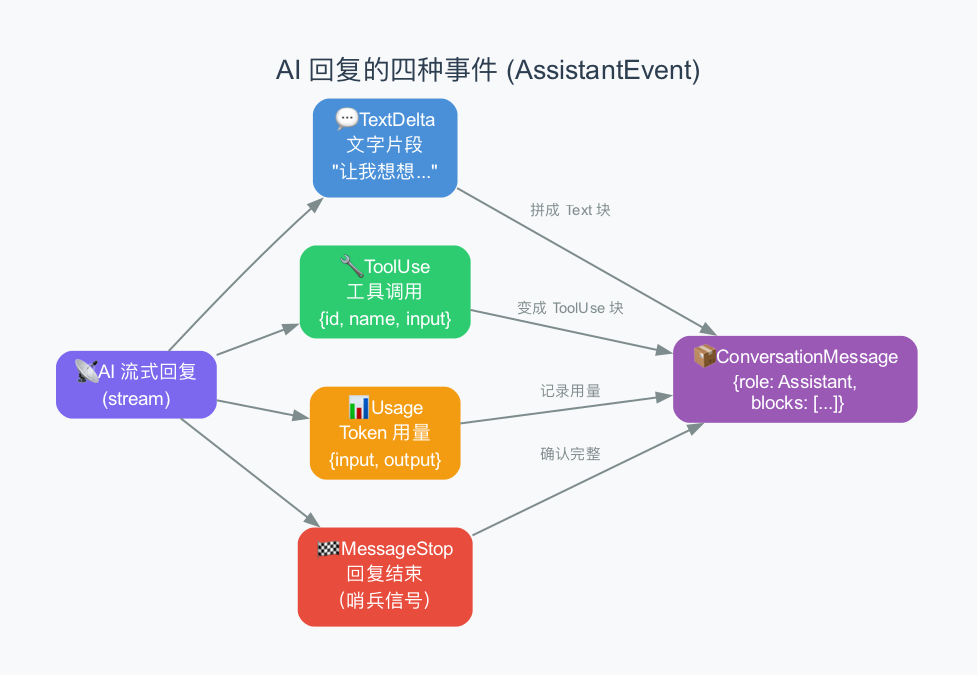
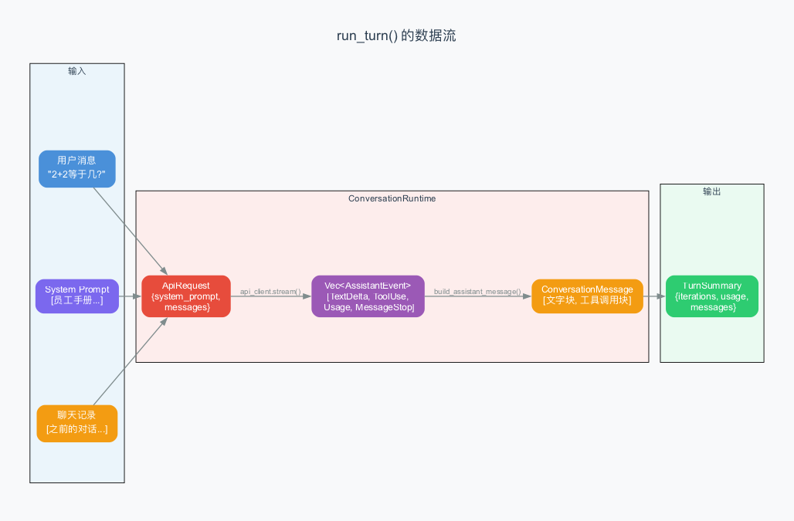

# 第4章：Agent Loop —— AI 的"思考→行动→观察"循环

> **本章目标**：深入 Agent 的心脏——Agent Loop。上一章我们看到 System Prompt 是怎么组装的，这一章我们来看：组装好之后，AI 是怎么一轮一轮地"思考、行动、观察"，直到任务完成的。我们会逐行解读 claw-code 中最核心的 Rust 代码。
>
> **难度**：⭐⭐⭐ 中级
>
> **对应源码**：`rust/crates/runtime/src/conversation.rs`

---

## 4.1 回顾：Agent Loop 是什么？

在第一章里，我们用了一个比喻：Agent 就像一个"勤快的厨师"——他会想菜谱（思考）、拿起刀切菜（行动）、尝一口看看熟没熟（观察），如果没熟就继续，熟了就端菜上桌。

这个"思考→行动→观察→再思考"的过程，就是 **Agent Loop**（智能体循环）。它是整个 Agent 架构中最核心的部分——没有它，AI 只能回答一句话，不能连续行动。

> 上一章我们讲了 System Prompt——它是"员工手册"，告诉 AI 该怎么做。但员工拿到手册之后，具体是怎么一步步干活的？这就是本章要回答的问题。

**Agent Loop 的核心逻辑，用伪代码表示就是：**

```
循环：
    1. 把"员工手册 + 聊天记录 + 可用工具"发给 AI
    2. 收到 AI 的回复
    3. AI 想调用工具吗？
       - 想调用 → 检查权限 → 执行 → 把结果追加到聊天记录 → 回到第 1 步
       - 不想调用 → AI 觉得做完了 → 退出循环
```

就这么简单。但"魔鬼在细节里"——让我们一步步拆开来看。

---

## 4.2 先看全貌：一张流程图



这张图展示了 Agent Loop 的完整流程。注意几个关键节点：

- **"有工具调用?"** 这个菱形是循环的"方向盘"——AI 每次回复后，都要判断它是想继续干活，还是觉得做完了
- **"权限检查"** 是安全关卡——不是 AI 想做什么就能做什么
- **"超过 16 轮?"** 是安全阀——防止 AI 陷入无限循环

> 你可能好奇：为什么是 16 轮？因为大多数任务在 3-5 轮内就能完成。16 轮是一个合理的上限——如果 16 轮还没做完，很可能是 AI 陷入了循环，需要停下来。

---

## 4.3 源码结构：ConversationRuntime 是什么？

在 claw-code 中，Agent Loop 住在一个叫 `ConversationRuntime` 的结构体里。你可以把它理解为**"对话管理者"**——它负责管理整个循环过程。

```rust
pub struct ConversationRuntime<C, T> {
    session: Session,              // 聊天记录
    api_client: C,                 // 和 AI 通信的"电话线"
    tool_executor: T,              // 执行工具的"双手"
    permission_policy: PermissionPolicy,  // 权限策略
    system_prompt: Vec<String>,    // "员工手册"
    max_iterations: usize,         // 最大循环次数（默认 16）
    usage_tracker: UsageTracker,   // Token 用量追踪器
}
```

> **结构体（struct）**：Rust 语言中用来组织相关数据的方式，类似于 Python 的 class。`<C, T>` 是泛型参数——表示"用什么类型的电话线和工具"，这样代码更灵活。

这 7 个字段各有分工：

| 字段 | 比喻 | 作用 |
|------|------|------|
| `session` | 备忘录 | 保存所有聊天记录 |
| `api_client` | 电话线 | 和远端 AI 服务器通信 |
| `tool_executor` | 厨具 | 具体的工具实现（读文件、写文件等） |
| `permission_policy` | 门卫 | 决定 AI 的操作是否被允许 |
| `system_prompt` | 员工手册 | 告诉 AI "你是谁、该怎么做" |
| `max_iterations` | 计步器 | 防止循环次数过多 |
| `usage_tracker` | 记账本 | 记录用了多少 token、花了多少钱 |

> 注意：`C` 和 `T` 是泛型（generic），意味着你可以用任何实现了对应接口的类型来替代。比如测试时可以用一个"假装的"AI 客户端，不需要真的联网。这是一种很好的设计模式——把"用什么"和"怎么用"分开。

---

## 4.4 核心函数：run_turn() 的完整解读

`run_turn()` 是 Agent Loop 的入口函数。当你按下回车、输入一句话后，整个循环就从这里开始。

让我们用"慢镜头"逐段看这个函数：

### 第一步：接收用户消息

```rust
pub fn run_turn(
    &mut self,
    user_input: impl Into<String>,        // 用户输入的文字
    mut prompter: Option<&mut dyn PermissionPrompter>,  // 权限提示器
) -> Result<TurnSummary, RuntimeError> {
    // 把用户的消息追加到聊天记录
    self.session
        .messages
        .push(ConversationMessage::user_text(user_input.into()));
```

这段代码做的事情很简单：把你说的那句话变成一条"用户消息"，追加到聊天记录里。

> `impl Into<String>` 是 Rust 的一个惯用写法——表示"任何能转成 String 的类型"。这样你可以传入 `&str`、`String` 等多种类型，更灵活。

### 第二步：准备循环变量

```rust
    let mut assistant_messages = Vec::new();  // 收集 AI 的所有回复
    let mut tool_results = Vec::new();        // 收集所有工具执行结果
    let mut iterations = 0;                    // 循环计数器
```

三个"收集箱"：一个装 AI 说了什么，一个装工具执行的结果，一个记录循环了几轮。

### 第三步：进入循环！

```rust
    loop {
        iterations += 1;
        if iterations > self.max_iterations {
            return Err(RuntimeError::new(
                "conversation loop exceeded the maximum number of iterations",
            ));
        }
```

`loop` 是 Rust 中的"无限循环"关键字——它会一直执行，直到遇到 `break`。但我们在开头加了一个安全检查：如果循环次数超过 `max_iterations`（默认 16），就直接报错退出。

> **为什么需要这个安全阀？** 因为 AI 有时会"卡住"——比如两个工具互相调用，或者 AI 一直在重复同样的操作。没有上限的话，循环永远不会停，程序就挂了。

### 第四步：组装请求，发给 AI

```rust
        let request = ApiRequest {
            system_prompt: self.system_prompt.clone(),   // 员工手册
            messages: self.session.messages.clone(),     // 完整聊天记录
        };
        let events = self.api_client.stream(request)?;  // 发给 AI，拿回事件流
```

这里组装了一个 `ApiRequest`——把"员工手册"和"聊天记录"打包，通过"电话线"（api_client）发给远端的 AI。`stream` 方法会返回一个事件列表（后面详讲）。

> **为什么每次都发完整的聊天记录？** 因为 AI 没有记忆——它每次都是"从零开始"理解对话。所以我们需要把之前所有的对话都发给它，让它知道"我们之前聊了什么"。这也是为什么对话越长，token 消耗越多。

### 第五步：把事件流变成消息

```rust
        let (assistant_message, usage) = build_assistant_message(events)?;
        if let Some(usage) = usage {
            self.usage_tracker.record(usage);  // 记录 token 用量
        }
```

AI 的回复不是一整块，而是一连串的"事件"（event）。`build_assistant_message` 函数把这些事件拼装成一条完整的消息。同时记录 token 用量。

> 下一节我们会详细看 AI 的回复是怎么被"拼装"的。

### 第六步：提取工具调用

```rust
        let pending_tool_uses = assistant_message
            .blocks
            .iter()
            .filter_map(|block| match block {
                ContentBlock::ToolUse { id, name, input } => {
                    Some((id.clone(), name.clone(), input.clone()))
                }
                _ => None,
            })
            .collect::<Vec<_>>();
```

这段代码从 AI 的回复里，把"工具调用"提取出来。AI 的回复可能同时包含文字和多个工具调用——我们需要把工具调用单独拿出来处理。

> **`filter_map`** 是 Rust 中的函数式编程技巧——遍历每个块，如果它是工具调用就提取出来，否则跳过。可以理解为"筛选 + 转换"。

### 第七步：保存 AI 的回复，判断是否继续

```rust
        self.session.messages.push(assistant_message.clone());
        assistant_messages.push(assistant_message);

        if pending_tool_uses.is_empty() {
            break;  // 没有工具调用 → AI 觉得做完了 → 退出循环
        }
```

把 AI 的回复追加到聊天记录里。然后检查：如果 AI 没有调用任何工具，说明它认为任务完成了——循环结束。

> 这是 Agent Loop 的**退出条件**：AI 的回复中不包含任何工具调用。理解这一点非常重要——AI 通过"不调用工具"来表示"我做完了"。

### 第八步：执行每个工具调用

```rust
        for (tool_use_id, tool_name, input) in pending_tool_uses {
            // 先检查权限
            let permission_outcome = if let Some(prompt) = prompter.as_mut() {
                self.permission_policy
                    .authorize(&tool_name, &input, Some(*prompt))
            } else {
                self.permission_policy.authorize(&tool_name, &input, None)
            };

            let result_message = match permission_outcome {
                PermissionOutcome::Allow => {
                    // 权限允许 → 执行工具
                    match self.tool_executor.execute(&tool_name, &input) {
                        Ok(output) => ConversationMessage::tool_result(
                            tool_use_id, tool_name, output, false,  // 成功
                        ),
                        Err(error) => ConversationMessage::tool_result(
                            tool_use_id, tool_name, error.to_string(), true,  // 失败
                        ),
                    }
                }
                PermissionOutcome::Deny { reason } => {
                    // 权限拒绝 → 返回拒绝原因
                    ConversationMessage::tool_result(
                        tool_use_id, tool_name, reason, true,  // 作为错误标记
                    )
                }
            };
            self.session.messages.push(result_message.clone());
            tool_results.push(result_message);
        }
```

这是循环中最复杂的部分。对每个工具调用，分三步：

1. **权限检查**：AI 想做这件事，但"门卫"允许吗？
2. **执行工具**：如果允许，就真的执行（比如读文件、写文件）
3. **记录结果**：不管成功还是失败，都把结果追加到聊天记录

> 注意：即使权限被拒绝，循环也不会停。AI 会收到"你被拒绝了"的消息，然后它可能会换一种方式完成任务。这也是 Agent 的"韧性"（resilience）体现。

### 第九步：循环结束，返回总结

```rust
    }  // loop 结束

    Ok(TurnSummary {
        assistant_messages,   // AI 的所有回复
        tool_results,         // 所有工具执行结果
        iterations,           // 循环了几轮
        usage: self.usage_tracker.cumulative_usage(),  // token 用量
    })
}
```

循环结束后，返回一个 `TurnSummary`——里面是这次对话的完整总结。

> `TurnSummary` 就像一张"小票"——告诉你：AI 回复了几次、调用了几个工具、循环了几轮、用了多少 token。这些信息在调试和统计时非常有用。

---

## 4.5 AI 的回复是怎么拼装的？

上一节我们跳过了 `build_assistant_message` 函数。现在来仔细看看。

AI 的回复不是一整块文字，而是一连串的"事件"（event）。为什么要这样？因为 AI 的回复是**流式**的——一个字一个字地"吐"出来，就像打字机一样。



Anthropic 的 SSE（Server-Sent Events）协议定义了 **6 种事件类型**。在 `main.rs` 的 `stream()` 方法中可以看到完整的处理逻辑：

| SSE 事件 | 含义 | 触发时机 | 举例 |
|---------|------|---------|------|
| **MessageStart** | 消息开始 | 最先到达 | 包含初始内容块（如 AI 的第一段文字） |
| **ContentBlockStart** | 内容块开始 | 新内容块开始 | 工具调用的开头（只有 name，还没有 input） |
| **ContentBlockDelta** | 内容块增量 | 每个字/每个 JSON 片段 | TextDelta("让我先看看") / InputJsonDelta('{"pa') |
| **ContentBlockStop** | 内容块结束 | 一个块完整了 | 工具调用参数拼接完成，生成 ToolUse 事件 |
| **MessageDelta** | 消息级增量 | 接近结束时 | 携带 TokenUsage（input_tokens, output_tokens） |
| **MessageStop** | 消息结束 | 最后到达 | 标记整个回复完成 |

> claw-code 的 `AssistantEvent` 枚举把 6 种 SSE 事件简化为 4 种：TextDelta、ToolUse、Usage、MessageStop。这是因为 ContentBlockStart 和 ContentBlockDelta 在 claw-code 的处理中被合并了——`pending_tool` 缓冲区在后台拼接工具参数。

> **Delta（增量）**：意思是"一小块"。AI 不是一次把整段话给你，而是每次给一小块文字（可能是一个字、一个词），最终拼成完整的话。这样做的好处是你能实时看到 AI 在"打字"，不用等它全部想完。

`build_assistant_message` 函数的逻辑是：

```rust
fn build_assistant_message(
    events: Vec<AssistantEvent>,
) -> Result<(ConversationMessage, Option<TokenUsage>), RuntimeError> {
    let mut text = String::new();      // 文字缓冲区
    let mut blocks = Vec::new();       // 内容块列表
    let mut finished = false;          // 是否收到了结束信号
    let mut usage = None;              // Token 用量

    for event in events {
        match event {
            // 收到文字片段 → 拼到缓冲区
            AssistantEvent::TextDelta(delta) => text.push_str(&delta),
            
            // 收到工具调用 → 先把缓冲区的文字变成一个块，再加工具调用块
            AssistantEvent::ToolUse { id, name, input } => {
                flush_text_block(&mut text, &mut blocks);
                blocks.push(ContentBlock::ToolUse { id, name, input });
            }
            
            // 收到用量 → 记下来
            AssistantEvent::Usage(value) => usage = Some(value),
            
            // 收到结束信号 → 标记完成
            AssistantEvent::MessageStop => finished = true,
        }
    }

    // 最后把缓冲区里剩余的文字也变成一个块
    flush_text_block(&mut text, &mut blocks);

    // 安全检查：必须收到结束信号，且内容不能为空
    if !finished {
        return Err(RuntimeError::new("stream ended without a message stop event"));
    }
    if blocks.is_empty() {
        return Err(RuntimeError::new("stream produced no content"));
    }

    Ok((ConversationMessage::assistant_with_usage(blocks, usage), usage))
}
```

> **`flush_text_block`** 是一个辅助函数——把文字缓冲区里的内容"冲刷"成内容块。为什么要这样做？因为 AI 可能先说一段话，然后调用工具，然后再说一段话。文字和工具调用是交替出现的，需要分块处理。

用一个具体例子来理解：

```
AI 的回复事件序列：

TextDelta("让我先看看文件")    → 文字缓冲区: "让我先看看文件"
TextDelta("的内容")             → 文字缓冲区: "让我先看看文件的内容"
ToolUse { name: "Read", ... }   → ① 把"让我先看看文件的内容"变成 Text 块
                                 → ② 加一个 ToolUse 块
Usage { input: 500, ... }       → 记录 token 用量
TextDelta("文件中有 3 个")      → 文字缓冲区: "文件中有 3 个"
TextDelta("print 语句")         → 文字缓冲区: "文件中有 3 个print 语句"
MessageStop                     → 标记完成
                                 → ③ 把"文件中有 3 个print 语句"变成 Text 块

最终结果：一条消息包含 3 个内容块
  [Text: "让我先看看文件的内容",
   ToolUse: Read(main.py),
   Text: "文件中有 3 个print 语句"]
```

---

## 4.6 数据流：从输入到输出的完整路径

让我们把 `run_turn()` 的数据流画成一张图：



用文字描述就是：

```
用户输入 + System Prompt + 聊天记录
           ↓
       ApiRequest（打包发送）
           ↓
       api_client.stream()（调用 AI）
           ↓
       Vec<AssistantEvent>（事件流）
           ↓
       build_assistant_message()（拼装消息）
           ↓
       ConversationMessage（AI 的回复）
           ↓
    有工具调用吗？
      ├── 有 → 权限检查 → 执行 → 结果追加到 Session → 回到顶部
      └── 没有 → 循环结束
           ↓
       TurnSummary（总结报告）
```

> 这张图里的每一个箭头，都是一次数据的转换。理解数据怎么从一种形式变成另一种形式，是理解 Agent Loop 的关键。

---

## 4.7 深入 SSE 流处理：工具参数是怎么拼接的

在 claw-code 的真实实现中，`stream()` 方法展示了 SSE 事件是怎么被处理的。最有趣的部分是**工具调用参数的拼接**——因为 AI 的工具调用参数不是一次性给完的，而是像拼图一样一块一块传来。

```rust
// AnthropicRuntimeClient::stream() 中的核心循环
let mut pending_tool: Option<(String, String, String)> = None;
//                        (id,        name,     input_buffer)

while let Some(event) = stream.next_event().await? {
    match event {
        // 文字增量 → 直接输出到终端
        ContentBlockDelta::TextDelta { text } => {
            write!(stdout, "{text}")?;   // 你看到的"AI 打字"效果！
            events.push(AssistantEvent::TextDelta(text));
        }

        // JSON 增量 → 拼接到 pending_tool 的缓冲区
        ContentBlockDelta::InputJsonDelta { partial_json } => {
            if let Some((_, _, input)) = &mut pending_tool {
                input.push_str(&partial_json);  // 一点一点拼接
            }
        }

        // 内容块开始 → 记录工具调用的 id 和 name
        ContentBlockStart::ToolUse { id, name, .. } => {
            *pending_tool = Some((id, name, String::new()));  // 创建新缓冲区
        }

        // 内容块结束 → 把缓冲区的内容变成完整的 ToolUse 事件
        ContentBlockStop(_) => {
            if let Some((id, name, input)) = pending_tool.take() {
                events.push(AssistantEvent::ToolUse { id, name, input });
            }
        }
    }
}
```

用一个具体例子来理解：

```
AI 决定调用 read_file("main.py")

SSE 事件流：
  ContentBlockStart(ToolUse { id: "tool-1", name: "read_file" })
    → pending_tool = Some(("tool-1", "read_file", ""))

  ContentBlockDelta(InputJsonDelta { partial_json: "{\"pa" })
    → pending_tool = Some(("tool-1", "read_file", "{\"pa"))

  ContentBlockDelta(InputJsonDelta { partial_json: "th\":" })
    → pending_tool = Some(("tool-1", "read_file", "{\"path\":"))

  ContentBlockDelta(InputJsonDelta { partial_json: "\"main.py\"}" })
    → pending_tool = Some(("tool-1", "read_file", "{\"path\":\"main.py\"}"))

  ContentBlockStop
    → pending_tool.take() → ToolUse { id: "tool-1", name: "read_file", input: "{\"path\":\"main.py\"}" }
```

> **为什么工具参数要分块发送？** 因为 AI 生成 JSON 参数时也是一个字符一个字符"想"出来的。SSE 协议让客户端能实时看到 AI 的思考过程。在终端中，你会看到 AI 的文字输出，但看不到工具参数的拼接——因为拼接是在内存中默默完成的。

---

## 4.7 StaticToolExecutor：工具是怎么注册和执行的？

在 `ConversationRuntime` 中，工具的执行是通过 `ToolExecutor` 这个**接口**（trait）来完成的。claw-code 提供了一个默认实现叫 `StaticToolExecutor`。

```rust
pub struct StaticToolExecutor {
    handlers: BTreeMap<String, ToolHandler>,  // 工具名 → 处理函数
}
```

> **trait（特征）**：Rust 中的接口概念。`ToolExecutor` 定义了"工具执行器"必须有的方法，`StaticToolExecutor` 是它的一个具体实现。

`StaticToolExecutor` 的工作方式很简单——它维护一个"工具名 → 处理函数"的映射表。注册工具就像往字典里加条目：

```rust
// 创建执行器
let executor = StaticToolExecutor::new()
    .register("add", |input| {
        let sum = input.split(',')
            .map(|n| n.parse::<i32>().unwrap())
            .sum::<i32>();
        Ok(sum.to_string())
    })
    .register("read_file", |input| {
        std::fs::read_to_string(input)
            .map_err(|e| ToolError::new(e.to_string()))
    });
```

执行时，根据工具名找到对应的处理函数，调用它：

```rust
impl ToolExecutor for StaticToolExecutor {
    fn execute(&mut self, tool_name: &str, input: &str) -> Result<String, ToolError> {
        self.handlers
            .get_mut(tool_name)
            .ok_or_else(|| ToolError::new(format!("unknown tool: {tool_name}")))?
            (input)
    }
}
```

> **这种设计模式叫"注册表模式"**：工具不是写死在代码里的，而是动态注册的。添加新工具只需要调用 `.register()`，不需要修改任何现有代码。

---

## 4.8 安全机制：三道防线

Agent Loop 中有三道安全防线，防止 AI 做出危险操作：

### 第一道：最大迭代次数

```rust
if iterations > self.max_iterations {  // 默认 16
    return Err(...);
}
```

防止 AI 陷入无限循环。

### 第二道：权限检查

```rust
let permission_outcome = self.permission_policy.authorize(&tool_name, &input, ...);
match permission_outcome {
    PermissionOutcome::Allow => { /* 执行 */ }
    PermissionOutcome::Deny { reason } => { /* 拒绝 */ }
}
```

不是 AI 想做什么就能做什么——每个工具调用都要经过权限检查。

### 第三道：错误处理

```rust
match self.tool_executor.execute(&tool_name, &input) {
    Ok(output) => { /* 成功 */ }
    Err(error) => { /* 失败，但不会崩溃 */ }
}
```

即使工具执行失败，程序也不会崩溃。错误信息会反馈给 AI，让它知道出了什么问题。

> 这三道防线的设计哲学是：**永远不要完全信任 AI**。AI 很聪明，但它也可能犯错、陷入循环、或者试图执行不该执行的操作。作为开发者，我们需要在每个关键节点都加上安全检查。

---

## 4.9 一个完整的例子：2+2 等于几？

claw-code 的测试代码中有一个很好的例子，展示了 `run_turn` 的完整工作过程。让我们跟着走一遍：

### 初始状态

```
Session.messages = []（空，新会话）
System Prompt = ["你是一个助手"]
可用工具 = ["add"]
权限模式 = Prompt（需要用户确认）
```

### 用户输入："what is 2 + 2?"

**第一轮迭代：**

```
发送给 AI：
  System Prompt: ["你是一个助手"]
  Messages: [用户: "what is 2 + 2?"]
  
AI 回复的事件流：
  TextDelta("Let me calculate that.")  ← AI 先说了句话
  ToolUse { id: "tool-1", name: "add", input: "2,2" }  ← 然后调用工具
  Usage { input: 20, output: 6 }       ← 用了 20+6=26 个 token
  MessageStop                          ← 回复结束

拼装后的 AI 消息：
  [Text: "Let me calculate that.", ToolUse: add("2,2")]

权限检查：用户确认允许 → ✅

执行工具 add("2,2") → 结果: "4"

工具结果追加到 Session：
  Session.messages = [
    用户: "what is 2 + 2?",
    AI: [Text: "Let me calculate that.", ToolUse: add("2,2")],
    工具: [ToolResult: add → "4"]
  ]

pending_tool_uses 不为空 → 继续循环
```

**第二轮迭代：**

```
发送给 AI：
  System Prompt: ["你是一个助手"]
  Messages: [用户, AI, 工具结果]  ← 包含了第一轮的所有内容

AI 回复的事件流：
  TextDelta("The answer is 4.")  ← AI 看到了工具结果，给出最终答案
  Usage { input: 24, output: 4 }
  MessageStop

拼装后的 AI 消息：
  [Text: "The answer is 4."]

pending_tool_uses 为空（没有工具调用）→ 循环结束！
```

**返回总结：**

```
TurnSummary {
  assistant_messages: [
    [Text: "Let me calculate that.", ToolUse: add("2,2")],
    [Text: "The answer is 4."]
  ],
  tool_results: [
    [ToolResult: add → "4"]
  ],
  iterations: 2,           ← 循环了 2 轮
  usage: { input: 44, output: 10 },  ← 总共用了 54 个 token
}
```

> 注意：这个例子中 AI 只用了 2 轮就完成了任务。实际使用中，复杂任务可能需要 5-10 轮甚至更多。

---

## 4.10 源码中的测试：为什么测试这么重要？

claw-code 的 `conversation.rs` 文件有 4 个测试用例，覆盖了不同的场景：

| 测试 | 场景 | 验证什么 |
|------|------|---------|
| `runs_user_to_tool_to_result_loop_end_to_end` | 正常流程 | 2 轮循环、工具调用、token 统计 |
| `records_denied_tool_results_when_prompt_rejects` | 权限拒绝 | 被拒绝后 AI 会继续对话 |
| `reconstructs_usage_tracker_from_restored_session` | 恢复会话 | 重启后 token 统计仍然正确 |
| `compacts_session_after_turns` | 对话压缩 | 多轮后能正确压缩历史 |

> 这些测试使用了 `ScriptedApiClient`——一个"假装的"AI 客户端，它会按照预设的脚本返回结果。这样就不需要真的调用 AI 接口，测试可以瞬间跑完。这种技巧叫**mock（模拟）**。

特别值得一提的是，测试中 `StaticToolExecutor` 注册了一个 `add` 工具：

```rust
let tool_executor = StaticToolExecutor::new().register("add", |input| {
    let total = input
        .split(',')
        .map(|part| part.parse::<i32>().expect("input must be valid integer"))
        .sum::<i32>();
    Ok(total.to_string())
});
```

这个工具接收 "2,2" 这样的输入，计算并返回 "4"。非常简洁，却能完整地测试 Agent Loop 的核心逻辑。

---

## 4.11 通用知识：Agent Loop 的设计模式

Agent Loop 不是 claw-code 独有的概念。几乎所有 Agent 框架都有类似的循环机制：

| 框架 | Loop 实现 | 最大迭代 | 特点 |
|------|----------|---------|------|
| **claw-code** | `run_turn()` | 16 | 类型安全，权限内置 |
| **LangChain** | `AgentExecutor` | 可配置 | 最灵活，但复杂 |
| **OpenCode (Go)** | `Execute()` | 128 | 限制更宽松 |
| **CrewAI** | Task Loop | 可配置 | 多 Agent 协作 |
| **AutoGPT** | 主循环 | 连续运行 | 早期 Agent，常陷入循环 |

> **从 AutoGPT 的教训可以看出最大迭代次数的重要性**：早期的 AutoGPT 没有好的循环限制，经常陷入无限循环，消耗大量 token 和费用。claw-code 把默认上限设为 16，是一个务实的平衡。

### ReAct 模式 vs 其他模式

claw-code 使用的是 **ReAct**（Reasoning + Acting）模式：

```
思考（Reasoning）：AI 分析当前情况，决定下一步做什么
行动（Acting）：AI 调用工具执行操作
观察（Observation）：AI 看到工具的结果
→ 回到"思考"，直到任务完成
```

还有其他常见的模式：

- **Plan-then-Execute**：AI 先制定完整计划，再逐步执行。适合复杂任务，但灵活性差。
- **Reflexion**：AI 执行后自我反思，发现错误就纠正。更智能，但更慢更贵。
- **Multi-Agent**：多个 AI 协作，每个负责不同任务。适合大型项目，但架构复杂。

> claw-code 选择 ReAct 模式是合理的——它简单、灵活、适合大多数编程任务。

---

## 4.12 本章小结

### 核心流程

| 步骤 | 代码 | 做了什么 |
|------|------|---------|
| 1. 追加用户消息 | `session.messages.push(...)` | 把你的话加到聊天记录 |
| 2. 组装请求 | `ApiRequest { system_prompt, messages }` | 打包发送给 AI |
| 3. 调用 AI | `api_client.stream(request)` | 获得事件流 |
| 4. 拼装消息 | `build_assistant_message(events)` | 把事件变成消息 |
| 5. 判断退出 | `pending_tool_uses.is_empty()` | 没有工具调用就退出 |
| 6. 权限检查 | `permission_policy.authorize(...)` | 允许或拒绝 |
| 7. 执行工具 | `tool_executor.execute(...)` | 真的动手做 |
| 8. 追加结果 | `session.messages.push(...)` | 结果加到聊天记录 |
| 9. 循环回到 2 | `loop` | 下一轮 |

### 关键概念

| 概念 | 解释 |
|------|------|
| **Agent Loop** | "思考→行动→观察"的循环，直到任务完成 |
| **run_turn()** | 一次完整的用户交互，可能包含多轮循环 |
| **AssistantEvent** | AI 回复的四种事件：文字、工具调用、用量、结束信号 |
| **ContentBlock** | 消息中的内容块：文字块或工具调用块 |
| **TurnSummary** | 一次交互的总结：迭代次数、token 用量、消息列表 |
| **max_iterations** | 安全阀，默认 16 轮 |
| **ReAct 模式** | 思考+行动的 Agent 设计模式 |

### 关键数字

| 数字 | 含义 |
|------|------|
| **16** | 默认最大循环次数 |
| **4** | AssistantEvent 的四种类型 |
| **3** | 安全防线数量（迭代限制、权限检查、错误处理） |

### 术语速查

| 术语 | 解释 |
|------|------|
| **struct（结构体）** | Rust 中组织数据的方式，类似 Python 的 class |
| **trait（特征）** | Rust 中的接口概念，定义行为规范 |
| **泛型 `<C, T>`** | 让代码适用于不同类型，增加灵活性 |
| **stream（流式）** | 数据一点一点地返回，而非一次性返回 |
| **mock（模拟）** | 用假组件替代真组件，方便测试 |
| **delta（增量）** | 一小块数据，最终拼成完整内容 |

---

> **下一章**：[第5章：工具系统](05-tool-system.md) —— AI 的"双手"是怎么实现的？Read、Write、Edit、Bash 这些工具背后有什么设计模式？
