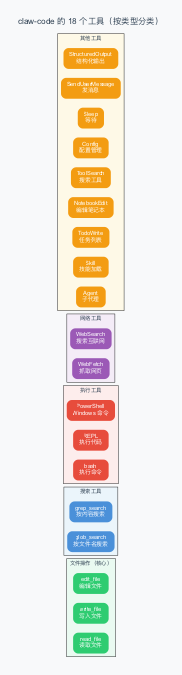
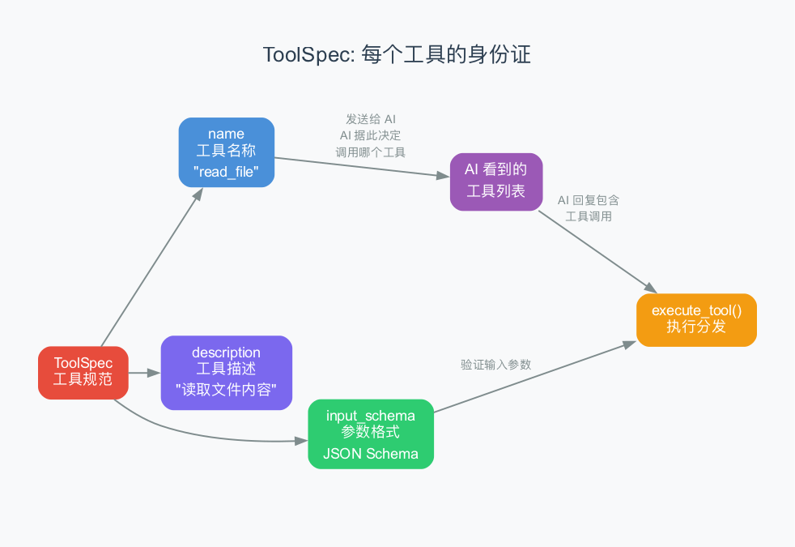
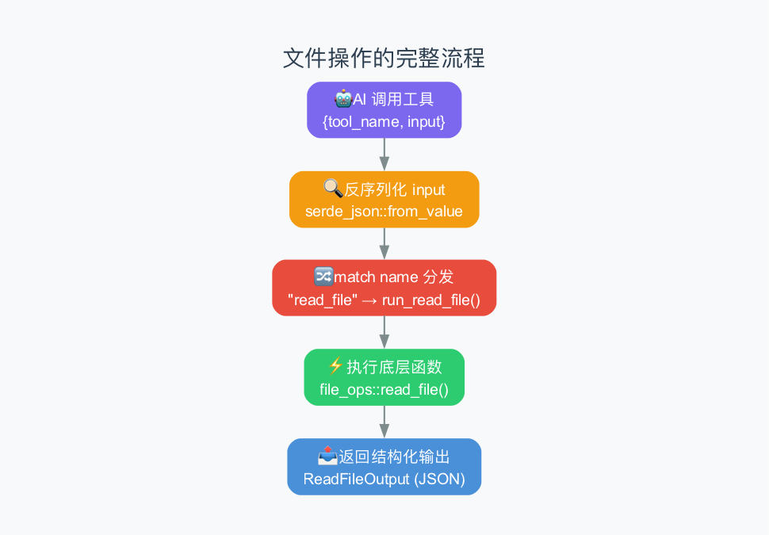

# 第5章：工具系统 —— AI 的"双手"是怎么设计的

> **本章目标**：理解 Agent 是怎么定义工具、执行工具、管理工具的。上一章我们看到 Agent Loop 是中 AI 谳调用工具，这一章我们深入看工具本身——它们是什么、怎么被定义的、怎么被执行的。
>
> **难度**：⭐⭐⭐ 中级
> 
> **对应源码**：`rust/crates/tools/src/lib.rs`、 `rust/crates/runtime/src/file_ops.rs`

---

## 5.1 从上一章到这一章：工具是什么？

上一章我们讲了 Agent Loop。在循环的每一步， AI 可能决定"调用工具"——比如读取文件、编辑代码、执行命令。但这一章我们就来看：这些"工具"到底是什么。

你可能已经在用 Claude Code 时注意到了一些关键词：`Read`、 `Write`、 `Edit`、 `Bash`、 `Glob`、 `Grep`。 这些就是 Agent 的"双手"——它通过这些工具，AI 才能"看见"文件、"修改"文件、"执行命令"。

> 把工具理解为"给 AI 的遥控器"——就像你给机器人装上了机械臂，AI 想要拿起一个杯子，就调用"抓手"工具；想要走路，就调用"轮子"工具。每个工具就是一种特定的"能力"。

---

## 5.2 claw-code 有多少个工具？

claw-code 的 `mvp_tool_specs()` 函数定义了 **18 个工具**。听起来很多，但大多数都是我们日常生活中会用到的几种：



### 核心工具（最常用）

| 工具 | 比喻 | 功能 |
|------|------|------|
| **bash** | 执行命令 | 执行终端命令，如 `npm install`、`git status` |
| **read_file** | 知识阅读 | 读取文件内容（可指定行范围） |
| **write_file** | 写下文字 | 创建或覆盖文件 |
| **edit_file** | 空格修改 | 替换文件中的指定文字 |

> 这 5 个核心工具覆盖了 90% 的日常使用场景。AI 最常用的操作就是"读文件 → 攃改 → 再读取"。

### 搜索工具

| 工具 | 比喻 | 功能 |
|------|------|------|
| **glob_search** | 查找文件 | 按文件名模式搜索，如 `**/*.py` |
| **grep_search** | 查找内容 | 按正则表达式搜索文件内容 |

> **glob 和 grep** 是两个经典的 Linux 命令。claw-code 用 Rust 库重新实现了它们，而不是调用系统命令。这样更快、更可控。

### 执行工具

| 工具 | 功能 |
|------|------|
| **REPL** | 执行 Python/JS/Shell 代码片段 |
| **PowerShell** | Windows 上的命令执行（使用 `pwsh` 或 `powershell`） |

> **REPL** 支持三种语言：Python（`python3 -c`）、JavaScript（`node -e`）、Shell（`bash -lc`）。它会自动检测系统上安装了哪个解释器。

### 癯络工具

| 工具 | 功能 |
|------|------|
| **WebFetch** | 抓取网页内容，转换为可读文本 |
| **WebSearch** | 搜索互联网（默认用 DuckDuckGo） |

> **WebFetch** 会自动把 HTML 转成纯文本，它还能识别图片、提取标题。**WebSearch** 默认使用 DuckDuckGo 的 HTML 接口搜索，不需要 API key。

### 辅助工具

| 工具 | 功能 |
|------|------|
| **Agent** | 启动子代理（subagent），执行特定任务 |
| **Skill** | 加载技能定义（SKILL.md 文件） |
| **ToolSearch** | 搜索延迟加载的工具 |
| **TodoWrite** | 管理 todo 任务列表 |
| **NotebookEdit** | 编辑 Jupyter Notebook 单元格 |
| **Config** | 读取/修改 Claude Code 设置 |
| **Sleep** | 等待指定毫秒数 |
| **SendUserMessage** | 向用户发送消息（带附件） |
| **StructuredOutput** | 返回结构化数据 |

> **Agent** 工具特别有趣——它允许 AI 启动一个"子代理"来并行处理任务。子代理有自己的 system prompt 和独立的循环，结果会保存到磁盘上的 `.md` 和 `.json` 文件中。这是 Agent 系统实现"多代理协作"的基础。

---

## 5.3 工具是怎么定义的？—— ToolSpec 三要素

每个工具都有一个"身份证"，叫 **ToolSpec**（工具规范）。它包含三个要素：



```rust
pub struct ToolSpec {
    pub name: &'static str,          // 工具名称
    pub description: &'static str,    // 工具描述
    pub input_schema: Value,         // 参数格式（JSON Schema）
}
```

> **JSON Schema**：一种描述 JSON 数据格式的方式。它告诉你"这个字段是什么类型、是否必填、取值范围是什么"。就像填表时的"格式说明"。

举个例子，`read_file` 的 ToolSpec 长这样：

```rust
ToolSpec {
    name: "read_file",
    description: "Read a text file from the workspace.",
    input_schema: json!({
        "type": "object",
        "properties": {
            "path": { "type": "string" },           // 文件路径
            "offset": { "type": "integer", "minimum": 0 },  // 起始行号
            "limit": { "type": "integer", "minimum": 1 }    // 读取行数
        },
        "required": ["path"],                    // path 是必填的
        "additionalProperties": false            // 不允许额外的字段
    }),
}
```

这三个要素组合起来，就告诉 AI："有一个叫 `read_file` 的工具，它可以读取文件。你需要提供 `path`（必填），可以选填 `offset` 和 `limit`。"

> **AI 怎么用这些信息？** 当 AI 收到工具列表时，它就知道有哪些工具可用。当它决定调用某个工具时，它会按照 `input_schema` 的格式生成参数。`additionalProperties: false` 焏味着 AI 不能传额外的参数——这是一种"类型安全"的保障。

---

## 5.4 工具是怎么被执行的？—— 从调用到结果

当 AI 决定调用一个工具时，数据流是这样的：



### 第一步：反序列化输入

AI 传来的 `input` 是一个 JSON 字符串。代码首先用 `serde_json::from_value` 把它转成 Rust 结构体：

```rust
// AI 传来: {"path": "main.py", "offset": 0, "limit": 50}
// 转成 Rust 结构体:
struct ReadFileInput {
    path: String,
    offset: Option<usize>,
    limit: Option<usize>,
}
```

> **serde（序列化框架）**：Rust 生态中最常用的 JSON 处理库。`from_value` 把 JSON 转成 Rust 结构体，`to_string_pretty` 把结构体转回 JSON。就像 Python 里的 `json.loads()` 和 `json.dumps()`。

### 第二步：按名称分发

代码用 `match` 语句（Rust 的模式匹配）来决定调用哪个函数：

```rust
pub fn execute_tool(name: &str, input: &Value) -> Result<String, String> {
    match name {
        "bash" => from_value::<BashCommandInput>(input).and_then(run_bash),
        "read_file" => from_value::<ReadFileInput>(input).and_then(run_read_file),
        "write_file" => from_value::<WriteFileInput>(input).and_then(run_write_file),
        "edit_file" => from_value::<EditFileInput>(input).and_then(run_edit_file),
        "glob_search" => from_value::<GlobSearchInputValue>(input).and_then(run_glob_search),
        "grep_search" => from_value::<GrepSearchInput>(input).and_then(run_grep_search),
        // ... 其他 12 个工具
        _ => Err(format!("unsupported tool: {name}")),
    }
}
```

> **为什么用 `match` 而不用 `HashMap`？** 这是 claw-code 的刻意设计。`match` 语句在编译时会检查所有分支是否完整——如果你添加了新工具但忘了加 `match` 分支，编译器就会报错。这比运行时才发现问题要安全得多。18 个工具用 `match` 刚刚好，但如果工具数量膨胀到上百个，可能需要换用 HashMap。

### 第三步：执行底层函数

每个 `run_*` 函数调用 `runtime` crate 里的底层实现。比如 `run_read_file`：

```rust
fn run_read_file(input: ReadFileInput) -> Result<String, String> {
    to_pretty_json(read_file(&input.path, input.offset, input.limit)
        .map_err(io_to_string)?)
}
```

> 这里有一个分层设计：`tools` crate 负责工具定义和分发，`runtime` crate 负责底层实现。这样做的好处是"定义"和"实现"分离——你可以在不修改底层代码的情况下添加新工具。

### 第四步：返回结果

所有工具的输出都会被转成 JSON 字符串：

```rust
fn to_pretty_json<T: serde::Serialize>(value: T) -> Result<String, String> {
    serde_json::to_string_pretty(&value).map_err(|error| error.to_string())
}
```

> 工具的返回值也是 JSON——这样 AI 就能理解结果。比如 `read_file` 返回的是 `ReadFileOutput` 结构体的 JSON，包含文件内容、行号、总行数等信息。

---

## 5.5 深入看 Bash 工具的实现

Bash 工具是 Agent 最强大也最危险的工具——它让 AI 能执行任何终端命令。让我们看看它在 claw-code 的 `bash.rs` 中是怎么实现的。

### 输入参数

```rust
pub struct BashCommandInput {
    pub command: String,                    // 要执行的命令
    pub timeout: Option<u64>,              // 超时时间（毫秒）
    pub run_in_background: Option<bool>,   // 是否后台运行
    pub dangerously_disable_sandbox: Option<bool>,  // 是否禁用沙箱
}
```

> **`dangerously_disable_sandbox`** 这个字段名本身就是一个警告——它在告诉你"这是危险操作"。真实 Claude Code 中，沙箱限制了 AI 可以访问的文件系统范围。

### 执行流程

```rust
pub async fn execute_bash(input: BashCommandInput) -> io::Result<BashCommandOutput> {
    let mut command = Command::new("bash");
    command.arg("-lc").arg(&input.command);

    // 后台模式：不等待完成，立即返回
    if input.run_in_background == Some(true) {
        command.stdin(Stdio::null())
               .stdout(Stdio::null())
               .stderr(Stdio::null());
        let _ = command.spawn()?;
        return Ok(BashCommandOutput { ... });
    }

    // 前台模式：执行并等待，带超时
    let timeout = Duration::from_millis(input.timeout.unwrap_or(120_000));
    let result = tokio::time::timeout(timeout, async {
        let output = Command::new("bash")
            .arg("-lc").arg(&input.command)
            .output().await?;
        Ok(output)
    }).await;
}
```

### 三种执行模式

| 模式 | 触发条件 | 行为 |
|------|---------|------|
| **前台** | 默认 | 执行命令，等待完成，返回 stdout/stderr |
| **超时** | 设了 timeout | 执行命令，超过时间就 kill 进程 |
| **后台** | `run_in_background: true` | 启动后立即返回，不等待结果 |

> 前台模式对应你在 Claude Code 中最常见的场景——AI 执行 `npm install`、`git status` 等命令。后台模式用于长时间运行的任务——比如启动一个开发服务器。你可以在后台运行一个 `npm start`，然后 AI 继续做其他事情。

### 输出结构

```rust
pub struct BashCommandOutput {
    pub stdout: String,                        // 标准输出
    pub stderr: String,                        // 标准错误
    pub interrupted: bool,                     // 是否被中断（超时）
    pub return_code_interpretation: String,    // 返回码解释："success" / "failure"
}
```

> `return_code_interpretation` 字段是给 AI 看的——AI 不需要知道 "exit code 1" 是什么意思，只需要知道"执行失败了"。

---

## 5.6 深入看四个核心文件操作

文件操作是 Agent 最基础的能力。让我们看看它们在 `file_ops.rs` 中是怎么实现的。

### read_file：读取文件

```rust
pub fn read_file(
    path: &str,
    offset: Option<usize>,   // 从第几行开始读
    limit: Option<usize>,     // 读几行
) -> io::Result<ReadFileOutput> {
    let absolute_path = normalize_path(path)?;  // 转成绝对路径
    let content = fs::read_to_string(&absolute_path)?;  // 读取全部内容
    let lines: Vec<&str> = content.lines().collect();  // 按行分割

    let start_index = offset.unwrap_or(0).min(lines.len());
    let end_index = limit.map_or(lines.len(), |limit| {
        start_index.saturating_add(limit).min(lines.len())
    });

    let selected = lines[start_index..end_index].join("\n");  // 截取需要的行

    Ok(ReadFileOutput {
        kind: String::from("text"),
        file: TextFilePayload {
            file_path: absolute_path.to_string_lossy().into_owned(),
            content: selected,
            num_lines: end_index - start_index,
            start_line: start_index + 1,  // 行号从 1 开始
            total_lines: lines.len(),
        },
    })
}
```

这个函数的逻辑很直观：
1. 把路径转成绝对路径
2. 读取整个文件
3. 按行分割
4. 根据 `offset` 和 `limit` 截取需要的行
5. 返回结构化结果

> **`offset` 和 `limit` 的设计**：为什么不直接读整个文件？因为有些文件很大（几千行）。如果 AI 只需要看第 100-150 行，发送整个文件会浪费大量 token。所以 claw-code 支持分页读取。

### write_file：写入文件

```rust
pub fn write_file(path: &str, content: &str) -> io::Result<WriteFileOutput> {
    let absolute_path = normalize_path_allow_missing(path)?;
    let original_file = fs::read_to_string(&absolute_path).ok();  // 尝试读取原文件

    if let Some(parent) = absolute_path.parent() {
        fs::create_dir_all(parent)?;  // 自动创建父目录
    }
    fs::write(&absolute_path, content)?;  // 写入新内容

    Ok(WriteFileOutput {
        kind: if original_file.is_some() { "update" } else { "create" },
        file_path: ...,
        content: ...,
        structured_patch: make_patch(original_file..., content),  // 生成 diff
        original_file,  // 保存原始内容
        git_diff: None,
    })
}
```

> 写入文件时，代码会自动创建父目录（如果不存在），并生成一个"补丁"（patch），显示修改前后的差异。这让 AI 能看到自己改了什么。

### edit_file：编辑文件

```rust
pub fn edit_file(
    path: &str,
    old_string: &str,    // 要替换的旧文字
    new_string: &str,    // 替换成的新文字
    replace_all: bool,    // 是否替换所有匹配
) -> io::Result<EditFileOutput> {
    let absolute_path = normalize_path(path)?;
    let original_file = fs::read_to_string(&absolute_path)?;

    // 安全检查
    if old_string == new_string {
        return Err(...);  // 旧内容和新内容不能一样
    }
    if !original_file.contains(old_string) {
        return Err(...);  // 旧内容必须存在于文件中
    }

    let updated = if replace_all {
        original_file.replace(old_string, new_string)  // 替换所有
    } else {
        original_file.replacen(old_string, new_string, 1)  // 只替换第一个
    };
    fs::write(&absolute_path, &updated)?;

    Ok(EditFileOutput { ... })
}
```

> **edit_file 是 AI 最常用的工具之一**。它的工作方式很巧妙：AI 不需要知道行号，只需要指定"把这段旧文字替换成这段新文字"。这比传统的"第N行到第M行替换"方式更自然。如果 `old_string` 在文件中出现多次，默认只替换第一次，除非设了 `replace_all: true`。

---

## 5.7 搜索工具：glob 和 grep

### glob_search：按文件名搜索

```rust
pub fn glob_search(pattern: &str, path: Option<&str>) -> io::Result<GlobSearchOutput> {
    // ... 搜索文件 ...
    let truncated = matches.len() > 100;  // 最多返回 100 个文件
    let filenames = matches.into_iter().take(100).collect();
    Ok(GlobSearchOutput {
        duration_ms: started.elapsed().as_millis(),  // 记录耗时
        num_files: filenames.len(),
        filenames,
        truncated,  // 是否被截断
    })
}
```

> **glob 模式**：一种文件名匹配语法。比如 `**/*.py` 表示"所有子目录下的 .py 文件"， `src/**/*.rs` 表示"src 目录下所有 .rs 文件"。这是程序员查找文件的标准方式。

### grep_search：按内容搜索

```rust
pub fn grep_search(input: &GrepSearchInput) -> io::Result<GrepSearchOutput> {
    // 支持三种输出模式：
    // "files_with_matches" → 只返回文件名（默认）
    // "content" → 返回匹配的行内容
    // "count" → 返回匹配次数

    // 支持的过滤选项：
    // glob: 按文件名过滤（如 "*.rs"）
    // type: 按扩展名过滤（如 "py"）
    // -i: 忽略大小写
    // -B/-A/-C: 上下文行数
}
```

> **grep**（全局正则表达式打印）：Linux 上最经典的文本搜索工具。claw-code 用 Rust 的 `regex` 库重新实现了它，支持正则表达式、大小写忽略、上下文行等高级功能。

---

## 5.8 简单模式：只暴露 3 个工具

claw-code 支持一种"简单模式"（simple mode），只暴露 3 个最基本的工具：

```python
if simple_mode:
    tools = [tool for tool in tools if tool.name in {'BashTool', 'FileReadTool', 'FileEditTool'}]
```

为什么要这样做？因为在某些受限环境中，你可能不希望 AI 有太多能力——比如只允许它执行命令、读文件和编辑文件，不允许它访问网络或启动子代理。

> 这就像给新员工只配基础权限：可以看文件、可以改文件、可以执行命令。高级功能（上网搜索、启动子代理）需要更多权限。

---

## 5.9 工具系统的设计模式

### 模式一：规范与实现分离

`tools` crate 定义工具规范（ToolSpec），`runtime` crate 实现底层逻辑。这样添加新工具时只需要在两个地方改：加一个 ToolSpec、加一个 match 分支。

### 模式二：静态匹配分发

使用 `match` 语句而非 HashMap，获得编译时完整性检查。

### 模式三：JSON Schema 约束

工具的输入输出都用 JSON Schema 描述，AI 和代码共享同一份"接口契约"。

### 模式四：结构化输出

所有工具返回结构化的 JSON 输出，而非纯文本。这让 AI 能精确理解结果。

> 这四种模式组合在一起，形成了一个**安全、可扩展、类型安全**的工具系统。添加新工具只需要 3 步：定义 ToolSpec、实现 run_* 函数、在 match 中加一行。

---

## 5.10 和其他 Agent 框架的对比

| 特性 | claw-code | LangChain | OpenCode |
|------|----------|-----------|----------|
| 工具数量 | 18 个（内置） | 无限制（自建） | ~15 个 |
| 定义方式 | ToolSpec + JSON Schema | Python 函数 + 装饰器 | Go 接口 |
| 分发方式 | 静态 match | 动态注册 | 接口实现 |
| 文件操作 | 原生 Rust 实现 | Python 调用系统命令 | Go 实现 |
| 网络工具 | 内置（DuckDuckGo） | 需要插件 | 内置 |
| 子代理 | Agent 工具 | 需要自己实现 | 无 |
| 类型安全 | 编译时检查 | 运行时检查 | 编译时检查 |

> **claw-code 的优势**：工具系统是最完善的。18 个工具覆盖了几乎所有场景，而且每个工具都有完善的参数验证和错误处理。

---

## 5.11 本章小结

### 核心概念

| 概念 | 解释 |
|------|------|
| **ToolSpec** | 工具的"身份证"，包含名称、描述和参数格式 |
| **JSON Schema** | 描述 JSON 数据格式的标准，用于定义工具参数 |
| **match 分发** | 用 Rust 的模式匹配来决定调用哪个工具函数 |
| **serde** | Rust 的序列化框架，用于 JSON 和结构体之间的转换 |
| **simple mode** | 只暴露 3 个基础工具的受限模式 |

### 18 个工具速查

| 工具 | 类别 | 功能 |
|------|------|------|
| bash | 核心 | 执行终端命令 |
| read_file | 核心 | 读取文件 |
| write_file | 核心 | 写入文件 |
| edit_file | 核心 | 编辑文件（替换文字） |
| glob_search | 搜索 | 按文件名搜索 |
| grep_search | 搜索 | 按内容搜索 |
| WebFetch | 网络 | 抓取网页 |
| WebSearch | 网络 | 搜索互联网 |
| REPL | 执行 | 执行代码片段 |
| PowerShell | 执行 | Windows 命令 |
| Agent | 辅助 | 启动子代理 |
| Skill | 辅助 | 加载技能 |
| ToolSearch | 辅助 | 搜索工具 |
| TodoWrite | 辅助 | 管理任务 |
| NotebookEdit | 辅助 | 编辑笔记本 |
| Config | 辅助 | 管理配置 |
| Sleep | 辅助 | 等待 |
| SendUserMessage | 辅助 | 发送消息 |
| StructuredOutput | 辅助 | 结构化输出 |

### 术语速查

| 术语 | 解释 |
|------|------|
| **glob** | 文件名匹配模式，如 `**/*.py` |
| **grep** | 文本内容搜索工具 |
| **JSON Schema** | 描述 JSON 格式的标准 |
| **serde** | Rust 的序列化/反序列化框架 |
| **match** | Rust 的模式匹配语法 |
| **ToolSpec** | 工具规范（名称+描述+参数格式） |
| **diff / patch** | 文件修改的差异对比 |

---

> **下一章**：[第6章：消息模型](06-message-model.md) —— 消息在 Agent 内部是怎么表示的？`ConversationMessage`、`ContentBlock` 这些数据结构长什么样？为什么说"消息模型"是整个系统的基石？
