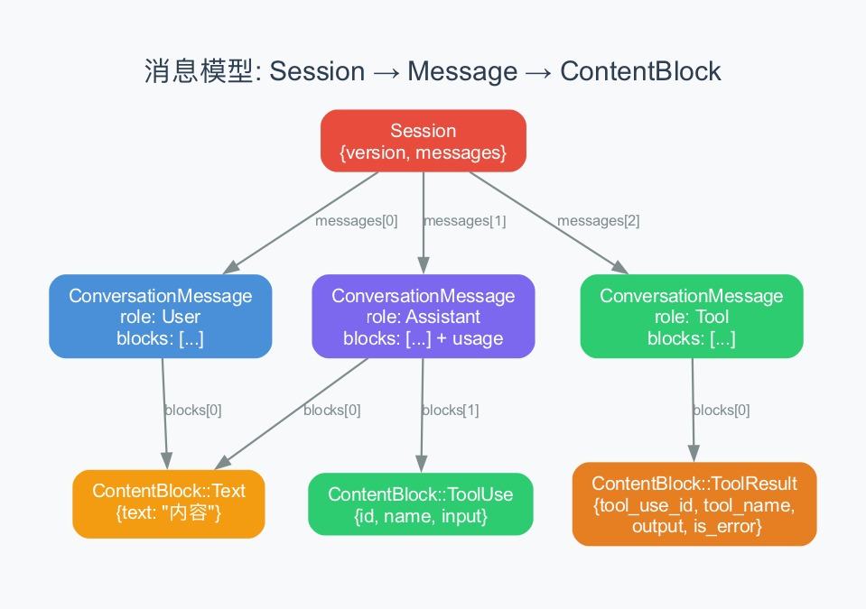
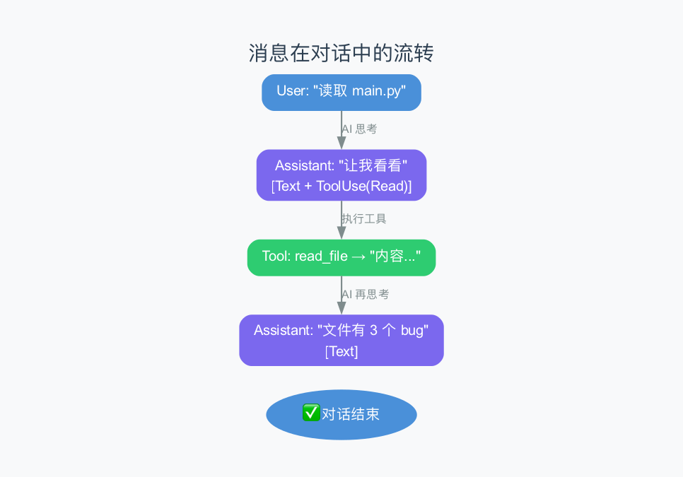
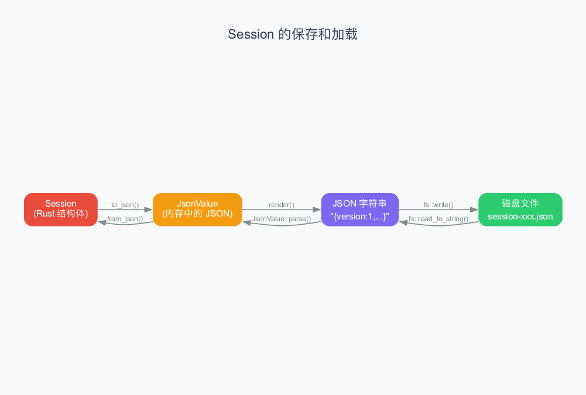

# 第6章：消息模型 —— Agent 内部的"快递系统"

> **本章目标**：理解 Agent 内部的消息是怎么组织的。在前几章中，我们多次提到了"聊天记录"、"AI 的回复"、"工具结果"——这些数据到底长什么样？它们是怎么被存储、传输、和还原的？理解消息模型是理解整个 Agent 系统的基石。
>
> **难度**：⭐⭐⭐ 中级
>
> **对应源码**：`rust/crates/runtime/src/session.rs`

---

## 6.1 为什么需要消息模型？

想象一个快递系统：你有寄件人、收件人、包裹内容。快递公司需要知道——这个包裹是谁寄的？寄给谁？里面装的是什么？

Agent 的消息模型也是一样的道理。在一次对话中，有"你说的"、"AI 说的"、"工具返回的结果"——系统需要清晰地标记每条消息是谁发的、内容是什么。

> 如果没有统一的消息模型，AI 就不知道哪些内容是"工具返回的结果"，哪些是"用户的指令"。消息模型就是 Agent 内部的"快递标签系统"。

---

## 6.2 三个核心概念：Session、Message、ContentBlock

claw-code 的消息模型有三层结构，就像俄罗斯套娃：



### 第一层：Session（会话）

Session 是最外层的容器，代表一次完整的对话。

```rust
pub struct Session {
    pub version: u32,                        // 版本号（目前固定为 1）
    pub messages: Vec<ConversationMessage>,  // 所有消息的列表
}
```

> **Session** 就像一个"聊天窗口"——它包含了你和 AI 之间的所有对话。当你打开 Claude Code 时，就会创建一个新的 Session；当你关闭再打开时，它会加载之前保存的 Session。

### 第二层：ConversationMessage（对话消息）

每条消息都有一个"角色"和若干"内容块"。

```rust
pub struct ConversationMessage {
    pub role: MessageRole,               // 这条消息是谁说的
    pub blocks: Vec<ContentBlock>,       // 具体内容（可能有多个块）
    pub usage: Option<TokenUsage>,       // Token 用量（仅 AI 消息有）
}
```

角色有四种：

| 角色 | 含义 | 举例 |
|------|------|------|
| **System** | 系统消息 | 对话压缩后的摘要（第10章详讲） |
| **User** | 用户消息 | 你说的话 |
| **Assistant** | AI 消息 | AI 的回复（可能包含文字+工具调用） |
| **Tool** | 工具消息 | 工具执行的结果 |

> **为什么需要四种角色？** 因为 Anthropic 的 Messages API 要求每条消息都有明确的角色标记。这样 AI 才能区分"这是我说的"、"这是用户说的"、"这是工具返回的结果"。

### 第三层：ContentBlock（内容块）

每条消息可以包含多个内容块。有三种类型：

```rust
pub enum ContentBlock {
    Text {
        text: String,                          // 纯文字
    },
    ToolUse {
        id: String,                            // 工具调用的唯一 ID
        name: String,                          // 工具名称
        input: String,                         // 输入参数（JSON 字符串）
    },
    ToolResult {
        tool_use_id: String,                   // 对应的 ToolUse ID
        tool_name: String,                     // 工具名称
        output: String,                        // 执行结果
        is_error: bool,                        // 是否是错误
    },
}
```

> **为什么一条消息可以有多个内容块？** 因为 AI 的回复经常是"文字 + 工具调用"混合的。比如 AI 说"让我先看看文件内容"，同时调用 Read 工具——这就需要两个内容块：一个 Text、一个 ToolUse。

---

## 6.3 消息在对话中是怎么流转的？

让我们用一个真实的例子来理解消息模型。



你输入"读取 main.py"，以下消息会依次出现在 Session 中：

### 消息 1：用户消息

```json
{
  "role": "user",
  "blocks": [
    { "type": "text", "text": "读取 main.py" }
  ]
}
```

这是一条简单的用户消息——只有一个 Text 块。

### 消息 2：AI 的回复（包含工具调用）

```json
{
  "role": "assistant",
  "blocks": [
    { "type": "text", "text": "让我先看看文件内容" },
    { "type": "tool_use", "id": "tool-1", "name": "read_file", "input": "{\"path\":\"main.py\"}" }
  ],
  "usage": { "input_tokens": 150, "output_tokens": 30, ... }
}
```

AI 先说了句话（Text 块），然后决定读取文件（ToolUse 块）。两个块在一条消息里。

> 注意 `id: "tool-1"`——这是工具调用的唯一标识。后面工具返回结果时，会通过这个 ID 关联到这次调用。

### 消息 3：工具结果

```json
{
  "role": "tool",
  "blocks": [
    {
      "type": "tool_result",
      "tool_use_id": "tool-1",
      "tool_name": "read_file",
      "output": "{\"kind\":\"text\",\"file\":{\"content\":\"print('hello')\\nprint('world')\",...}}",
      "is_error": false
    }
  ]
}
```

工具执行后，结果被包装成一条 Tool 角色的消息。`tool_use_id` 对应消息 2 中的 `tool-1`，`is_error: false` 表示执行成功。

### 消息 4：AI 的最终回答

```json
{
  "role": "assistant",
  "blocks": [
    { "type": "text", "text": "文件内容如上，包含两行代码。" }
  ],
  "usage": { ... }
}
```

AI 看到工具结果后，给出了最终回答。这次没有 ToolUse 块，所以循环结束。

> **消息之间的关联链**：消息 2 的 ToolUse 有 `id: "tool-1"` → 消息 3 的 ToolResult 有 `tool_use_id: "tool-1"`。通过这个 ID，系统知道"这次工具调用"对应"那次工具结果"。

---

## 6.4 消息是怎么创建的？

claw-code 为每种消息类型提供了便捷的构造函数：

### 用户消息

```rust
ConversationMessage::user_text("帮我把 print 换成 logging")
```

自动创建一个 `role: User`、包含一个 Text 块的消息。

### AI 消息

```rust
ConversationMessage::assistant_with_usage(blocks, usage)
```

AI 消息通常由 `build_assistant_message()` 函数（上一章讲的）创建。`blocks` 是从事件流拼装出来的内容块列表。

### 工具结果消息

```rust
ConversationMessage::tool_result("tool-1", "read_file", "文件内容...", false)
```

参数依次是：工具调用 ID、工具名、输出结果、是否是错误。

> 这三个构造函数覆盖了 Agent Loop 中所有需要创建消息的场景。代码中不会手动构造 `ConversationMessage`——总是通过这些函数，确保数据格式一致。

---

## 6.5 Session 的保存和加载

Session 需要被保存到磁盘上，这样下次启动时可以恢复之前的对话。



### 保存流程

```rust
pub fn save_to_path(&self, path: impl AsRef<Path>) -> Result<(), SessionError> {
    fs::write(path, self.to_json().render())?;
    Ok(())
}
```

三步走：
1. `to_json()` — 把 Session 转成 JsonValue（内存中的 JSON 树）
2. `render()` — 把 JsonValue 转成 JSON 字符串
3. `fs::write()` — 写入磁盘文件

### 加载流程

```rust
pub fn load_from_path(path: impl AsRef<Path>) -> Result<Self, SessionError> {
    let contents = fs::read_to_string(path)?;
    Self::from_json(&JsonValue::parse(&contents)?)
}
```

也是三步走，反方向：
1. `fs::read_to_string()` — 从磁盘读取 JSON 字符串
2. `JsonValue::parse()` — 解析成 JSON 树
3. `from_json()` — 转成 Session 结构体

> **为什么不用 serde_json？** claw-code 实现了自己的简易 JSON 解析器（`json.rs`），而不是用 Rust 生态中最流行的 `serde_json`。这样做的原因可能是教学目的——让学习者理解 JSON 解析的原理，同时也减少外部依赖。

### 自制 JSON 解析器揭秘

claw-code 的 `json.rs` 实现了一个完整的递归下降 JSON 解析器。它由两个核心部分组成：

**1. JsonValue 枚举（数据表示）：**

```rust
pub enum JsonValue {
    Null,                           // null
    Bool(bool),                     // true / false
    Number(i64),                    // 整数（注意：只支持整数，不支持浮点数）
    String(String),                 // 字符串
    Array(Vec<JsonValue>),          // 数组
    Object(BTreeMap<String, JsonValue>),  // 对象（有序映射）
}
```

> 只支持 `i64` 整数——这意味着不能表示 `3.14` 这样的浮点数。对于 Session 文件来说足够了，因为消息中不需要浮点数。

**2. Parser 结构体（递归下降解析器）：**

```rust
struct Parser<'a> {
    chars: Vec<char>,    // 源字符串拆成字符数组
    index: usize,        // 当前解析位置（"光标"）
}

impl<'a> Parser<'a> {
    fn parse_value(&mut self) -> Result<JsonValue, JsonError> {
        match self.peek() {
            Some('n') => self.parse_literal("null", JsonValue::Null),
            Some('t') => self.parse_literal("true", JsonValue::Bool(true)),
            Some('f') => self.parse_literal("false", JsonValue::Bool(false)),
            Some('"') => self.parse_string(),
            Some('[') => self.parse_array(),
            Some('{') => self.parse_object(),
            Some('-' | '0'..='9') => self.parse_number(),
            _ => Err(JsonError::new("unexpected character")),
        }
    }
}
```

> **递归下降（Recursive Descent）**：一种解析技术——每种语法结构有自己的解析函数。`parse_value` 看到第一个字符后决定调用哪个子函数：看到 `{` 调用 `parse_object`，看到 `[` 调用 `parse_array`，以此类推。这就像一个调度员——根据"信封上的标记"把信分给不同的部门处理。

**3. 序列化（render）：**

```rust
impl JsonValue {
    pub fn render(&self) -> String {
        match self {
            Self::Null => "null".to_string(),
            Self::Bool(value) => value.to_string(),
            Self::Number(value) => value.to_string(),
            Self::String(value) => render_string(value),   // 处理转义字符
            Self::Array(values) => format!("[{}]", values.iter().map(Self::render).join(",")),
            Self::Object(entries) => format!("{{{}}}", entries.iter().map(...).join(",")),
        }
    }
}
```

> `render()` 是 `parse()` 的逆操作——把 `JsonValue` 树转回 JSON 字符串。注意 `render_string()` 函数会处理特殊字符的转义：换行变 `\n`、引号变 `\"`、控制字符变 `\uXXXX`。

### 保存后的 JSON 长什么样？

```json
{
  "version": 1,
  "messages": [
    {
      "role": "user",
      "blocks": [{ "type": "text", "text": "hello" }]
    },
    {
      "role": "assistant",
      "blocks": [
        { "type": "text", "text": "thinking" },
        { "type": "tool_use", "id": "tool-1", "name": "bash", "input": "echo hi" }
      ],
      "usage": {
        "input_tokens": 10,
        "output_tokens": 4,
        "cache_creation_input_tokens": 1,
        "cache_read_input_tokens": 2
      }
    },
    {
      "role": "tool",
      "blocks": [{
        "type": "tool_result",
        "tool_use_id": "tool-1",
        "tool_name": "bash",
        "output": "hi",
        "is_error": false
      }]
    }
  ]
}
```

> 这个 JSON 文件就是你在磁盘上的"对话存档"。下次打开 Claude Code 时，它会读取这个文件，恢复之前的所有对话。

---

## 6.6 和 Anthropic API 的对应关系

claw-code 的消息模型直接映射到 Anthropic 的 Messages API 格式。这意味着从 Session 转成 API 请求只需要简单的映射：

| claw-code | Anthropic API | 说明 |
|-----------|---------------|------|
| `MessageRole::User` | `{ "role": "user" }` | 用户消息 |
| `MessageRole::Assistant` | `{ "role": "assistant" }` | AI 消息 |
| `ContentBlock::Text` | `{ "type": "text", "text": "..." }` | 文字块 |
| `ContentBlock::ToolUse` | `{ "type": "tool_use", ... }` | 工具调用 |
| `ContentBlock::ToolResult` | `{ "type": "tool_result", ... }` | 工具结果 |

> 这种直接映射不是巧合，而是刻意的设计。claw-code 的消息模型就是 Anthropic API 格式的 Rust 版本——序列化成 JSON 后，可以直接作为 API 请求的一部分发送。这避免了复杂的格式转换。

---

## 6.7 消息模型的设计哲学

### 哲学一：一条消息可以有多个内容块

这是最重要的设计决策。AI 的回复不是"要么是文字，要么是工具调用"，而是"可以同时包含两者"。

```
AI 回复:
  Text("让我先看看文件")     ← 告诉用户它在做什么
  ToolUse("read_file", ...)  ← 实际去做
```

### 哲学二：工具调用和结果通过 ID 关联

```
消息 2: ToolUse { id: "tool-1", ... }
消息 3: ToolResult { tool_use_id: "tool-1", ... }
                              ↑ 通过 ID 关联
```

### 哲学三：Token 用量附着在 AI 消息上

只有 `Assistant` 角色的消息才携带 `usage` 字段。这是因为只有 AI 的每次推理才有 token 消耗。

### 哲学四：错误不是异常，而是数据

工具执行失败不会抛异常，而是返回一条 `is_error: true` 的 ToolResult。这让 AI 能看到错误信息并自行处理。

> 这四种哲学组合在一起，形成了一个**灵活但严格**的消息系统：灵活在于一条消息可以包含多种内容，严格在于每种内容都有明确的类型和字段。

---

## 6.8 通用知识：其他框架的消息模型

| 框架 | 消息模型 | 特点 |
|------|---------|------|
| **claw-code** | Session → Message → ContentBlock | 三层嵌套，直接映射 API |
| **LangChain** | ChatMessage(role, content) | 简单扁平，工具结果存在 `content` 里 |
| **OpenAI** | ChatMessage + Function Call | 工具调用和消息分开 |
| **AutoGPT** | 自定义 JSON | 格式不统一 |

> **claw-code 的消息模型是最规范的**——它完全遵循 Anthropic API 的格式，同时又用 Rust 的类型系统确保数据安全。

---

## 6.9 本章小结

### 核心概念

| 概念 | 解释 |
|------|------|
| **Session** | 一次完整的对话，包含所有消息 |
| **ConversationMessage** | 一条消息，有角色和内容块 |
| **MessageRole** | 四种角色：System、User、Assistant、Tool |
| **ContentBlock** | 三种内容：Text、ToolUse、ToolResult |
| **tool_use_id** | 工具调用和结果之间的关联 ID |

### 消息流转规则

| 步骤 | 创建的消息 | 角色 |
|------|-----------|------|
| 用户输入 | user_text(input) | User |
| AI 回复（含工具调用） | assistant_with_usage(blocks, usage) | Assistant |
| 工具执行结果 | tool_result(id, name, output, is_error) | Tool |

### 术语速查

| 术语 | 解释 |
|------|------|
| **Session** | 一次完整的对话会话 |
| **序列化** | 把内存中的数据转成可存储的格式（如 JSON） |
| **反序列化** | 把存储的格式转回内存中的数据 |
| **ContentBlock** | 消息中的内容块（文字、工具调用、工具结果） |
| **tool_use_id** | 工具调用的唯一标识，用于关联调用和结果 |

---

> **下一章**：[第7章：权限系统](07-permission-system.md) —— AI 想做的每件事都需要"许可"吗？权限系统是怎么设计的？Allow、Deny、Prompt 三种模式有什么区别？
