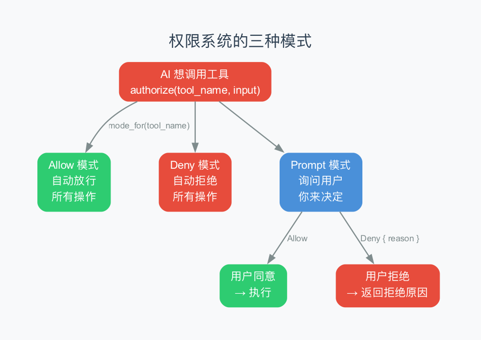
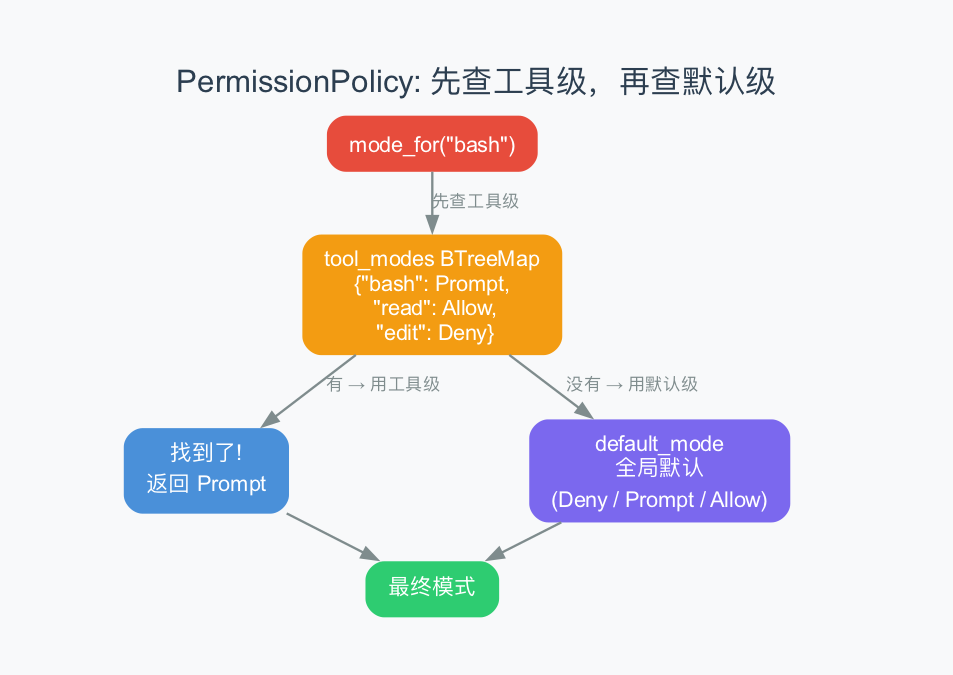
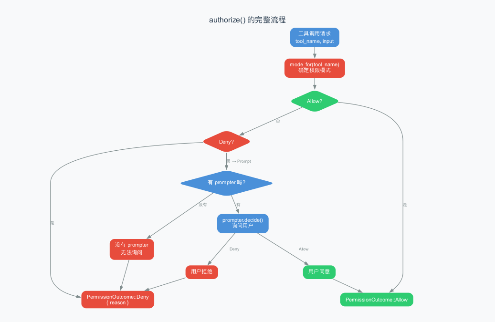

# 第7章：权限系统 —— AI 的"门卫"是怎么工作的

> **本章目标**：理解 Agent 的权限系统——为什么 AI 不能随便执行任何操作？Allow、Deny、Prompt 三种模式有什么区别？权限策略是怎么分层配置的？
>
> **难度**：⭐⭐⭐ 中级
>
> **对应源码**：`rust/crates/runtime/src/permissions.rs`

---

## 7.1 从上一章到这一章：为什么需要权限系统？

上一章我们讲了消息模型——Agent 内部的"快递系统"。在 Agent Loop 中，每当 AI 决定调用一个工具，系统就会创建一条 ToolResult 消息。但在创建这条消息之前，有一个关键的步骤：**权限检查**。

你可能已经注意到了：当你用 Claude Code 时，AI 想执行某些操作（比如 `rm -rf`），终端会弹出一个确认提示，问你"允许这样做吗？"。这就是权限系统在工作。

> **权限系统的核心问题**：AI 很聪明，但它不是你。它可能：
> - 执行 `rm -rf /`（删除所有文件）
> - 读取 `/etc/shadow`（查看密码文件）
> - 向外发送网络请求（泄露代码）
>
> 权限系统就是"门卫"——在 AI 动手之前，先检查"这个操作是否被允许"。

---

## 7.2 三种权限模式

claw-code 的权限系统有三种模式：



### Allow（自动允许）

AI 想做的所有操作都会被自动批准，不需要任何确认。

```
AI: "我要读取 main.py"
门卫: Allow → "去吧"
```

> **什么时候用 Allow？** 当你完全信任 AI 的操作时。比如在 CI/CD 流水线中、或者在受控的测试环境中。但**不建议在日常使用中设为 Allow**——AI 可能会做出你意想不到的操作。

### Deny（自动拒绝）

AI 想做的所有操作都会被自动拒绝。

```
AI: "我要执行 bash 命令"
门卫: Deny → "不行"
```

> **什么时候用 Deny？** 当你想完全禁止某个工具时。比如禁止 AI 执行 bash 命令、或者禁止它访问网络。这是最严格的模式。

### Prompt（询问用户）

AI 想做操作时，会弹出一个提示让你决定。

```
AI: "我要执行 bash 命令"
门卫: Prompt → "主人，AI 想执行 bash 命令，你允许吗？"
你: "允许" → 执行
你: "拒绝" → 不执行，AI 收到拒绝原因
```

> **Prompt 是默认且最常用的模式。** 它在安全和便利之间取得了平衡——你不会被自动执行的命令吓到，也不会因为每个读文件操作都需要确认而烦恼。

---

## 7.3 源码解读：PermissionPolicy

权限系统的核心是 `PermissionPolicy`（权限策略）结构体：

```rust
pub struct PermissionPolicy {
    default_mode: PermissionMode,              // 默认模式
    tool_modes: BTreeMap<String, PermissionMode>,  // 按工具覆盖
}
```

> **BTreeMap**：Rust 中的有序映射表，类似 Python 的 dict。它按 key 排序存储，查找速度是 O(log n)。

### 创建策略

```rust
// 默认全部拒绝
let policy = PermissionPolicy::new(PermissionMode::Deny);

// 默认拒绝，但 bash 允许用户确认
let policy = PermissionPolicy::new(PermissionMode::Deny)
    .with_tool_mode("bash", PermissionMode::Prompt);

// 默认全部允许，但危险操作需要确认
let policy = PermissionPolicy::new(PermissionMode::Allow)
    .with_tool_mode("bash", PermissionMode::Prompt)
    .with_tool_mode("edit_file", PermissionMode::Prompt);
```

> **建造者模式（Builder Pattern）**：`.with_tool_mode()` 返回一个新的策略对象，这样你可以链式调用。这种模式在 Rust 中非常常见，让代码读起来像自然语言。

### 查找权限模式

```rust
pub fn mode_for(&self, tool_name: &str) -> PermissionMode {
    self.tool_modes
        .get(tool_name)                  // 先查工具级配置
        .copied()
        .unwrap_or(self.default_mode)    // 没找到就用默认配置
}
```



这段代码的逻辑是：
1. 先在 `tool_modes` 里找有没有这个工具的特殊配置
2. 找到了就用工具级配置
3. 没找到就用全局默认配置

> 这是一种"特殊优先于一般"的设计——默认规则适用于所有工具，但你可以为特定工具设置不同的规则。

---

## 7.4 源码解读：authorize() 的完整流程

`authorize()` 是权限检查的入口函数。让我们逐段看：



```rust
pub fn authorize(
    &self,
    tool_name: &str,           // 工具名
    input: &str,               // 输入参数
    mut prompter: Option<&mut dyn PermissionPrompter>,  // 提示器（可能没有）
) -> PermissionOutcome {
    match self.mode_for(tool_name) {
        // 情况一：Allow → 直接放行
        PermissionMode::Allow => PermissionOutcome::Allow,

        // 情况二：Deny → 直接拒绝
        PermissionMode::Deny => PermissionOutcome::Deny {
            reason: format!("tool '{tool_name}' denied by permission policy"),
        },

        // 情况三：Prompt → 需要询问用户
        PermissionMode::Prompt => match prompter.as_mut() {
            // 有 prompter → 询问用户
            Some(prompter) => match prompter.decide(&PermissionRequest {
                tool_name: tool_name.to_string(),
                input: input.to_string(),
            }) {
                PermissionPromptDecision::Allow => PermissionOutcome::Allow,
                PermissionPromptDecision::Deny { reason } => PermissionOutcome::Deny { reason },
            },
            // 没有 prompter → 无法询问，只能拒绝
            None => PermissionOutcome::Deny {
                reason: format!("tool '{tool_name}' requires interactive approval"),
            },
        },
    }
}
```

> **`dyn PermissionPrompter`**：Rust 的动态分发（trait object）。它表示"任何实现了 PermissionPrompter 接口的类型"。在终端模式下，prompter 是一个弹出确认提示的组件；在测试中，它是一个预设好回答的假组件。

### 四种可能的路径

| 模式 | 有 prompter？ | 用户回答 | 结果 |
|------|-------------|---------|------|
| Allow | 不重要 | 不重要 | 放行 |
| Deny | 不重要 | 不重要 | 拒绝 |
| Prompt | 有 | 同意 | 放行 |
| Prompt | 有 | 拒绝 | 拒绝（附带原因） |
| Prompt | 没有 | — | 拒绝（"需要交互式确认"） |

> 最后一种情况（Prompt + 没有 prompter）常出现在非交互式模式下——比如 CI/CD 流水线中，没有终端可以弹出提示，所以只能拒绝。

---

## 7.5 PermissionPrompter：谁来问你"允许吗"？

`PermissionPrompter` 是一个接口（trait），定义了"怎么问用户"：

```rust
pub trait PermissionPrompter {
    fn decide(&mut self, request: &PermissionRequest) -> PermissionPromptDecision;
}
```

在真实环境中，它的实现会：
1. 在终端显示"AI 想执行 `bash echo hi`，允许吗？"
2. 等待你输入 y/n
3. 返回 Allow 或 Deny

在测试中，它可以预设好回答：

```rust
struct AllowPrompter;
impl PermissionPrompter for AllowPrompter {
    fn decide(&mut self, request: &PermissionRequest) -> PermissionPromptDecision {
        // 测试中自动允许所有请求
        PermissionPromptDecision::Allow
    }
}
```

> **依赖注入（Dependency Injection）**：`authorize()` 不直接处理用户输入，而是通过 `prompter` 参数来询问。这样测试时可以注入假的 prompter，生产时注入真的终端 prompter。这种设计模式让代码更灵活、更易测试。

---

## 7.6 实际使用：权限系统在 Agent Loop 中的位置

回顾第4章的 Agent Loop，权限检查在第6-7步之间：

```
循环：
    ① 组装请求，发给 AI
    ② 收到 AI 回复
    ③ 提取工具调用
    ④ ★ 权限检查 ← 就在这里！
    ⑤ 执行工具（如果允许）
    ⑥ 追加结果到聊天记录
    ⑦ 继续循环或退出
```

具体代码：

```rust
for (tool_use_id, tool_name, input) in pending_tool_uses {
    // 权限检查
    let permission_outcome = if let Some(prompt) = prompter.as_mut() {
        self.permission_policy.authorize(&tool_name, &input, Some(*prompt))
    } else {
        self.permission_policy.authorize(&tool_name, &input, None)
    };

    // 根据权限结果决定下一步
    let result_message = match permission_outcome {
        PermissionOutcome::Allow => {
            // 允许 → 执行工具
            match self.tool_executor.execute(&tool_name, &input) {
                Ok(output) => ConversationMessage::tool_result(..., false),
                Err(error) => ConversationMessage::tool_result(..., true),
            }
        }
        PermissionOutcome::Deny { reason } => {
            // 拒绝 → 返回拒绝原因
            ConversationMessage::tool_result(..., true)
        }
    };
}
```

> 注意：即使权限被拒绝，循环也不会停止。AI 会收到"你被拒绝了"的消息，然后它可能会换一种方式完成任务。比如，AI 想用 bash 删除文件被拒绝了，它可能会改用 edit_file 来清空文件内容。

---

## 7.7 Claude Code 中的三层权限模式

Claude Code 实际使用的是一个**三模式系统**，而非简单的 Allow/Deny/Prompt。在 claw-code 的 `main.rs` 中，`permission_policy()` 函数揭示了真实实现：

```rust
fn permission_policy(mode: &str) -> PermissionPolicy {
    if normalize_permission_mode(mode) == Some("read-only") {
        // 模式一：只读模式
        PermissionPolicy::new(PermissionMode::Deny)          // 默认拒绝所有
            .with_tool_mode("read_file", PermissionMode::Allow)     // 但允许读文件
            .with_tool_mode("glob_search", PermissionMode::Allow)   // 允许搜索文件名
            .with_tool_mode("grep_search", PermissionMode::Allow)   // 允许搜索文件内容
    } else {
        // 模式二：工作区写入模式 & 模式三：完全访问模式
        PermissionPolicy::new(PermissionMode::Allow)         // 默认允许所有
    }
}
```

> 源码揭示了三种模式，通过环境变量 `RUSTY_CLAUDE_PERMISSION_MODE` 控制：

### 模式一：read-only（只读）

```
默认：Deny（拒绝所有写操作）
例外：read_file ✅ / glob_search ✅ / grep_search ✅
```

只读模式是最安全的——AI 只能"看"，不能"改"。适合以下场景：
- 代码审查（AI 只需要读代码）
- 文档生成（AI 不需要修改任何文件）
- 安全审计（严格限制 AI 的操作范围）

### 模式二：workspace-write（工作区写入，默认）

```
默认：Allow（允许所有操作）
适用：读写文件、执行命令、网络访问……全部允许
```

这是默认模式——AI 可以执行所有操作，不需要确认。适合日常开发场景。

> 你可能会惊讶："这不就是完全信任 AI 吗？" 是的。在生产环境的 Claude Code 中，默认模式实际上需要用户在终端中确认每个操作。claw-code 的实现做了简化——把"交互确认"简化为"自动允许"。

### 模式三：danger-full-access（完全访问）

```
默认：Allow（和 workspace-write 相同）
区别：语义上表示"我知道风险，我完全信任 AI"
```

在 claw-code 的简化实现中，workspace-write 和 danger-full-access 的行为相同。但在真实的 Claude Code 中，danger-full-access 会绕过一些额外的安全检查（如沙箱限制）。

### 三种模式的对比

| 模式 | 默认策略 | 读文件 | 写文件 | 执行命令 | 适用场景 |
|------|---------|--------|--------|---------|---------|
| **read-only** | Deny | ✅ | ❌ | ❌ | 代码审查、安全审计 |
| **workspace-write** | Allow | ✅ | ✅ | ✅ | 日常开发（默认） |
| **danger-full-access** | Allow | ✅ | ✅ | ✅ | CI/CD、自动化流程 |

### 切换模式

在 REPL 中通过 `/permissions` 命令切换：

```
› /permissions read-only          # 切换到只读模式
Permissions updated
  Result           mode switched
  Previous mode    workspace-write
  Active mode      read-only

› /permissions                     # 查看当前模式
Permissions
  Active mode      read-only
  Modes
    read-only          ● current   Read/search tools only
    workspace-write    ○ available Edit files inside the workspace
    danger-full-access ○ available Unrestricted tool access
```

> 注意切换模式时，Agent 会**重新构建 ConversationRuntime**——这意味着权限变更会立即生效，不需要重启。

```rust
fn set_permissions(&mut self, mode: Option<String>) -> Result<...> {
    let normalized = normalize_permission_mode(&mode)?;
    // 重新构建 runtime，使用新的权限策略
    self.runtime = build_runtime_with_permission_mode(
        session,
        self.model.clone(),
        self.system_prompt.clone(),
        true,
        self.allowed_tools.clone(),
        normalized,  // 新的权限模式
    )?;
}
```

---

## 7.8 通用知识：其他 Agent 的权限设计

| 框架 | 权限模型 | 特点 |
|------|---------|------|
| **claw-code** | Allow/Deny/Prompt 三模式 | 简洁，支持按工具覆盖 |
| **Claude Code** | 多级权限 + 用户确认 | 最精细 |
| **Cursor** | 内置规则 + 用户确认 | IDE 集成 |
| **LangChain** | 无内置权限 | 需要自己实现 |
| **Aider** | 自动确认 | 信任度最高 |
| **AutoGPT** | 自动确认 | 无权限限制 |

> **LangChain 没有内置权限系统**——这是一个重要的区别。在 LangChain 中，AI 可以执行任何操作而不需要确认。这在快速原型开发时很方便，但在生产环境中是安全隐患。

---

## 7.9 本章小结

### 核心概念

| 概念 | 解释 |
|------|------|
| **PermissionMode** | 三种模式：Allow、Deny、Prompt |
| **PermissionPolicy** | 权限策略，包含默认模式 + 按工具覆盖 |
| **PermissionPrompter** | 询问用户的接口（可替换） |
| **PermissionOutcome** | 检查结果：Allow 或 Deny { reason } |
| **authorize()** | 权限检查的入口函数 |

### 权限检查流程

```
查找工具级配置 → 找到 → 用工具级模式
                → 没找到 → 用默认模式

模式判断：
  Allow → 直接放行
  Deny → 直接拒绝
  Prompt → 有 prompter？→ 询问用户
                       → 没有 → 拒绝
```

### 术语速查

| 术语 | 解释 |
|------|------|
| **BTreeMap** | Rust 的有序映射表 |
| **Builder Pattern** | 链式调用创建对象的模式 |
| **Dependency Injection** | 通过参数注入依赖的设计模式 |
| **trait object（dyn）** | Rust 的动态分发 |
| **最小权限原则** | 只给最小的必要权限 |

---

> **下一章**：[第8章：启动流程](08-bootstrap.md) —— 从你输入 `claude` 到出现提示符，Agent 内部经历了哪些阶段？12 个 Bootstrap 阶段分别做了什么？
