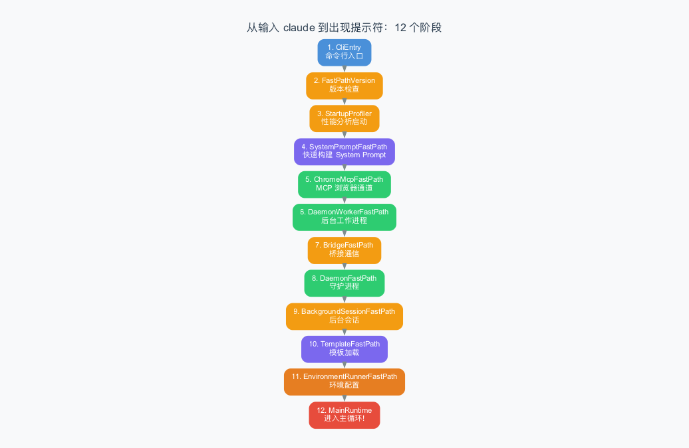
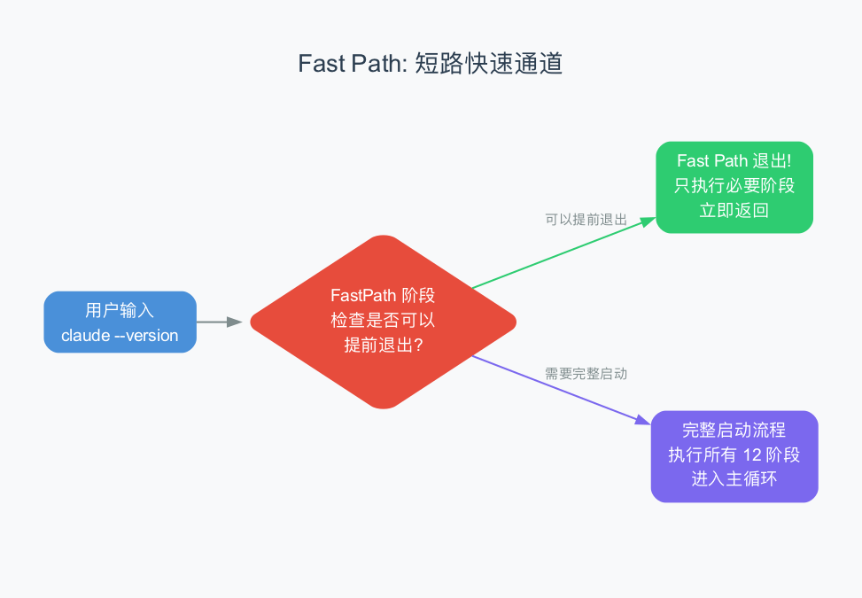

# 第8章：启动流程 —— 从 `claude` 到提示符的 12 个阶段

> **本章目标**：理解当你输入 `claude` 命令后，系统内部经历了哪些阶段才最终出现提示符。这 12 个阶段是 Agent 系统的"启动仪式"——每个阶段都有明确的职责，而且有一个巧妙的设计叫 "Fast Path"。
>
> **难度**：⭐⭐⭐⭐ 中高级
>
> **对应源码**：`rust/crates/runtime/src/bootstrap.rs`

---

## 8.1 从上一章到这一章：启动流程是什么？

前几章我们讲了 Agent Loop、工具系统、消息模型、权限系统——这些都是 Agent 运行时的核心组件。但有一个问题：这些组件是怎么被初始化的？

当你打开终端，输入 `claude`，按回车——从这一刻到出现 `>` 提示符，中间发生了什么？这个过程就是**启动流程（Bootstrap）**。

> 比喻：启动流程就像开一家餐厅。你不能直接开门营业——你需要先检查食材（版本检查）、打开水电（环境配置）、培训员工（加载 System Prompt）、设置安全规则（权限配置）……每一步都有顺序，不能乱。

---

## 8.2 12 个 Bootstrap 阶段

claw-code 定义了 12 个启动阶段，每个阶段用 `BootstrapPhase` 枚举表示：

```rust
pub enum BootstrapPhase {
    CliEntry,                    // 1. 命令行入口
    FastPathVersion,             // 2. 快速版本检查
    StartupProfiler,             // 3. 性能分析启动
    SystemPromptFastPath,        // 4. System Prompt 快速构建
    ChromeMcpFastPath,           // 5. Chrome MCP 快速通道
    DaemonWorkerFastPath,        // 6. 后台工作进程
    BridgeFastPath,              // 7. 桥接通信
    DaemonFastPath,              // 8. 守护进程
    BackgroundSessionFastPath,   // 9. 后台会话
    TemplateFastPath,            // 10. 模板加载
    EnvironmentRunnerFastPath,   // 11. 环境配置运行
    MainRuntime,                 // 12. 进入主循环
}
```



让我们逐一看看每个阶段做了什么：

### 阶段 1：CliEntry（命令行入口）

这是起点——当你输入 `claude` 时，操作系统会执行 CLI 二进制文件的 `main()` 函数。

```
用户: claude
  ↓
CliEntry: 解析命令行参数、设置日志、初始化基础配置
```

> CLI（Command Line Interface）是"命令行界面"的缩写。`CliEntry` 就是命令行的入口点——它负责解析你输入的参数（如 `--version`、`--model` 等）。

在 claw-code 的 `main.rs` 中，`CliEntry` 实际做了两件事：

```rust
fn main() {
    if let Err(error) = run() {
        eprintln!("error: {error}\n\nRun `rusty-claude-cli --help` for usage.");
        std::process::exit(1);
    }
}

fn run() -> Result<(), Box<dyn std::error::Error>> {
    let args: Vec<String> = env::args().skip(1).collect();
    match parse_args(&args)? {
        CliAction::Version => print_version(),
        CliAction::Repl { model, allowed_tools } => run_repl(model, allowed_tools)?,
        CliAction::Prompt { prompt, model, .. } =>
            LiveCli::new(model, false, allowed_tools)?.run_turn_with_output(&prompt, ...),
        // ... 更多分支
    }
    Ok(())
}
```

> 注意 `run()` 的返回值是 `Result`——这是 Rust 的错误处理惯用写法。如果任何阶段出错，错误会"冒泡"到 `main()`，打印错误信息后以退出码 1 退出。

### 阶段 2：FastPathVersion（版本检查）

如果你输入的是 `claude --version`，系统不需要完整启动——只需要打印版本号就退出。这就是"Fast Path"（快速通道）。

```
用户: claude --version
  ↓
FastPathVersion: 打印 "claude 1.0.0" → 直接退出
```

> "Fast Path" 是启动流程中最巧妙的设计——不是每次都需要走完所有 12 个阶段。如果用户只是查看版本号，在第 2 阶段就可以提前退出。

在源码中，`parse_args()` 函数解析命令行参数后直接返回 `CliAction::Version`：

```rust
fn parse_args(args: &[String]) -> Result<CliAction, String> {
    // ...
    if wants_version {
        return Ok(CliAction::Version);  // 提前返回，不继续解析
    }
    // ...
}
```

### 阶段 3：StartupProfiler（性能分析启动）

启动性能分析器，记录每个阶段的耗时。这在调试启动速度时非常有用。

```
StartupProfiler: 开始计时...
  阶段 1: 5ms
  阶段 2: 2ms
  阶段 3: 1ms
  ...
```

> **为什么关心启动速度？** 用户体验。如果一个工具启动需要 10 秒，用户会很沮丧。Claude Code 的目标是在 1-2 秒内完成启动。性能分析器帮助开发者找到启动过程中的瓶颈。

### 阶段 4：SystemPromptFastPath（System Prompt 快速构建）

构建 System Prompt（第 3 章讲过的）。这个阶段会加载 CLAUDE.md 文件、构建动态部分。

> 这是启动过程中较重的阶段之一——因为需要扫描文件系统查找 CLAUDE.md 文件。

在源码中，这一步调用 `build_system_prompt()`：

```rust
fn build_system_prompt() -> Result<Vec<String>, Box<dyn std::error::Error>> {
    Ok(load_system_prompt(
        env::current_dir()?,     // 当前工作目录
        DEFAULT_DATE,             // 日期（用于注入到 prompt 中）
        env::consts::OS,          // 操作系统类型
        "unknown",                // shell 类型
    )?)
}
```

### 阶段 5-9：各种 Fast Path

这几个阶段检查是否有特殊的运行模式：

| 阶段 | 含义 | 何时触发 |
|------|------|---------|
| ChromeMcpFastPath | Chrome 浏览器 MCP 通道 | 需要浏览器集成时 |
| DaemonWorkerFastPath | 后台工作进程 | 后台任务模式 |
| BridgeFastPath | 桥接通信 | IDE 集成模式 |
| DaemonFastPath | 守护进程 | 长期运行的守护进程模式 |
| BackgroundSessionFastPath | 后台会话 | 恢复之前的后台会话 |

> 这些 Fast Path 是为不同使用场景设计的。比如，在 VS Code 插件中，Claude Code 可能以 Bridge 模式启动；在 CI/CD 中，它可能以 Daemon 模式启动。

### 阶段 10：TemplateFastPath（模板加载）

加载工具模板——即 `mvp_tool_specs()` 定义的 18 个工具规范。在源码中这一步是 `filter_tool_specs()` 函数，它会根据 `--allowedTools` 参数过滤可用工具：

```rust
fn filter_tool_specs(allowed_tools: Option<&AllowedToolSet>) -> Vec<tools::ToolSpec> {
    mvp_tool_specs()
        .into_iter()
        .filter(|spec| allowed_tools.is_none_or(|allowed| allowed.contains(spec.name)))
        .collect()
}
```

> 如果你通过 `--allowedTools read,glob` 指定了只允许特定工具，系统就只加载这些工具的规范。这是一种**安全收敛**——工具越少，AI 的能力越受限。

### 阶段 11：EnvironmentRunnerFastPath（环境配置）

运行环境配置脚本，设置必要的环境变量。在源码中，这一步涉及 `ConfigLoader` 加载配置文件：

```rust
let config = ConfigLoader::default_for(&cwd).load()?;
// 从以下位置查找配置文件：
// ~/.claude/settings.json (用户级)
// .claude/settings.json   (项目级)
// .claude/settings.local.json (本地级)
```

### 阶段 12：MainRuntime（进入主循环）

终于！所有准备工作完成，进入主循环——等待用户输入，执行 Agent Loop。

```
MainRuntime: 一切就绪，显示提示符 ">"
```

在源码中，这一步创建了 `ConversationRuntime` 并进入 REPL 循环：

```rust
fn run_repl(model: String, allowed_tools: Option<AllowedToolSet>) -> Result<(), Box<dyn std::error::Error>> {
    let mut cli = LiveCli::new(model, true, allowed_tools)?;
    let editor = input::LineEditor::new("› ");    // 显示提示符
    println!("{}", cli.startup_banner());           // 打印欢迎信息

    while let Some(input) = editor.read_line()? {   // 等待用户输入
        let trimmed = input.trim();
        if trimmed.is_empty() { continue; }
        if matches!(trimmed, "/exit" | "/quit") { break; }
        if let Some(command) = SlashCommand::parse(trimmed) {
            cli.handle_repl_command(command)?;       // 处理斜杠命令
            continue;
        }
        cli.run_turn(trimmed)?;                     // 执行 Agent Loop
    }
    Ok(())
}
```

---

## 8.3 CLI 参数解析：从命令行到动作分发

Bootstrap 阶段 1 的核心是**参数解析**——把用户输入的命令行参数翻译成内部动作。claw-code 用 `CliAction` 枚举来表示所有可能的动作：

```rust
enum CliAction {
    DumpManifests,                              // 调试：打印命令/工具清单
    BootstrapPlan,                              // 调试：打印启动计划
    PrintSystemPrompt { cwd, date },            // 调试：打印 System Prompt
    Version,                                    // 打印版本号
    ResumeSession { session_path, commands },   // 恢复会话
    Prompt { prompt, model, output_format, allowed_tools },  // 单次提示
    Login,                                      // OAuth 登录
    Logout,                                     // OAuth 登出
    Repl { model, allowed_tools },              // 交互模式（默认）
    Help,                                       // 打印帮助
}
```

> 这个枚举有 10 个变体——意味着 `claude` 命令有 10 种不同的行为。其中最常用的是 `Repl`（交互模式）和 `Prompt`（单次执行）。

参数解析用手工编写的 `parse_args()` 函数（不用 `clap` 等第三方库），逐个处理参数：

```rust
fn parse_args(args: &[String]) -> Result<CliAction, String> {
    let mut model = DEFAULT_MODEL.to_string();        // "claude-sonnet-4-20250514"
    let mut output_format = CliOutputFormat::Text;
    let mut wants_version = false;
    let mut allowed_tool_values = Vec::new();
    let mut rest = Vec::new();

    while index < args.len() {
        match args[index].as_str() {
            "--version" | "-V" => { wants_version = true; index += 1; }
            "--model" => { model = args[index + 1].clone(); index += 2; }
            "--output-format" => { /* ... */ }
            "--allowedTools" => { /* 收集允许的工具名 */ }
            other => { rest.push(other.to_string()); index += 1; }
        }
    }

    // 优先级：Version > Help > Repl > Prompt
    if wants_version { return Ok(CliAction::Version); }
    if rest.is_empty() { return Ok(CliAction::Repl { model, allowed_tools }); }
    if rest[0] == "--help" { return Ok(CliAction::Help); }
    // ...
}
```

> **解析优先级很重要**：`--version` 总是第一个检查，这样即使你输入 `claude --version --model opus`，也会只打印版本号。

解析完成后，`run()` 函数用 `match` 把动作分发到对应的处理函数：

```rust
fn run() -> Result<(), Box<dyn std::error::Error>> {
    match parse_args(&args)? {
        CliAction::Version => print_version(),
        CliAction::Repl { model, allowed_tools } => run_repl(model, allowed_tools)?,
        CliAction::Prompt { prompt, model, .. } =>
            LiveCli::new(model, false, allowed_tools)?
                .run_turn_with_output(&prompt, output_format)?,
        CliAction::ResumeSession { session_path, commands } =>
            resume_session(&session_path, &commands),
        CliAction::Login => run_login()?,
        // ... 其他动作
    }
    Ok(())
}
```

> **这就是 Bootstrap 的"命令分发器"**——它决定了程序做什么。注意 `CliAction::Repl` 和 `CliAction::Prompt` 都会创建 `LiveCli`，区别在于 `Repl` 进入交互循环，`Prompt` 执行一次就退出。

---

## 8.4 LiveCli 初始化：把所有组件组装起来

`LiveCli` 是交互模式下的"总管"——它持有 Agent 运行所需的所有组件：

```rust
struct LiveCli {
    model: String,                    // 当前模型
    allowed_tools: Option<AllowedToolSet>,  // 允许的工具集
    system_prompt: Vec<String>,       // System Prompt
    runtime: ConversationRuntime<AnthropicRuntimeClient, CliToolExecutor>,
    session: SessionHandle,           // 会话文件路径
}
```

它的 `new()` 方法展示了完整的初始化流程：

```rust
impl LiveCli {
    fn new(model: String, enable_tools: bool, allowed_tools: Option<AllowedToolSet>)
        -> Result<Self, Box<dyn std::error::Error>>
    {
        // 1. 构建 System Prompt（阶段 4）
        let system_prompt = build_system_prompt()?;

        // 2. 创建会话文件句柄（阶段 9）
        let session = create_managed_session_handle()?;

        // 3. 构建 ConversationRuntime（阶段 12）
        let runtime = build_runtime(
            Session::new(),                 // 空 Session
            model.clone(),
            system_prompt.clone(),
            enable_tools,
            allowed_tools.clone(),
        )?;

        let cli = Self { model, allowed_tools, system_prompt, runtime, session };
        cli.persist_session()?;   // 保存初始 Session 到磁盘
        Ok(cli)
    }
}
```

### build_runtime()：创建 Agent 核心

`build_runtime()` 是最关键的函数——它把所有组件组装成 `ConversationRuntime`：

```rust
fn build_runtime(session, model, system_prompt, enable_tools, allowed_tools)
    -> Result<ConversationRuntime<...>, ...>
{
    Ok(ConversationRuntime::new(
        session,                                    // 会话（保存聊天记录）
        AnthropicRuntimeClient::new(model, ...)?,   // API 客户端（和 AI 通信）
        CliToolExecutor::new(allowed_tools),        // 工具执行器
        permission_policy(permission_mode),         // 权限策略
        system_prompt,                              // System Prompt
    ))
}
```

这 5 个参数恰好对应了我们在第 4-7 章学到的核心组件：

| 参数 | 对应章节 | 作用 |
|------|---------|------|
| `session` | 第 6/9 章 | 聊天记录 |
| `AnthropicRuntimeClient` | 第 4 章 | API 客户端 |
| `CliToolExecutor` | 第 5 章 | 工具执行器 |
| `permission_policy` | 第 7 章 | 权限策略 |
| `system_prompt` | 第 3 章 | System Prompt |

### Session 文件在哪里？

`create_managed_session_handle()` 创建一个唯一的会话文件：

```rust
fn create_managed_session_handle() -> Result<SessionHandle, Box<dyn std::error::Error>> {
    let id = generate_session_id();    // "session-{毫秒时间戳}"
    let path = sessions_dir()?.join(format!("{id}.json"));  // .claude/sessions/session-xxx.json
    Ok(SessionHandle { id, path })
}

fn sessions_dir() -> Result<PathBuf, ...> {
    let cwd = env::current_dir()?;
    let path = cwd.join(".claude").join("sessions");
    fs::create_dir_all(&path)?;    // 自动创建目录
    Ok(path)
}
```

> 会话文件保存在当前工作目录的 `.claude/sessions/` 下。每次启动都会生成一个新的 `session-{timestamp}.json` 文件。

---

## 8.5 Fast Path 设计：不是每次都要走完



"Fast Path" 是 Bootstrap 中最重要的设计理念。它的核心思想是：

> **不是每个命令都需要完整的启动流程。** 如果用户只是查看版本号、或者只是执行一个简单的命令，为什么要加载 System Prompt、初始化权限系统、启动 MCP 服务呢？

### Fast Path 的工作方式

每个 "Fast Path" 阶段都会检查：

1. 当前的运行模式是什么？
2. 是否可以在这一步提前退出？

如果可以提前退出，就直接返回结果，不再执行后续阶段。

```
输入: claude --version
  阶段 1 (CliEntry): 解析参数 → 发现是 --version
  阶段 2 (FastPathVersion): 打印版本号 → 直接退出!
  
  阶段 3-12: 根本不会执行
```

```
输入: claude "帮我写个函数"
  阶段 1: 解析参数 → 正常模式
  阶段 2: 不是 --version → 继续
  阶段 3: 启动性能分析
  阶段 4: 构建 System Prompt
  ...
  阶段 12: 进入主循环 → 执行 Agent Loop
```

> 这种设计让简单操作（查看版本、打印帮助）几乎瞬间完成，而复杂的交互操作才会走完完整的启动流程。

---

## 8.6 BootstrapPlan：启动计划的代码表示

claw-code 用 `BootstrapPlan` 结构体来表示启动计划：

```rust
pub struct BootstrapPlan {
    phases: Vec<BootstrapPhase>,  // 阶段列表（有序）
}
```

### 默认启动计划

```rust
BootstrapPlan::claude_code_default()
```

返回包含全部 12 个阶段的默认计划。

### 自定义启动计划

```rust
BootstrapPlan::from_phases(vec![
    BootstrapPhase::CliEntry,
    BootstrapPhase::FastPathVersion,
    BootstrapPhase::MainRuntime,
])
```

你可以只包含需要的阶段——比如测试时只需要最少的阶段。

### 自动去重

```rust
pub fn from_phases(phases: Vec<BootstrapPhase>) -> Self {
    let mut deduped = Vec::new();
    for phase in phases {
        if !deduped.contains(&phase) {
            deduped.push(phase);
        }
    }
    Self { phases: deduped }
}
```

如果你不小心重复添加了某个阶段，它会自动去重。这防止了同一个阶段被执行两次。

> **去重用的是线性扫描而非 HashSet**——因为只有 12 个阶段，线性扫描的性能完全足够，而且保持了阶段的顺序。

---

## 8.7 API 客户端初始化：认证与流式通信

在 `LiveCli::new()` 中，`AnthropicRuntimeClient` 的创建是一个值得深入看的过程。它要解决两个问题：**认证**和**流式通信**。

### 认证解析

```rust
fn resolve_cli_auth_source() -> Result<AuthSource, Box<dyn std::error::Error>> {
    // 优先级 1：环境变量中的 API Key
    match AuthSource::from_env() {
        Ok(auth) => Ok(auth),
        Err(api::ApiError::MissingApiKey) => {
            // 优先级 2：OAuth 令牌
            let config = ConfigLoader::default_for(&cwd).load()?;
            if let Some(oauth) = config.oauth() {
                if let Some(token_set) = resolve_saved_oauth_token(oauth)? {
                    return Ok(AuthSource::from(token_set));
                }
            }
            // 优先级 3：回退到其他认证方式
            Ok(AuthSource::from_env_or_saved()?)
        }
        Err(error) => Err(Box::new(error)),
    }
}
```

认证有三种来源，按优先级排列：

| 优先级 | 来源 | 场景 |
|--------|------|------|
| 1 | `ANTHROPIC_API_KEY` 环境变量 | 开发者自备 API key |
| 2 | OAuth 令牌（`login` 命令获取） | 通过 `claude login` 登录 |
| 3 | 其他存储的凭据 | 各种回退机制 |

> 这就是 `claude login` 命令的意义——它通过 OAuth 流程获取令牌并保存到本地。之后每次启动就不需要 API key 了。

### 流式 SSE 通信

`AnthropicRuntimeClient` 实现了 `ApiClient` trait 的 `stream()` 方法，处理 6 种 SSE 事件类型：

```rust
fn stream(&mut self, request: ApiRequest) -> Result<Vec<AssistantEvent>, RuntimeError> {
    self.runtime.block_on(async {
        let mut stream = self.client.stream_message(&message_request).await?;

        while let Some(event) = stream.next_event().await? {
            match event {
                // 事件 1：消息开始（可能包含初始内容块）
                ApiStreamEvent::MessageStart(start) => {
                    for block in start.message.content {
                        push_output_block(block, &mut stdout, &mut events, &mut pending_tool)?;
                    }
                }
                // 事件 2：新内容块开始（如工具调用的开始）
                ApiStreamEvent::ContentBlockStart(start) => {
                    push_output_block(start.content_block, ...)?;
                }
                // 事件 3：内容增量（文字片段或 JSON 片段）
                ApiStreamEvent::ContentBlockDelta(delta) => match delta.delta {
                    TextDelta { text } => {
                        write!(stdout, "{text}")?;      // 实时输出到终端
                        events.push(AssistantEvent::TextDelta(text));
                    }
                    InputJsonDelta { partial_json } => {
                        // 工具调用参数是一点一点传来的，拼接到缓冲区
                        if let Some((_, _, input)) = &mut pending_tool {
                            input.push_str(&partial_json);
                        }
                    }
                },
                // 事件 4：内容块结束（工具调用完成）
                ApiStreamEvent::ContentBlockStop(_) => {
                    if let Some((id, name, input)) = pending_tool.take() {
                        events.push(AssistantEvent::ToolUse { id, name, input });
                    }
                }
                // 事件 5：消息级别的增量（Token 用量）
                ApiStreamEvent::MessageDelta(delta) => {
                    events.push(AssistantEvent::Usage(TokenUsage { ... }));
                }
                // 事件 6：消息结束
                ApiStreamEvent::MessageStop(_) => {
                    saw_stop = true;
                    events.push(AssistantEvent::MessageStop);
                }
            }
        }
        Ok(events)
    })
}
```

> 这 6 种事件类型来自 Anthropic 的 SSE（Server-Sent Events）协议。事件以流式方式到达——AI 的文字是一个字一个字传来的，工具调用参数是逐块拼接的。`pending_tool` 就是工具参数的"拼接缓冲区"。

---

## 8.8 启动流程在真实 Claude Code 中的样子

真实的 Claude Code 启动流程比 claw-code 的 12 阶段更复杂，但核心思想相同：

| 阶段 | claw-code | Claude Code | 区别 |
|------|----------|-------------|------|
| 入口 | CliEntry | Node.js 入口 | 不同语言 |
| 版本检查 | FastPathVersion | 同 | 类似 |
| 配置加载 | 包含在 SystemPromptFastPath | 独立阶段 | Claude Code 更细 |
| MCP 初始化 | ChromeMcpFastPath | 多种 MCP 通道 | 类似 |
| 权限初始化 | 包含在 MainRuntime | 独立阶段 | Claude Code 更细 |
| 主循环 | MainRuntime | REPL 循环 | 类似 |

> **真实 Claude Code 的启动大约需要 1-3 秒**，其中大部分时间花在：加载 System Prompt（扫描 CLAUDE.md）、初始化 MCP 连接、构建工具列表。

---

## 8.9 通用知识：其他框架的启动流程

| 框架 | 启动方式 | 耗时 |
|------|---------|------|
| **claw-code** | 12 阶段 + Fast Path | < 1 秒 |
| **Claude Code** | 多阶段 + 缓存 | 1-3 秒 |
| **LangChain** | Python import + 初始化 | 2-5 秒 |
| **Aider** | Python 启动 + 模型连接 | 3-5 秒 |
| **Cursor** | IDE 内置（预加载） | < 0.5 秒 |

> **Cursor 最快**——因为它作为 IDE 插件常驻内存，不需要每次都重新启动。而 CLI 工具每次都需要重新初始化。这也是为什么 claw-code 特别设计了 Fast Path——尽可能减少不必要的启动时间。

---

## 8.10 设计模式总结：启动流程中的智慧

### 模式一：阶段性初始化

不是一口气初始化所有组件，而是分阶段进行。这样做的好处是：
- 每个阶段有明确的职责
- 容易定位启动问题（"卡在第几阶段？"）
- 方便跳过不需要的阶段

### 模式二：Fast Path 短路

在阶段序列中加入"检查点"，如果满足条件就提前退出。这避免了"大炮打蚊子"——简单操作不需要完整的初始化。

### 模式三：去重保护

自动去重防止同一阶段被执行两次。这是一种防御性编程（defensive programming）的实践。

---

## 8.11 本章小结

### 12 个启动阶段

| 阶段 | 名称 | 职责 |
|------|------|------|
| 1 | CliEntry | 解析命令行参数 |
| 2 | FastPathVersion | 版本检查（可能提前退出） |
| 3 | StartupProfiler | 启动性能分析 |
| 4 | SystemPromptFastPath | 构建 System Prompt |
| 5 | ChromeMcpFastPath | Chrome MCP 通道 |
| 6 | DaemonWorkerFastPath | 后台工作进程 |
| 7 | BridgeFastPath | 桥接通信 |
| 8 | DaemonFastPath | 守护进程 |
| 9 | BackgroundSessionFastPath | 后台会话 |
| 10 | TemplateFastPath | 模板加载 |
| 11 | EnvironmentRunnerFastPath | 环境配置 |
| 12 | MainRuntime | 进入主循环 |

### 核心概念

| 概念 | 解释 |
|------|------|
| **Bootstrap** | 系统启动的初始化过程 |
| **Fast Path** | 提前退出的快速通道 |
| **BootstrapPhase** | 启动阶段的枚举 |
| **BootstrapPlan** | 启动计划（阶段列表） |

### 术语速查

| 术语 | 解释 |
|------|------|
| **CLI** | 命令行界面 |
| **Bootstrap** | "引导"或"启动"，源自 "pulling oneself up by one's bootstraps" |
| **Daemon** | 后台守护进程 |
| **Fast Path** | 快速通道，避免不必要的初始化 |
| **防御性编程** | 预防性地处理可能的错误情况 |

---

> **下一章**：[第9章：Session 持久化](09-session-persistence.md) —— 对话是怎么被保存和恢复的？当 Agent 崩溃重启后，为什么能"记住"之前聊了什么？
