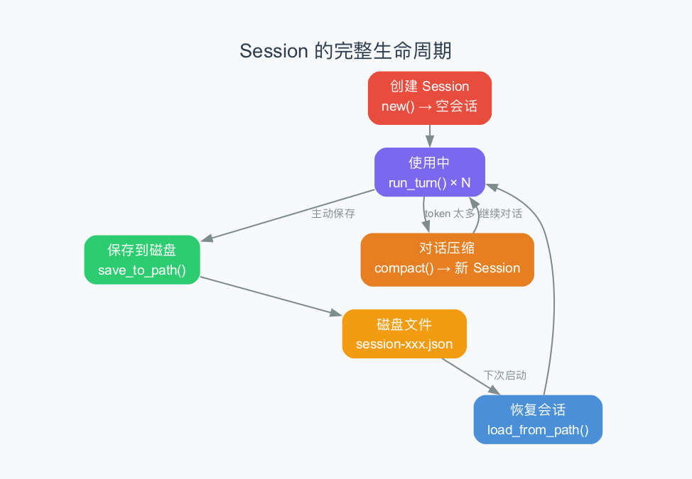
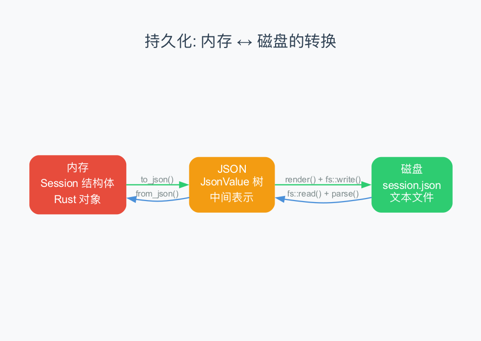

# 第9章：Session 持久化 —— Agent 怎么"记住"之前的对话

> **本章目标**：理解 Agent 是怎么把对话保存到磁盘、下次启动时又怎么恢复的。本章在第6章"消息模型"的基础上，深入 Session 的**目录结构、生命周期管理、会话恢复与切换、并发处理**等高级话题。如果说第6章介绍了 Session 的"数据结构"，本章就聚焦它的"文件系统"和"管理机制"。
>
> **难度**：⭐⭐⭐⭐ 高级
>
> **对应源码**：`rust/crates/runtime/src/session.rs`（底层存储）、`main.rs`（会话管理逻辑）

---

## 9.1 从上一章到这一章

上一章我们看了启动流程——从输入 `claude` 到出现提示符的 12 个阶段。其中有一个关键的隐含步骤：**检查是否有之前保存的会话**。

如果有的话，系统会加载之前的对话，你可以继续之前的讨论——就好像什么都没中断过一样。这就是 Session 持久化的魔力。

> 比喻：Session 持久化就像你的微信聊天记录。你关掉微信再打开，之前的聊天还在——因为聊天记录被保存在了手机里。Agent 的 Session 也是一样：关掉终端再打开，之前的对话还在。

---

## 9.2 Session 的完整生命周期



一个 Session 从创建到销毁，会经历以下阶段。如果拿"餐厅"来比喻，一个 Session 就像一张"餐桌记录单"——顾客落座时创建、点菜和使用时不断追加、打烊时保存、第二天开张时恢复、记录太长时精简摘要。

### 创建（Create）

```rust
let session = Session::new();
// session = { version: 1, messages: [] }
```

一个新的空会话。此时没有任何消息。同时系统会为这个会话生成一个唯一 ID，用于后续的文件命名和索引。

### 使用（Use）

```rust
session.messages.push(ConversationMessage::user_text("帮我写个函数"));
// Agent Loop 运行...
session.messages.push(ConversationMessage::assistant_with_usage(...));
session.messages.push(ConversationMessage::tool_result(...));
// ...更多轮对话
```

每次对话循环，消息都会追加到 `messages` 列表中。

### 持久保存（Persist）

不同于第6章介绍的 `save_to_path()`（底层序列化机制），实际使用中 Agent 会在**每一轮对话结束后**自动调用持久化，把最新状态写入磁盘：

```
用户输入 → AI 回复 → 工具执行 → 再次持久化 → 等待下一轮
```

这意味着即使 Agent 中途崩溃，最多只丢失最后一轮对话——就像手机微信每隔几秒自动备份聊天记录一样。

### 恢复（Resume）

```rust
let session = Session::load_from_path("~/.claude/sessions/session-123.json")?;
```

下次启动时，从磁盘读取 JSON 文件，反序列化成 Session 结构体。恢复不仅是加载数据，还包括重建运行时环境（权限、工具列表、token 计数器等）——后面 9.9 节会详细讲。

### 压缩（Compact）

```rust
let compacted = session.compact(CompactionConfig { ... });
```

当对话太长时（token 太多），压缩旧消息，保留关键信息。压缩后同样需要持久化保存。

> 压缩是第10章的主题，这里只需要知道"对话太长时会被压缩"。

### 清理（Clear）

当用户主动结束会话或开始新会话时，旧的 Session 文件保留在磁盘上，但不主动加载。这样设计是为了让用户随时可以回头查看历史会话——就像微信不会因为你开了新聊天就删掉旧聊天记录。

---

## 9.3 持久化的技术实现

Session 的保存和加载是一个"序列化 → 存储 → 反序列化"的过程。第6章我们已经看过底层 API（`save_to_path` / `load_from_path`），本节重点看**触发时机和保障机制**。



### 保存：从内存到磁盘

```rust
// 第一步：Session → JsonValue（内存中的 JSON 树）
let json = session.to_json();

// 第二步：JsonValue → JSON 字符串
let string = json.render();

// 第三步：字符串 → 磁盘文件（原子写入，避免写到一半断电导致文件损坏）
fs::write(path, string)?;
```

### 加载：从磁盘到内存

```rust
// 第一步：磁盘文件 → JSON 字符串
let string = fs::read_to_string(path)?;

// 第二步：JSON 字符串 → JsonValue（内存中的 JSON 树）
let json = JsonValue::parse(&string)?;

// 第三步：JsonValue → Session
let session = Session::from_json(&json)?;
```

> 这两个过程完全对称——保存和加载是彼此的"逆操作"。

### 持久化的触发时机

和第6章"手动调用一次 save"不同，实际运行中持久化会在以下时刻被触发：

| 时机 | 原因 |
|------|------|
| 每轮 Agent Loop 结束后 | 确保最新的消息不丢失 |
| 压缩（Compact）完成后 | 压缩后的消息需要覆盖旧文件 |
| 用户输入 `/resume` 恢复会话后 | 更新运行时状态 |
| 主动导出会话时 | 触发格式化输出 |

> 比喻：持久化就像你在写论文时的"Ctrl+S"——不是写完才保存，而是每写一段就自动保存一次。

---

## 9.4 保存的 JSON 格式详解

一个典型的 Session JSON 文件长这样：

```json
{
  "version": 1,
  "messages": [
    {
      "role": "user",
      "blocks": [
        { "type": "text", "text": "帮我写一个 Python 函数" }
      ]
    },
    {
      "role": "assistant",
      "blocks": [
        { "type": "text", "text": "好的，让我看看你的项目结构" },
        {
          "type": "tool_use",
          "id": "tool-abc123",
          "name": "glob_search",
          "input": "{\"pattern\":\"**/*.py\"}"
        }
      ],
      "usage": {
        "input_tokens": 256,
        "output_tokens": 42,
        "cache_creation_input_tokens": 0,
        "cache_read_input_tokens": 0
      }
    },
    {
      "role": "tool",
      "blocks": [
        {
          "type": "tool_result",
          "tool_use_id": "tool-abc123",
          "tool_name": "glob_search",
          "output": "{\"numFiles\":3,\"filenames\":[\"main.py\",\"utils.py\",\"test.py\"]}",
          "is_error": false
        }
      ]
    }
  ]
}
```

> **`version: 1`**：版本号。如果将来消息格式发生变化（比如添加新字段），可以通过版本号兼容旧格式。这是一种**向前兼容**的设计。

---

## 9.5 Session 文件存在哪里？——目录结构与命名规则

在 claw-code 中，Session 文件保存在当前工作目录下的 `.claude/sessions/` 文件夹中：

```
your-project/
├── .claude/
│   └── sessions/
│       ├── session-1712345678901.json    ← 会话1（按时间戳命名）
│       ├── session-1712345999999.json    ← 会话2
│       └── session-1712350000000.json    ← 会话3
├── src/
└── Cargo.toml
```

### 目录的创建

系统启动时会自动确保 sessions 目录存在：

```rust
fn sessions_dir() -> Result<PathBuf, Box<dyn std::error::Error>> {
    let cwd = env::current_dir()?;                     // 获取当前工作目录
    let path = cwd.join(".claude").join("sessions");   // 拼接路径
    fs::create_dir_all(&path)?;                        // 如果不存在就创建（含父目录）
    Ok(path)
}
```

> `create_dir_all` 是 Rust 标准库提供的"递归创建目录"函数——如果 `.claude` 不存在，它会一并创建。就像你在新房子里装柜子，不需要先确认墙在不在，直接装就行。

### Session ID 的生成规则

每个会话文件以 `session-{毫秒时间戳}.json` 命名：

```rust
fn generate_session_id() -> String {
    let millis = SystemTime::now()
        .duration_since(UNIX_EPOCH)                    // 从1970年1月1日到现在的毫秒数
        .map(|duration| duration.as_millis())
        .unwrap_or_default();
    format!("session-{millis}")
}
```

这样命名的好处：

| 特性 | 说明 |
|------|------|
| **唯一性** | 毫秒级时间戳几乎不可能重复（同一毫秒创建两个会话的概率极低） |
| **有序性** | 文件名自然按时间排序，`ls` 一下就能看出先后 |
| **可读性** | 看到 `session-1712345678901.json` 就能大致推算是哪个时间点的会话 |
| **无需额外索引** | 不需要数据库或额外的元数据文件来追踪会话列表 |

> 比喻：这就像医院用"就诊日期+序号"来命名病历档案。你不需要一个"病历索引本"就能快速找到某天的记录。

### 为什么存在项目目录下？

claw-code 把 Session 文件存在**当前项目的 `.claude/` 目录下**，而不是统一存在 `~/.claude/sessions/` 里。这样的设计意味着：

- **不同项目的会话天然隔离**——项目 A 的对话不会出现在项目 B 的列表中
- **删除项目即删除所有会话**——清理很方便
- **支持版本控制忽略**——在 `.gitignore` 里加一行 `.claude/` 就行

> Claude Code 的做法稍有不同——它用项目路径的哈希值（hash，即把路径通过算法转换成一段固定长度的字符串）来区分不同项目，存在 `~/.claude/projects/<project-hash>/sessions/` 下。思路一样，只是目录位置不同。

---

## 9.6 持久化中的错误处理

保存和加载都可能出现错误。claw-code 用 `SessionError` 枚举来处理：

```rust
pub enum SessionError {
    Io(std::io::Error),        // 文件读写错误
    Json(JsonError),            // JSON 解析错误
    Format(String),             // 格式不正确
}
```

| 错误类型 | 什么时候发生 | 举例 |
|---------|------------|------|
| **Io** | 文件不存在、权限不足 | 磁盘满了、路径不存在 |
| **Json** | JSON 语法错误 | 文件被损坏了 |
| **Format** | 内容格式不对 | 缺少 `version` 字段、role 值无效 |

> 每种错误都有明确的类型，调用者可以针对不同错误做不同处理——比如 Io 错误时创建新 Session，Format 错误时提示用户。

---

## 9.7 会话管理实战：列出、恢复与切换

到目前为止，我们一直在讲"一个会话"的保存和加载。但在实际使用中，你可能会有**多个会话**——今天讨论了项目 A 的架构，明天帮项目 B 写测试，后天又回到项目 A 继续讨论。Agent 需要一套机制来管理这些会话。

> 比喻：想象你的手机上装了多个聊天 App——微信、钉钉、飞书。你需要能"列出所有对话"、"切到某个对话"、"从上次说到的地方继续"。Agent 的会话管理也是一样的需求。

### 列出所有历史会话

claw-code 提供了 `list_managed_sessions()` 函数来扫描 sessions 目录：

```rust
fn list_managed_sessions() -> Result<Vec<ManagedSessionSummary>, Box<dyn std::error::Error>> {
    let mut sessions = Vec::new();
    for entry in fs::read_dir(sessions_dir()?)? {           // 遍历 sessions 目录下所有文件
        let entry = entry?;
        let path = entry.path();
        if path.extension().and_then(|ext| ext.to_str()) != Some("json") {
            continue;                                        // 只看 .json 文件，忽略其他
        }
        // 提取元数据：修改时间、消息数量
        let metadata = entry.metadata()?;
        let message_count = Session::load_from_path(&path)
            .map(|session| session.messages.len())
            .unwrap_or_default();
        // ... 构建 ManagedSessionSummary
    }
    sessions.sort_by(|left, right|
        right.modified_epoch_secs.cmp(&left.modified_epoch_secs)  // 按修改时间倒序排列
    );
    Ok(sessions)
}
```

这个函数做了三件事：

1. **扫描目录**：遍历 `.claude/sessions/` 下的所有 `.json` 文件
2. **提取摘要**：读取每个文件的修改时间和消息数量
3. **按时间排序**：最近修改的会话排在最前面

> 注意这里的一个细节：它需要**加载每个 Session 文件**才能获取消息数量。对于大量会话来说这可能比较慢，但在实际使用中（通常不会超过几十个会话文件），性能完全够用。

### 会话摘要：ManagedSessionSummary

每个历史会话会被总结成一个摘要对象，包含以下信息：

| 字段 | 含义 | 用途 |
|------|------|------|
| **path** | 文件路径 | 恢复时用来定位文件 |
| **message_count** | 消息数量 | 显示对话长度 |
| **modified_epoch_secs** | 最后修改时间 | 排序和显示 |
| **session_id** | 会话 ID | 显示给用户看的标签 |

### 恢复历史会话（/resume）

当你输入 `/resume` 命令时，系统会执行以下流程：

```rust
fn resume_session(&mut self, session_path: Option<String>) -> Result<...> {
    // 第一步：定位会话文件
    let handle = resolve_session_reference(&session_ref)?;

    // 第二步：从磁盘加载 Session 数据
    let session = Session::load_from_path(&handle.path)?;

    // 第三步：用加载的 Session 重建运行时环境
    self.runtime = build_runtime_with_permission_mode(
        session,                       // 加载的会话数据
        self.model.clone(),            // 模型配置
        self.system_prompt.clone(),     // System Prompt
        true,                          // is_resume = true
        self.allowed_tools.clone(),    // 允许的工具列表
        permission_mode_label(),       // 权限模式
    )?;

    // 第四步：更新当前会话句柄并持久化
    self.session = handle;
    self.persist_session()?;
}
```

这里有一个关键点容易忽略：**恢复不仅仅是加载消息**。它还需要：

1. **重建运行时**：把加载的 Session 交给一个新的 `ConversationRuntime`，这样 Agent Loop 才能继续运行
2. **恢复权限模式**：之前的权限设置（Allow / Deny / Prompt）也需要恢复
3. **恢复 token 计数**：UsageTracker 需要从历史消息中重新计算累计 token 用量
4. **重新持久化**：恢复完成后立即保存一次，确保"最后修改时间"是最新的

> 比喻：恢复会话就像你在游戏里读取存档——不仅角色回到了上次的位置，装备、等级、任务进度都要恢复，否则就不是真正的"继续"。

### 会话的切换流程

```
用户输入 /resume
    ↓
系统列出历史会话列表
    ↓
用户选择一个会话（或直接指定路径）
    ↓
resolve_session_reference() → 定位文件
    ↓
Session::load_from_path() → 加载数据
    ↓
build_runtime_with_permission_mode() → 重建运行时
    ↓
UsageTracker::from_session() → 恢复 token 计数
    ↓
persist_session() → 更新文件修改时间
    ↓
用户继续对话
```

---

## 9.8 并发会话的考量

如果你同时打开两个终端窗口，分别运行 Agent，会发生什么？

### 文件锁的缺失

claw-code 目前**没有实现文件锁**（file locking，即防止多个进程同时读写同一个文件的机制）。这意味着：

| 场景 | 行为 |
|------|------|
| 两个 Agent 读写**不同**的会话文件 | 互不影响，各自独立 |
| 两个 Agent 读写**同一个**会话文件 | 后写入的会覆盖先写入的，可能丢失消息 |

### 为什么可以这样设计？

实际上，由于 Session ID 包含毫秒时间戳，两个同时启动的 Agent 几乎一定会获得**不同的 Session ID**，因此自然不会冲突。每个终端窗口对应一个独立的 Session 文件，互不干扰。

```
终端窗口 1 → session-1712345678901.json   ← 独立文件
终端窗口 2 → session-1712345678902.json   ← 独立文件（差了1毫秒）
```

> 这是一种**通过命名约定来避免冲突**的设计——与其用复杂的锁机制，不如让每个进程自然地拥有自己的文件。就像餐厅给每桌客人一张独立的点菜单，而不是所有人共享一张单子。

### 如果需要在同一会话上协作呢？

如果你确实需要多个 Agent 共享同一个会话（比如一个在写代码、一个在跑测试），claw-code 的设计就不太够用了。这时候你需要：

- 自己实现文件锁（如 Rust 的 `fs2` crate）
- 或者切换到数据库存储（如 SQLite）
- 或者用消息队列来协调

> 这是 claw-code 为了"简单"而做出的取舍——对于大多数使用场景来说，一终端一会话的模型已经足够了。

---

## 9.9 UsageTracker 的恢复

在 `ConversationRuntime::new()` 中，有一个重要的细节：

```rust
let usage_tracker = UsageTracker::from_session(&session);
```

当从磁盘恢复 Session 时，UsageTracker 会遍历所有消息，累加之前用过的 token 数。这样即使重启，token 统计也是连续的。

> 想象你在用手机流量——如果每次重启手机都忘了之前用了多少流量，那月底就会超流量。UsageTracker 的恢复机制就是"记住之前用了多少"。

---

## 9.10 通用知识：其他框架的持久化方式

| 框架 | 持久化方式 | 特点 |
|------|----------|------|
| **claw-code** | JSON 文件 | 简单直接，人类可读 |
| **Claude Code** | JSON 文件 + SQLite | 更复杂，支持多种存储 |
| **LangChain** | 需要自己实现 | 内置多种存储后端 |
| **ChatGPT** | 服务端数据库 | 用户不关心存储细节 |
| **Cursor** | IDE 本地存储 | 跟随项目 |

> **claw-code 选择 JSON 文件的原因**：简单、透明、易于调试。你可以直接打开 JSON 文件查看对话内容，也可以手动编辑（虽然不建议）。

---

## 9.11 会话导出：把对话变成人类可读的文档

除了保存为 JSON（给机器看），claw-code 还支持把会话导出为**纯文本 Markdown 格式**（给人看）。这个功能对于以下场景非常有用：

- 把一段有价值的对话分享给同事
- 保存 AI 的回答作为文档或笔记
- 调试时查看完整的对话流程

### 导出的格式

```rust
fn render_export_text(session: &Session) -> String {
    let mut lines = vec!["# Conversation Export".to_string(), String::new()];
    for (index, message) in session.messages.iter().enumerate() {
        // 每条消息按角色标注
        let role = match message.role {
            MessageRole::System => "system",
            MessageRole::User => "user",
            MessageRole::Assistant => "assistant",
            MessageRole::Tool => "tool",
        };
        lines.push(format!("## {}. {role}", index + 1));
        // 渲染每个 ContentBlock...
    }
    lines.join("\n")
}
```

导出后的 Markdown 大致长这样：

```markdown
# Conversation Export

## 1. user
帮我写一个 Python 函数，计算斐波那契数列

## 2. assistant
好的，让我先看看你的项目结构。
[ToolUse: glob_search, pattern="**/*.py"]

## 3. tool
[ToolResult: glob_search, found 3 files: main.py, utils.py, test.py]

## 4. assistant
以下是斐波那契函数的实现：
...
```

### 导出 vs 原始 JSON 的区别

| 特性 | 原始 JSON | 导出 Markdown |
|------|----------|--------------|
| **目标读者** | 程序（Agent、调试器） | 人类 |
| **包含元数据** | 版本号、usage、tool_use_id 等 | 只保留角色和内容 |
| **格式** | JSON（需要工具查看） | Markdown（文本编辑器直接看） |
| **可编辑性** | 不建议手动编辑 | 可以自由编辑和注释 |
| **用途** | 恢复会话、调试 | 分享、归档、记录 |

> 比喻：JSON 文件就像医院的电子病历——结构严谨、机器可读，但普通人看着头疼。导出的 Markdown 就像医生口述的病历摘要——普通人也能看懂。

---

## 9.12 本章小结

### 第6章 vs 第9章：同一数据结构的不同视角

| 视角 | 第6章：消息模型 | 第9章：Session 持久化 |
|------|----------------|---------------------|
| **关注点** | 数据长什么样 | 数据怎么存、怎么管 |
| **核心问题** | Message、ContentBlock 的结构 | 文件存在哪、怎么恢复、怎么切换 |
| **比喻** | 快递包裹的标签系统 | 快递仓库的货架管理 |
| **深度** | 入门-中级 | 高级 |

### 核心概念

| 概念 | 解释 |
|------|------|
| **Session 持久化** | 把对话保存到磁盘，下次启动时恢复 |
| **Session ID** | 基于毫秒时间戳的唯一标识，用于文件命名 |
| **sessions 目录** | `.claude/sessions/`，每个项目独立存储 |
| **会话恢复** | 加载历史 Session 并重建完整的运行时环境 |
| **会话导出** | 把 JSON 格式的对话转换为人类可读的 Markdown |
| **并发安全** | 通过独立 Session ID 避免多进程冲突 |

### Session 管理的完整流程

```
创建: generate_session_id() → Session::new() → 保存到 sessions 目录
使用: Agent Loop → 每轮结束自动持久化
列表: list_managed_sessions() → 扫描目录 → 按时间排序
恢复: /resume → load_from_path() → 重建运行时 → 恢复 token 计数
导出: render_export_text() → JSON → Markdown
清理: 旧会话保留在磁盘，不主动删除
```

### 术语速查

| 术语 | 解释 |
|------|------|
| **持久化（persistence）** | 把数据保存到非易失性存储（如磁盘） |
| **序列化（serialization）** | 把对象转成可传输/存储的格式 |
| **反序列化（deserialization）** | 把存储格式转回对象 |
| **向前兼容** | 新版本能处理旧版本的数据 |
| **关注点分离** | 每个模块只负责自己的职责 |
| **文件锁（file locking）** | 防止多个进程同时读写同一文件的机制 |
| **时间戳 ID** | 基于时间的唯一标识符，天然有序且不重复 |
| **会话恢复（session resume）** | 从磁盘加载历史会话并重建运行时环境 |
| **会话导出（session export）** | 将机器格式的对话转换为人类可读格式 |

---

> **下一章**：[第10章：对话压缩算法](10-compact.md) —— 当对话太长时，Agent 是怎么"压缩"历史的？`compact_session()` 的算法是怎样的？
