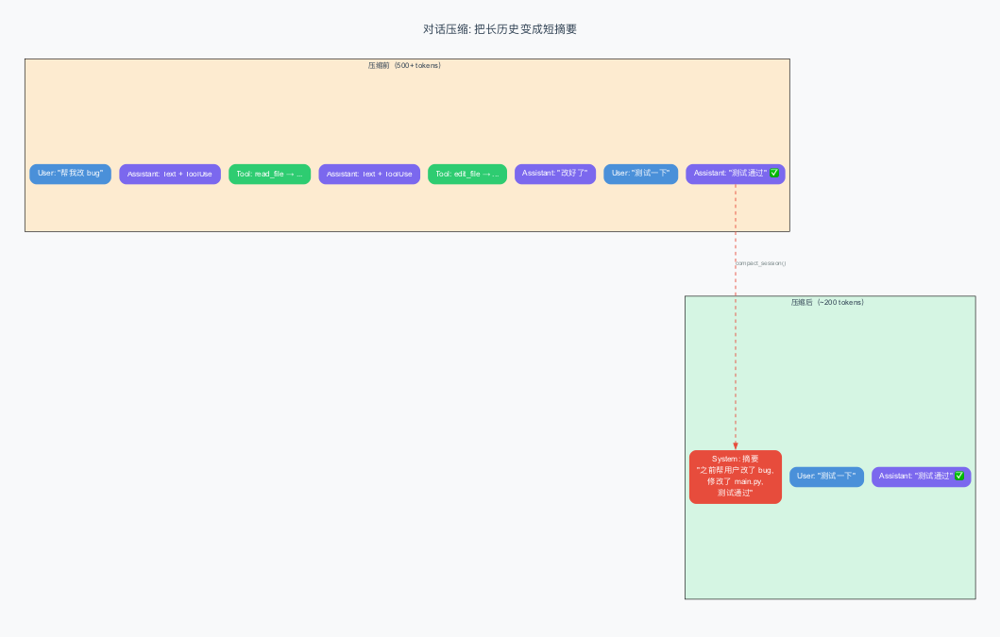
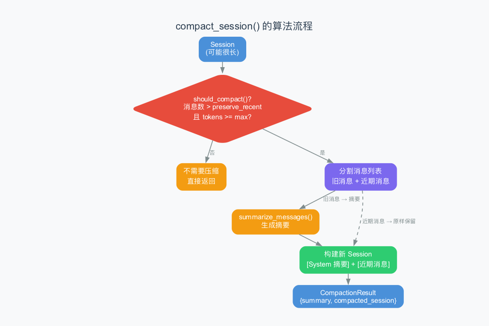

# 第10章：对话压缩算法 —— 当对话太长时怎么办

> **本章目标**：理解 Agent 是怎么处理"对话太长"这个问题的。当 token 数量接近上限时，系统会自动压缩旧消息，保留关键信息。这个压缩算法是 Agent 实现"无限对话"的关键技术。
>
> **难度**：⭐⭐⭐⭐ 高级
>
> **对应源码**：`rust/crates/runtime/src/compact.rs`

---

## 10.1 为什么需要对话压缩？

你可能已经注意到了：每次调用 AI 时，系统都会发送**完整的聊天记录**。如果你和 AI 聊了 100 轮，第 101 轮就需要发送前 100 轮的所有内容。

这意味着：
- **Token 消耗线性增长**——每轮对话都比上一轮多消耗一些 token
- **API 有 token 上限**——Claude 的上下文窗口是 200K token，超了就发不出去
- **费用不断增加**——输入 token 越多，每次 API 调用越贵

> 比喻：你在读一本书。每翻一页，你都要从头开始重新读一遍。读到第 100 页时，你需要重新读前 99 页 + 第 100 页。这显然不现实。对话压缩就是——把前 99 页压缩成一页"摘要"，你只需要读"摘要 + 最新一页"。

---

## 10.2 压缩的核心思想

压缩算法的核心思想很简单：**保留最近的消息，把旧消息变成摘要**。



---

## 10.3 算法流程详解



### 第一步：判断是否需要压缩

```rust
pub fn should_compact(session: &Session, config: CompactionConfig) -> bool {
    session.messages.len() > config.preserve_recent_messages
        && estimate_session_tokens(session) >= config.max_estimated_tokens
}
```

两个条件同时满足才压缩：
1. **消息数量**超过 `preserve_recent_messages`（默认 4 条）
2. **估计 token 数**超过 `max_estimated_tokens`（默认 10,000）

> 为什么需要两个条件？因为即使消息很多，如果每条消息都很短（比如"好的"、"继续"），总 token 可能并不多，不需要压缩。

### Token 估算方法

```rust
fn estimate_message_tokens(message: &ConversationMessage) -> usize {
    message.blocks.iter().map(|block| match block {
        ContentBlock::Text { text } => text.len() / 4 + 1,
        ContentBlock::ToolUse { name, input, .. } => (name.len() + input.len()) / 4 + 1,
        ContentBlock::ToolResult { tool_name, output, .. } => (tool_name.len() + output.len()) / 4 + 1,
    }).sum()
}
```

> **"字符数 / 4"** 是一种粗略的 token 估算方法。因为英文文本中，平均每个 token 大约是 4 个字符。中文稍微不同（每个汉字约 1-2 个 token），但这个估算对"是否需要压缩"的判断已经足够准确了。

### 第二步：分割消息列表

```rust
let keep_from = session.messages.len().saturating_sub(config.preserve_recent_messages);
let removed = &session.messages[..keep_from];       // 旧消息（要压缩的）
let preserved = session.messages[keep_from..].to_vec();  // 近期消息（原样保留）
```

举个例子：如果有 10 条消息，`preserve_recent_messages = 4`，那么：
- 旧消息：前 6 条（index 0-5）
- 近期消息：后 4 条（index 6-9）

### 第三步：生成摘要

`summarize_messages()` 函数会分析旧消息，提取关键信息：

```rust
fn summarize_messages(messages: &[ConversationMessage]) -> String {
    // 统计消息数量（按角色分类）
    // 收集使用过的工具名
    // 提取最近的用户请求（最多 3 条）
    // 推断待完成的工作
    // 收集引用过的关键文件
    // 推断当前工作内容
    // 生成时间线摘要
}
```

摘要包含以下部分：

| 摘要部分 | 内容 | 举例 |
|---------|------|------|
| **Scope** | 消息统计 | "10 条消息 (user=3, assistant=4, tool=3)" |
| **Tools** | 使用过的工具 | "bash, read_file, edit_file" |
| **Recent requests** | 最近的用户请求 | "帮我改 bug"、"添加测试" |
| **Pending work** | 待完成的工作 | "需要更新 CLI 部分" |
| **Key files** | 关键文件 | "src/main.py, tests/test_main.py" |
| **Current work** | 当前工作 | "正在修改 main.py 的第 42 行" |
| **Timeline** | 时间线摘要 | 每条消息的简短描述 |

> 摘要不是让 AI 重写旧消息，而是用**规则**提取关键信息。这比让 AI 总结更快速、更可控，也不消耗额外的 token。

### 第四步：构建新的 Session

```rust
let mut compacted_messages = vec![ConversationMessage {
    role: MessageRole::System,  // 注意：是 System 角色！
    blocks: vec![ContentBlock::Text { text: continuation }],
    usage: None,
}];
compacted_messages.extend(preserved);  // 追加近期消息
```

新的 Session 以一条 **System 消息**开头，包含摘要内容，后面跟着原样保留的近期消息。

> 为什么用 System 角色而不是 User 角色？因为 System 消息对 AI 来说是"系统级指令"——它不会把摘要当作用户的话来理解，而是当作"背景信息"来使用。

---

## 10.4 摘要长什么样？

一个真实的摘要示例：

```
This session is being continued from a previous conversation that ran out of context.
The summary below covers the earlier portion of the conversation.

Summary:
Conversation summary:
- Scope: 6 earlier messages compacted (user=2, assistant=2, tool=2).
- Tools mentioned: bash, read_file, edit_file.
- Recent user requests:
  - "帮我修复 main.py 中的 bug"
  - "添加单元测试"
- Pending work:
  - "Next: update tests and follow up on remaining CLI polish."
- Key files referenced: src/main.py, tests/test_main.py.
- Current work: 修改了 main.py 的第 42 行，将 print 改为 logging

Recent messages are preserved verbatim.
Continue the conversation from where it left off without asking the user any further questions.
```

> 最后那句"不要问用户问题，直接继续"是 `suppress_follow_up_questions` 参数的效果——压缩后 AI 不应该停下来问"我们之前在做什么？"，而是直接继续工作。

---

## 10.5 文件推断：怎么知道哪些文件是"关键"的？

`collect_key_files()` 函数用了一个巧妙的方法来提取文件名：

```rust
fn extract_file_candidates(content: &str) -> Vec<String> {
    content.split_whitespace()
        .filter_map(|token| {
            let candidate = token.trim_matches(|c| matches!(c, ','|'.'|':'|';'|')'|'('|'"'|'\''|'`'));
            if candidate.contains('/') && has_interesting_extension(candidate) {
                Some(candidate.to_string())
            } else {
                None
            }
        })
        .collect()
}
```

它的判断逻辑是：
1. 按空格分词
2. 去掉标点符号
3. 如果包含 `/` 且有常见扩展名（rs, ts, py, json, md）→ 认为是文件路径

> 这是一种**启发式**（heuristic，即经验性的规则）方法。它不是 100% 准确的——可能会误识别一些不是文件名的字符串。但对于大多数编程场景，它足够好了。

---

## 10.6 默认配置

```rust
impl Default for CompactionConfig {
    fn default() -> Self {
        Self {
            preserve_recent_messages: 4,     // 保留最近 4 条消息
            max_estimated_tokens: 10_000,    // token 上限 10,000
        }
    }
}
```

| 参数 | 默认值 | 含义 |
|------|--------|------|
| `preserve_recent_messages` | 4 | 至少保留最近 4 条消息 |
| `max_estimated_tokens` | 10,000 | 超过 10K token 才压缩 |

> 为什么保留 4 条？因为最近的几轮对话通常包含最重要的上下文——用户最新的请求和 AI 最新的回复。保留太少会让 AI "失忆"，保留太多又浪费 token。4 条是一个经验性的平衡点。

---

## 10.7 压缩效果

测试代码中的断言验证了压缩的效果：

```rust
assert!(estimate_session_tokens(&result.compacted_session) < estimate_session_tokens(&session));
```

压缩后的 Session，token 数一定少于原始 Session。具体少多少取决于对话内容，通常可以减少 **50%-80%** 的 token。

---

## 10.8 Anthropic 官方压缩 API

2026 年初，Anthropic 推出了官方的对话压缩 API（`compact_20260112`），让压缩不再需要客户端自己实现。

### 工作原理

官方压缩 API 的工作方式是：

```
客户端                                     Anthropic 服务器
  │                                            │
  │── POST /v1/messages/compact ──────────→    │
  │    { messages: [...100条消息...] }          │
  │                                            │  服务器端 AI 压缩
  │← ─ ─ ─ ─ ─ ─ ─ ─ ─ ─ ─ ─ ─ ─ ─ ─ ─ ─    │
  │    { messages: [...5条摘要消息...] }        │
```

客户端把完整的消息列表发送给 Anthropic，服务器端用 AI 生成高质量摘要，返回压缩后的消息。

### 与 claw-code 规则压缩的对比

| 特性 | claw-code 规则压缩 | Anthropic 官方压缩 |
|------|-------------------|-------------------|
| **压缩质量** | 中等（提取统计信息） | 高（AI 理解语义） |
| **成本** | 免费（本地计算） | 需要额外 API 调用 |
| **延迟** | 几乎为零 | 需要等 API 响应 |
| **确定性** | 每次结果相同 | 每次可能不同 |
| **上下文保留** | 工具名、文件名、统计 | 语义理解、意图保留 |

> **怎么选？** 如果对成本敏感、需要确定性结果，用规则压缩。如果需要最高的压缩质量、愿意多花一点 token，用官方压缩。实际上，两者可以**组合使用**——先用规则压缩处理简单信息，再用官方压缩处理复杂的对话段落。

### 真实的 Claude Code 压缩策略

真实 Claude Code 在 2026 年初的压缩实现采用了**混合策略**：

1. **触发条件**：当 token 数接近上下文窗口的 80% 时自动触发
2. **压缩方式**：优先使用 Anthropic 官方压缩 API
3. **保留策略**：始终保留最近的 2-4 条消息原样
4. **System 摘要**：压缩后的内容以 System 消息的形式注入
5. **无缝衔接**：压缩后 AI 会收到一个指令"不要问用户问题，直接继续"

---

## 10.9 通用知识：其他框架的压缩策略

| 框架 | 压缩方式 | 特点 |
|------|---------|------|
| **claw-code** | 规则摘要 + 保留近期 | 快速、确定性 |
| **Claude Code** | AI 总结 + 保留近期 | 更智能，但消耗额外 token |
| **LangChain** | 多种策略可选 | 灵活但复杂 |
| **MemGPT** | 分层记忆（工作记忆 + 长期记忆） | 最先进，但实现复杂 |

> **claw-code 选择"规则摘要"而非"AI 总结"**——这是一个务实的权衡。AI 总结更智能，但需要额外调用一次 API（消耗 token + 增加延迟）。规则摘要虽然不如 AI 总结那么"理解"内容，但它快速、免费、确定性（每次结果一样）。

---

## 10.10 本章小结

### 核心概念

| 概念 | 解释 |
|------|------|
| **CompactionConfig** | 压缩配置（保留条数 + token 上限） |
| **should_compact()** | 判断是否需要压缩 |
| **compact_session()** | 执行压缩，返回新 Session |
| **summarize_messages()** | 生成旧消息的摘要 |
| **estimate_session_tokens()** | 估算 Session 的 token 数 |

### 压缩算法总结

```
1. 检查是否需要压缩（消息数 + token 数）
2. 分割：旧消息 + 近期消息
3. 旧消息 → 摘要（统计 + 提取关键信息）
4. 新 Session = [System 摘要] + [近期消息]
```

### 术语速查

| 术语 | 解释 |
|------|------|
| **compaction（压缩）** | 把长对话变成短摘要 |
| **preserve_recent_messages** | 保留最近的消息条数 |
| **heuristic（启发式）** | 基于经验规则的方法 |
| **token 估算** | 用"字符数/4"粗略估算 token 数 |

---

> **下一章**：[第11章：Token 计费](11-token-usage.md) —— Agent 怎么追踪 token 用量？不同模型的定价有什么区别？TokenUsage 和 UsageTracker 是怎么设计的？
