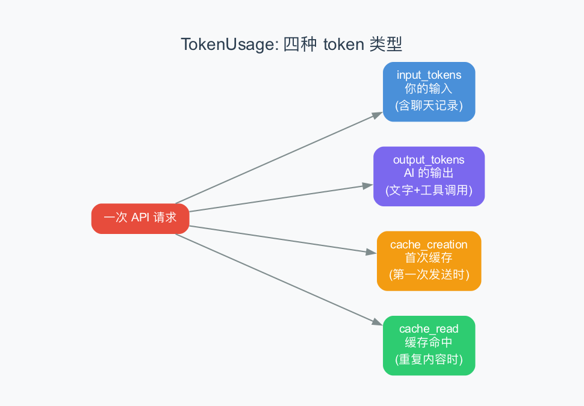
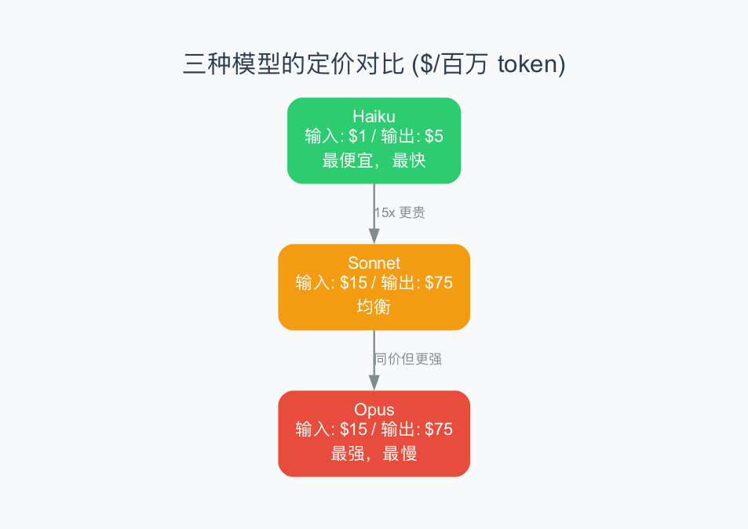

# 第11章：Token 计费 —— AI 的"话费"是怎么算的

> **本章目标**：理解 Agent 是怎么追踪 token 用量、计算费用的。不同模型（Haiku、Sonnet、Opus）的定价有什么区别？四种 token 类型（input、output、cache_creation、cache_read）分别是什么？
>
> **难度**：⭐⭐⭐ 中级
>
> **对应源码**：`rust/crates/runtime/src/usage.rs`

---

## 11.1 从上一章到这一章

上一章我们讲了对话压缩——当对话太长时，系统会把旧消息压缩成摘要。压缩的原因之一就是节省 token（减少费用）。这一章我们就来看：token 到底是怎么计量的？费用是怎么算的？

> 比喻：Token 就像手机流量。你有"国内流量"（input token）、"国际流量"（output token）、"缓存流量"（cache token）。每种流量的单价不同。UsageTracker 就是你的"流量管家"——帮你记录用了多少、花了多少钱。

---

## 11.2 四种 Token 类型

每次调用 AI API，都会返回四种 token 数据：



### Input Tokens（输入 token）

你发给 AI 的所有内容：System Prompt + 聊天记录 + 新消息。

```
input_tokens = System Prompt 的 token + 之前对话的 token + 你新输入的 token
```

> 每次请求都要发送完整的历史记录，所以 input_tokens 会随着对话轮数增长。这就是为什么对话越长越贵。

### Output Tokens（输出 token）

AI 返回的所有内容：文字 + 工具调用。

```
output_tokens = AI 说的文字的 token + 工具调用参数的 token
```

> Output token 通常比 input token 贵 5 倍！因为 AI "想"（生成输出）比"读"（理解输入）消耗更多计算资源。

### Cache Creation Tokens（缓存写入 token）

第一次发送某段内容时，API 会把它缓存起来。下次发送相同内容时，可以直接从缓存读取，更快更便宜。

```
cache_creation_input_tokens = 第一次发送的新内容（如 System Prompt）
```

> **Prompt Caching（提示缓存）**：Anthropic 的一项优化技术。当你反复发送相同的 System Prompt 时，只有第一次会"写入缓存"（cache_creation），后续都会"读缓存"（cache_read），价格便宜 90%。

### Cache Read Tokens（缓存读取 token）

从缓存中读取之前缓存过的内容。

```
cache_read_input_tokens = 从缓存读取的内容
```

> 缓存的 magic：System Prompt 每次请求都要发送，但只有第一次需要 cache_creation。后续请求中，System Prompt 全部变成 cache_read，价格只有 input 的 1/10。

---

## 11.3 三种模型的定价

claw-code 用 `pricing_for_model()` 函数来获取不同模型的定价：



| 模型 | Input ($/百万) | Output ($/百万) | Cache Write ($/百万) | Cache Read ($/百万) |
|------|-------------|--------------|-------------------|-------------------|
| **Haiku** | $1 | $5 | $1.25 | $0.10 |
| **Sonnet** | $15 | $75 | $18.75 | $1.50 |
| **Opus** | $15 | $75 | $18.75 | $1.50 |

> Sonnet 和 Opus 的价格一样——区别在于 Opus 更"聪明"（推理能力更强），但输出速度更慢。Haiku 便宜得多，适合简单任务。

### 源码实现

```rust
pub fn pricing_for_model(model: &str) -> Option<ModelPricing> {
    let normalized = model.to_ascii_lowercase();
    if normalized.contains("haiku") {
        return Some(ModelPricing {
            input_cost_per_million: 1.0,
            output_cost_per_million: 5.0,
            cache_creation_cost_per_million: 1.25,
            cache_read_cost_per_million: 0.1,
        });
    }
    if normalized.contains("opus") {
        return Some(ModelPricing { /* $15/$75 */ });
    }
    if normalized.contains("sonnet") {
        return Some(ModelPricing::default_sonnet_tier());
    }
    None  // 未知模型
}
```

> 通过模型名称中的关键词（"haiku"、"opus"、"sonnet"）来匹配定价。如果传入未知模型名，返回 `None`，使用默认的 Sonnet 定价。

---

## 11.4 UsageTracker：用量追踪器

`UsageTracker` 是 Agent 的"记账本"，记录所有 token 用量：

```rust
pub struct UsageTracker {
    latest_turn: TokenUsage,   // 最近一次的用量
    cumulative: TokenUsage,    // 累计用量
    turns: u32,                // 总轮数
}
```

### 记录用量

每次 AI 回复后，用量都会被记录：

```rust
pub fn record(&mut self, usage: TokenUsage) {
    self.latest_turn = usage;
    self.cumulative.input_tokens += usage.input_tokens;
    self.cumulative.output_tokens += usage.output_tokens;
    self.cumulative.cache_creation_input_tokens += usage.cache_creation_input_tokens;
    self.cumulative.cache_read_input_tokens += usage.cache_read_input_tokens;
    self.turns += 1;
}
```

### 从 Session 恢复

如果 Agent 重启，UsageTracker 可以从保存的 Session 中恢复累计用量：

```rust
pub fn from_session(session: &Session) -> Self {
    let mut tracker = Self::new();
    for message in &session.messages {
        if let Some(usage) = message.usage {
            tracker.record(usage);
        }
    }
    tracker
}
```

> 遍历所有消息，把每条 AI 消息的 `usage` 累加起来。这样即使重启，token 统计也是连续的。

### 费用计算

```rust
pub fn estimate_cost_usd_with_pricing(self, pricing: ModelPricing) -> UsageCostEstimate {
    UsageCostEstimate {
        input_cost_usd: cost_for_tokens(self.input_tokens, pricing.input_cost_per_million),
        output_cost_usd: cost_for_tokens(self.output_tokens, pricing.output_cost_per_million),
        cache_creation_cost_usd: cost_for_tokens(...),
        cache_read_cost_usd: cost_for_tokens(...),
    }
}
```

费用计算公式很简单：`tokens / 1,000,000 * 单价`

---

## 11.5 Prompt Caching：省钱的终极武器

### 什么是 Prompt Caching？

每次调用 AI API 时，你发送的内容（System Prompt + 聊天记录）会被 Anthropic 的服务器缓存。下次发送相同的前缀时，可以直接从缓存读取，不需要重新计算。

比喻：就像餐厅的"预制菜"——今天做好的红烧肉放在冰箱里，明天客人点红烧肉时不需要重新做，热一下就能上。

### 缓存的工作原理

```
第一次请求：
  发送：System Prompt (10K tokens) + 聊天记录 (5K tokens)
  结果：cache_creation_input_tokens = 10K（System Prompt 被缓存）
        input_tokens = 5K（聊天记录正常计费）

第二次请求：
  发送：System Prompt (10K tokens) + 聊天记录 (7K tokens)
  结果：cache_read_input_tokens = 10K（System Prompt 从缓存读取，价格便宜 90%）
        input_tokens = 7K（新增的聊天记录正常计费）
```

### cache_control：精细控制缓存

claw-code 的 API 客户端支持通过 `cache_control` 参数来标记哪些内容应该被缓存：

```python
# 在 System Prompt 的最后一段加上 ephemeral 标记
{
    "type": "text",
    "text": "...（System Prompt 的最后部分）",
    "cache_control": {"type": "ephemeral"}  # 标记为"临时缓存"
}
```

`ephemeral`（临时的）意味着这个缓存点在一段时间后（通常是 5 分钟）会自动过期。这对于 Agent 的对话场景非常合适——因为同一次对话中，System Prompt 在几分钟内不会变化，但过了 5 分钟后可能已经更新了。

### 缓存前缀匹配

缓存是基于**前缀匹配**的：只有当你发送的内容的前缀与之前缓存的内容完全一致时，才能命中缓存。

```
缓存了：[System Prompt A] + [消息1] + [消息2]
新请求：[System Prompt A] + [消息1] + [消息2] + [消息3]
结果：  cache_read = System Prompt A + 消息1 + 消息2
        input = 消息3
```

> 这就是为什么 System Prompt 每次请求都要发送——它是对话的"前缀"。只要前缀不变，就能命中缓存。这也是对话压缩（第 10 章）的一个副作用——压缩后会改变消息结构，导致缓存失效。

### TTL（Time To Live）

缓存有 5 分钟的 TTL（生存时间）。如果在 5 分钟内没有使用缓存，它会被自动清除。

```
T=0: 缓存 System Prompt
T=1min: 命中缓存 ✅
T=3min: 命中缓存 ✅
T=6min: 缓存过期，需要重新创建 cache_creation ❌
```

> Agent 的每次对话通常间隔几秒到几十秒，远小于 5 分钟。所以在正常使用中，缓存命中率很高。

### 实际节省计算

以 Sonnet 模型为例，一次 10 轮对话：

| 策略 | Input Token 总费用 | Cache Read 总费用 | 总计 |
|------|------------------|------------------|------|
| **无缓存** | 10 × 10K × $15/M = $1.50 | $0 | $1.50 |
| **有缓存** | 10 × 2K × $15/M = $0.30 | 9 × 10K × $1.50/M = $0.135 | $0.435 |

节省 71%！而且对话越长，节省比例越高。

---

## 11.6 费用报告示例

`summary_lines_for_model()` 方法生成人类可读的费用报告：

```
usage: total_tokens=1800000 input=1000000 output=500000 cache_write=100000 cache_read=200000 estimated_cost=$54.6750 model=claude-sonnet-4-20250514
  cost breakdown: input=$15.0000 output=$37.5000 cache_write=$1.8750 cache_read=$0.3000
```

> 这告诉你：总共用了 180 万 token，预计花费 $54.68。其中输出最贵（$37.50），缓存读取最便宜（$0.30）。

---

## 11.7 省钱策略

了解了计费规则后，有哪些省钱策略？

| 策略 | 原理 | 节省幅度 |
|------|------|---------|
| **使用缓存** | 相同的 System Prompt 会被缓存 | cache_read 比 input 便宜 90% |
| **对话压缩** | 压缩旧消息减少 input token | 减少 50-80% 的 input |
| **用 Haiku 做简单任务** | Haiku 比 Sonnet 便宜 15 倍 | 节省 90%+ |
| **减少工具返回内容** | 工具输出也是 input token | 精简输出 |
| **限制上下文长度** | 不要发送不必要的历史 | 减少 input |

> 最有效的策略是**使用缓存 + 对话压缩**。缓存让 System Prompt 几乎免费，压缩让旧消息不再重复发送。

---

## 11.8 本章小结

### 核心概念

| 概念 | 解释 |
|------|------|
| **TokenUsage** | 四种 token 的用量 |
| **UsageTracker** | 累计追踪 token 用量 |
| **ModelPricing** | 每百万 token 的价格 |
| **UsageCostEstimate** | 费用估算 |

### 定价速查

| 模型 | Input | Output | 特点 |
|------|-------|--------|------|
| Haiku | $1/M | $5/M | 最便宜 |
| Sonnet | $15/M | $75/M | 均衡 |
| Opus | $15/M | $75/M | 最强 |

### 术语速查

| 术语 | 解释 |
|------|------|
| **token** | AI 处理文本的最小单位（约 4 个字符） |
| **Prompt Caching** | 缓存重复发送的内容，减少费用 |
| **$/百万 token** | 每处理一百万 token 的价格 |

---

> **下一章**：[第12章：MCP 协议](12-mcp.md) —— Agent 是怎么连接外部工具服务的？MCP 协议的命名规则、传输类型、和工具发现机制是怎样的？
