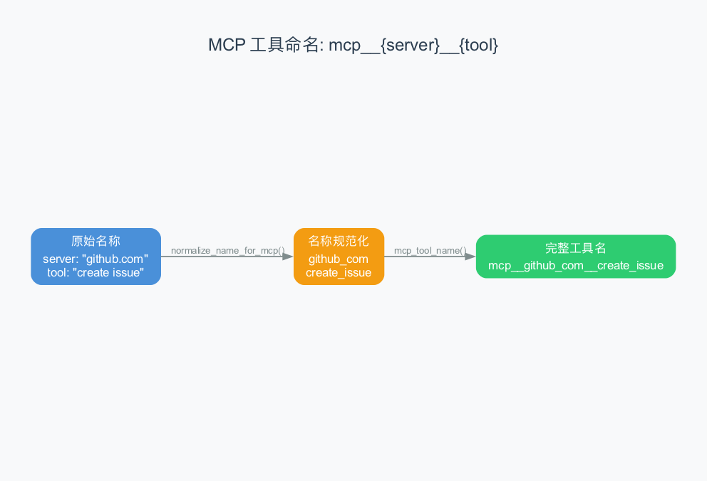
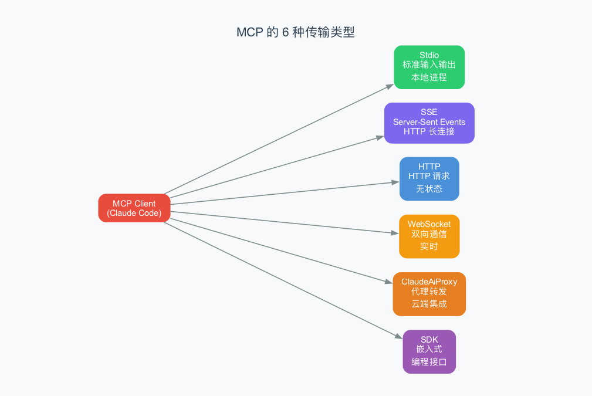

# 第12章：MCP 协议 —— Agent 怎么连接外部世界

> **本章目标**：理解 MCP（Model Context Protocol，模型上下文协议）——Agent 连接外部工具服务的标准协议。你将了解工具命名规则、传输类型、以及工具发现机制。
>
> **难度**：⭐⭐⭐⭐ 高级
>
> **对应源码**：`rust/crates/runtime/src/mcp.rs`

---

## 12.1 什么是 MCP？

在前面的章节中，我们看到 Agent 有 18 个内置工具（bash、read_file 等）。但 Agent 的能力远不止于此——它还可以连接**外部的工具服务**，比如：

- GitHub 服务器——创建 PR、查看 issue
- 数据库服务器——查询数据
- 搜索引擎服务器——网络搜索
- 自定义服务器——任何你想要的功能

MCP 就是连接 Agent 和这些外部服务的**标准协议**。

> 比喻：如果 Agent 是一台电脑，内置工具是预装的软件（记事本、计算器），那 MCP 就是 USB 接口——你可以通过它连接任何外部设备（打印机、扫描仪、摄像头）。MCP 规定了"接口长什么样"、"数据怎么传输"。

---

## 12.2 MCP 工具命名规则

当 Agent 通过 MCP 连接到一个外部服务器时，那个服务器提供的工具需要一个**全局唯一的名字**。claw-code 用以下规则生成名字：



```
格式：mcp__{server_name}__{tool_name}
```

### 名称规范化

```rust
pub fn normalize_name_for_mcp(name: &str) -> String {
    name.chars()
        .map(|ch| match ch {
            'a'..='z' | 'A'..='Z' | '0'..='9' | '_' | '-' => ch,
            _ => '_',  // 其他字符变成下划线
        })
        .collect::<String>()
}
```

规则很简单：
- 字母、数字、下划线、连字符 → 保持不变
- 其他字符（如 `.`、`/`、空格）→ 变成下划线

### 具体例子

| 服务器名 | 工具名 | 规范化后的完整名 |
|---------|--------|---------------|
| `github.com` | `create_issue` | `mcp__github_com__create_issue` |
| `my server` | `search tool!` | `mcp__my_server__search_tool_` |
| `claude.ai Example Server` | `weather tool` | `mcp__claude_ai_Example_Server__weather_tool` |

> **为什么要规范化？** 因为外部服务器的名字可能包含特殊字符（如 URL 中的 `.`），但工具名必须是合法的标识符（只包含字母、数字、下划线）。

### 特殊处理：claude.ai 服务器

```rust
if name.starts_with(CLAUDEAI_SERVER_PREFIX) {
    normalized = collapse_underscores(&normalized)
        .trim_matches('_')
        .to_string();
}
```

如果服务器名以 `"claude.ai "` 开头，还会额外：
1. 合并连续的下划线
2. 去掉首尾的下划线

---

## 12.3 六种传输类型

MCP 支持多种传输方式，适配不同的使用场景：



| 类型 | 场景 | 特点 |
|------|------|------|
| **Stdio** | 本地进程 | 最简单，通过标准输入/输出通信 |
| **SSE** | 远程服务 | HTTP 长连接，服务器可以推送消息 |
| **HTTP** | 远程服务 | 标准请求-响应模式 |
| **WebSocket** | 实时通信 | 双向通信，低延迟 |
| **ClaudeAiProxy** | 云端集成 | 通过 Anthropic 的代理连接 |
| **SDK** | 嵌入式 | 在同一进程中直接调用 |

### Stdio 传输（最常用）

```json
{
  "command": "uvx",
  "args": ["mcp-server-github"],
  "env": { "GITHUB_TOKEN": "xxx" }
}
```

Agent 会启动一个子进程，通过标准输入/输出与它通信。这是最简单的传输方式——不需要网络，不需要端口。

### 远程传输（SSE/HTTP/WebSocket）

```json
{
  "url": "https://api.example.com/mcp",
  "headers": { "Authorization": "Bearer xxx" }
}
```

通过网络连接远程服务器。SSE 适合服务器推送场景，HTTP 适合简单的请求-响应，WebSocket 适合实时双向通信。

---

## 12.4 服务器签名和配置哈希

claw-code 用**签名**（signature）和**哈希**（hash）来标识和比较 MCP 服务器配置。

### 服务器签名

```rust
pub fn mcp_server_signature(config: &McpServerConfig) -> Option<String> {
    match config {
        McpServerConfig::Stdio(config) => {
            Some(format!("stdio:[{}]", render_command_signature(&command)))
        }
        McpServerConfig::Sse(config) => {
            Some(format!("url:{}", unwrap_ccr_proxy_url(&config.url)))
        }
        // ... 其他类型
    }
}
```

签名的格式：
- Stdio：`stdio:[uvx|mcp-server]`
- 远程：`url:https://api.example.com/mcp`

> 签名用于**去重**——如果两个配置的签名相同，就认为是同一个服务器，不会重复连接。

### 配置哈希

```rust
pub fn scoped_mcp_config_hash(config: &ScopedMcpServerConfig) -> String {
    let rendered = match &config.config {
        McpServerConfig::Stdio(stdio) => format!("stdio|{}|{}|{}", ...),
        McpServerConfig::Sse(remote) => format!("sse|{}|{}|{}|{}", ...),
        // ...
    };
    stable_hex_hash(&rendered)  // FNV-1a 哈希算法
}
```

哈希是用 FNV-1a 算法（一种快速的非加密哈希）计算的 16 位十六进制字符串。

> **签名 vs 哈希的区别**：签名是给人看的（如 `stdio:[uvx|mcp-server]`），哈希是给机器看的（如 `a1b2c3d4e5f6a7b8`）。哈希更精确——包含了所有配置细节（环境变量、OAuth 参数等）。

---

## 12.5 CCR 代理 URL 解包

claw-code 支持通过 Anthropic 的代理连接 MCP 服务器。代理 URL 格式特殊，需要"解包"才能拿到真正的 MCP 服务器地址：

```rust
pub fn unwrap_ccr_proxy_url(url: &str) -> String {
    // 如果 URL 包含代理标记
    if url.contains("/v2/session_ingress/shttp/mcp/") ||
       url.contains("/v2/ccr-sessions/") {
        // 从查询参数中提取真正的 URL
        // ?mcp_url=https%3A%2F%2Fvendor.example%2Fmcp
        // → https://vendor.example/mcp
    }
    url.to_string()  // 不是代理 URL，原样返回
}
```

> **URL 编码**（percent encoding）：`%3A` = `:`，`%2F` = `/`。`https%3A%2F%2Fvendor.example%2Fmcp` 解码后是 `https://vendor.example/mcp`。

---

## 12.6 MCP 的工具发现机制

当 Agent 连接到一个 MCP 服务器后，会通过 `tools/list` 命令获取该服务器提供的所有工具。每个工具的信息包括：

- **name**：工具名
- **description**：工具描述
- **inputSchema**：参数格式（JSON Schema）

这些信息会被规范化后添加到 Agent 的工具列表中。对 AI 来说，MCP 工具和内置工具没有区别——都是 `ToolSpec`。

> 这就是 MCP 的精妙之处：AI 不需要知道工具是"内置的"还是"外部的"。无论是 `read_file` 还是 `mcp__github_com__create_issue`，对 AI 来说都是"我可以调用的工具"。

---

## 12.7 MCP 通信协议深度解析

前面几节我们了解了 MCP 的基本概念：工具命名、传输类型、签名与哈希。现在让我们深入 MCP 通信的底层细节——Agent 和 MCP 服务器之间到底在"说"什么？

> 比喻：前面讲的工具命名、传输类型，相当于你知道了"怎么写地址"和"走公路还是铁路"。现在我们要看的是"包裹里装的是什么格式的东西"——快递单怎么填、包裹怎么打包、收到包裹后怎么拆。

### JSON-RPC 2.0 消息格式

MCP 使用 JSON-RPC 2.0 协议进行通信。JSON-RPC 2.0 是一种轻量级的远程过程调用（Remote Procedure Call，一种让程序在另一台机器上执行函数的协议）格式，所有消息都是 JSON 结构。claw-code 在 `mcp_stdio.rs` 中定义了完整的类型系统：

```rust
// 请求
pub struct JsonRpcRequest<T = JsonValue> {
    pub jsonrpc: String,              // 固定为 "2.0"
    pub id: JsonRpcId,                // 请求 ID（数字或字符串）
    pub method: String,               // 方法名（如 "initialize"）
    pub params: Option<T>,            // 参数
}

// 响应
pub struct JsonRpcResponse<T = JsonValue> {
    pub jsonrpc: String,
    pub id: JsonRpcId,                // 对应请求的 ID
    pub result: Option<T>,            // 成功时的结果
    pub error: Option<JsonRpcError>,  // 失败时的错误
}

// 错误
pub struct JsonRpcError {
    pub code: i64,                    // 错误码（如 -32601 = 方法不存在）
    pub message: String,              // 错误描述
    pub data: Option<JsonValue>,      // 附加数据
}
```

一个实际初始化请求长这样：

```json
{
  "jsonrpc": "2.0",
  "id": 1,
  "method": "initialize",
  "params": {
    "protocolVersion": "2024-11-05",
    "capabilities": {},
    "clientInfo": { "name": "claw-code", "version": "1.0.0" }
  }
}
```

服务器回复：

```json
{
  "jsonrpc": "2.0",
  "id": 1,
  "result": {
    "protocolVersion": "2024-11-05",
    "capabilities": { "tools": {} },
    "serverInfo": { "name": "my-mcp-server", "version": "1.0.0" }
  }
}
```

> 注意 `id` 字段：请求里的 `id` 是 1，响应里的 `id` 也是 1。这样 Agent 就能知道"这个响应对应的是我之前发出的哪个请求"。

### ID 类型

JSON-RPC 2.0 允许 ID 为数字或字符串。claw-code 定义了三种 ID 类型：

```rust
pub enum JsonRpcId {
    Number(u64),    // 数字 ID（claw-code 默认从 1 递增）
    String(String), // 字符串 ID
    Null,           // 空 ID（通知消息用）
}
```

- **Number**：最常见的类型，claw-code 内部维护一个计数器，从 1 开始递增
- **String**：某些 MCP 服务器可能使用字符串 ID
- **Null**：用于"通知"（Notification）——不需要响应的单向消息

> 通知消息没有 `id`（或者 `id` 为 null），服务器不会回复。MCP 协议中 `notifications/initialized` 就是通知——客户端告诉服务器"我初始化完了"，不需要服务器回应。

### Stdio 帧编码

MCP Stdio 传输使用 HTTP 风格的 Content-Length 帧编码。前面说过 Stdio 是通过标准输入/输出通信的，但一个关键问题是：**怎么区分两条消息的边界？**

```
┌─────────────────────────────────────┐
│ Content-Length: 87\r\n              │ ← Header（声明消息体长度）
│ \r\n                                │ ← 空行分隔符
│ {"jsonrpc":"2.0","id":1,...}       │ ← JSON Payload（87 字节）
└─────────────────────────────────────┘
```

claw-code 的帧编码实现：

```rust
fn encode_frame(payload: &[u8]) -> Vec<u8> {
    let header = format!("Content-Length: {}\r\n\r\n", payload.len());
    let mut framed = header.into_bytes();
    framed.extend_from_slice(payload);
    framed
}
```

编码过程很简单：先写一行 header 声明消息体的字节长度，再加一个空行，最后是实际的 JSON 内容。

帧解码（`read_frame()`）的步骤：
1. 逐行读取 header，直到遇到空行 `\r\n`
2. 从 header 中提取 `Content-Length` 值
3. 精确读取指定长度的字节作为 payload

> **为什么用 Content-Length 而不是换行分隔？** 因为 JSON 消息本身可能包含换行符。如果用换行分隔，遇到 JSON 里的换行就会"误切"消息。Content-Length 方式可以精确知道消息的边界，不会出错。

> 这和 HTTP 的 `Content-Length` header 是同一个思路——HTTP 请求体也可能包含各种字符，用长度来定界最可靠。

### 工具发现生命周期

了解了消息格式和帧编码后，让我们看一个完整的工具发现流程。claw-code 的 `McpServerManager` 实现了三阶段生命周期：

```
① ensure_server_ready("my-server")
   ├── 进程未启动？→ spawn_mcp_stdio_process()
   └── 未初始化？  → initialize()

② discover_tools()
   └── for each server:
       ├── ensure_server_ready()
       ├── loop {  // 分页循环
       │     list_tools(id, {cursor})
       │     → 解析 result.tools
       │     → 注册到 tool_index
       │     → cursor = result.next_cursor
       │     → cursor 为空时 break
       │   }
       └── return 所有发现的工具

③ call_tool("mcp__my-server__echo", args)
   ├── 从 tool_index 查找路由
   │   → (server_name: "my-server", raw_name: "echo")
   ├── ensure_server_ready(server_name)
   └── process.call_tool(id, {name: "echo", arguments: args})
```

三个阶段的分工：

1. **ensure_server_ready**——确保进程在运行且已完成初始化握手。如果没有就启动进程并发送 `initialize` 请求
2. **discover_tools**——调用 `tools/list` 获取工具列表。支持分页（cursor 机制），如果工具很多会多次请求
3. **call_tool**——实际调用工具。先从路由表查找对应的服务器，再把请求转发过去

> 这就像去餐厅吃饭：先确认餐厅开门了（ensure_server_ready），再看菜单上有什么（discover_tools），最后点菜（call_tool）。

### McpServerManager 的工具路由

Agent 调用 MCP 工具时用的是全限定名（如 `mcp__github__create_issue`），但发送给 MCP 服务器时只需要原始工具名（`create_issue`）。中间的路由转换由 `McpServerManager` 完成：

```rust
struct ToolRoute {
    server_name: String,  // 服务器名
    raw_name: String,     // 服务器上的原始工具名
}

// 工具路由表：qualified_name → (server_name, raw_name)
tool_index: BTreeMap<String, ToolRoute>
```

当 AI 调用 `mcp__github__create_issue` 时：
1. 从 `tool_index` 查找 → `(server_name: "github", raw_name: "create_issue")`
2. 找到 "github" 对应的进程
3. 发送 `tools/call` 请求，`name` 为原始名 `create_issue`

> 这种设计让 AI 只需要知道全限定名，不需要关心路由细节。Manager 自动把请求转发到正确的服务器——就像你在餐厅点菜，只需要告诉服务员菜名，不需要知道是哪个厨房做的。

### McpTool 数据结构

MCP 服务器返回的工具定义：

```rust
pub struct McpTool {
    pub name: String,                          // 工具名
    pub description: Option<String>,           // 工具描述
    pub input_schema: Option<JsonValue>,        // JSON Schema 参数定义
    pub annotations: Option<JsonValue>,         // 注解（如只读标记）
    pub meta: Option<JsonValue>,                // 元数据
}
```

其中 `input_schema` 是 JSON Schema 格式，描述了工具参数的类型和结构。AI 看到这个 schema 就知道该传什么参数。

工具调用结果：

```rust
pub struct McpToolCallResult {
    pub content: Vec<McpToolCallContent>,       // 内容列表（文字、图片等）
    pub structured_content: Option<JsonValue>,  // 结构化内容（JSON）
    pub is_error: Option<bool>,                 // 是否是错误
}
```

> `structured_content` 是 MCP 2025-03-26 版本新增的字段——工具可以同时返回人类可读的 `content` 和机器可解析的 `structured_content`。就像餐厅的账单，既有给人看的小票（content），也有给收银系统扫描的条码（structured_content）。

---

## 12.8 通用知识：MCP 协议的生态

MCP 是 Anthropic 在 2024 年 11 月发布的开放协议。目前已经有大量实现：

| 类别 | 例子 |
|------|------|
| **文件系统** | 本地文件读写 |
| **数据库** | PostgreSQL、MySQL、SQLite |
| **Git** | GitHub、GitLab |
| **搜索** | Brave Search、Google |
| **通讯** | Slack、Discord |
| **开发工具** | Docker、Kubernetes |

> MCP 的愿景是成为"AI 工具的 USB 标准"——任何 AI 应用都可以通过 MCP 连接任何工具服务。

---

## 12.9 本章小结

### 核心概念

| 概念 | 解释 |
|------|------|
| **MCP** | 连接 AI 和外部工具服务的标准协议 |
| **工具命名** | `mcp__{server}__{tool}` 格式 |
| **传输类型** | Stdio、SSE、HTTP、WebSocket、Proxy、SDK |
| **签名** | 标识服务器的字符串 |
| **哈希** | 配置的 FNV-1a 哈希值 |

### 术语速查

| 术语 | 解释 |
|------|------|
| **MCP** | Model Context Protocol（模型上下文协议） |
| **Stdio** | 标准输入/输出，进程间通信方式 |
| **SSE** | Server-Sent Events，服务器推送技术 |
| **FNV-1a** | 一种快速的非加密哈希算法 |
| **percent encoding** | URL 中的特殊字符编码方式 |

---

> **下一章**：[第13章：Python 实现最小 Agent](13-python-agent.md) —— 用 Python 从零实现一个最小的 Agent！理解了原理之后，动手写一个能工作的 Agent。
